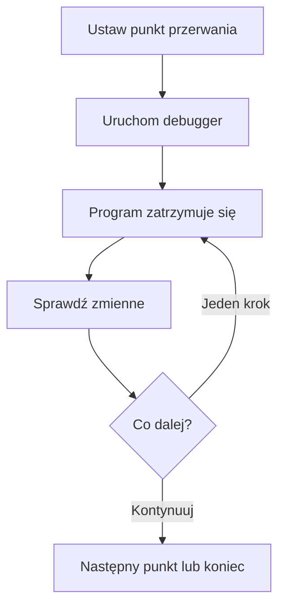

# 04 - Debugger w Code::Blocks

## Cel rozdziału

Nauczysz się praktycznych podstaw debugowania programu w Code::Blocks. Skupimy się tylko na tym, co jest najważniejsze na początku: zatrzymaniu programu, przechodzeniu krok po kroku i obserwowaniu zmiennych.

Debugger pozwala zatrzymać działający program. Dzięki temu możesz sprawdzić, w którym miejscu powstaje błąd i jakie wartości mają zmienne.

Debugger nie naprawia programu automatycznie. Pokazuje tylko, co program naprawdę robi.

> Zwykłe uruchomienie programu przypomina obejrzenie całego filmu. Debugger pozwala zatrzymać film, przejść o jedną scenę dalej i sprawdzić, co dokładnie się wydarzyło.

## Ważne założenia

Debugowanie wykonujemy w projekcie Code::Blocks, najlepiej w projekcie konsolowym utworzonym za pomocą kreatora.

Taki projekt ma zwykle konfigurację `Debug`. W typowej instalacji Code::Blocks z pakietem MinGW nie trzeba ręcznie konfigurować debuggera. Przed debugowaniem trzeba jednak wybrać konfigurację `Debug`.

Luźny pojedynczy plik `.cpp`, który nie należy do projektu Code::Blocks, może nie działać prawidłowo z debuggerem. Dlatego ćwiczenia z tego rozdziału wykonuj w projekcie.

## Najważniejsze pojęcia

Punkt przerwania to miejsce, w którym program ma się zatrzymać.

Podświetlony wiersz lub żółty znacznik wskazuje zwykle następną instrukcję do wykonania. To ważne: jeżeli program zatrzymał się na danym wierszu, ta instrukcja najczęściej nie została jeszcze wykonana.

Praca krokowa pozwala wykonać program po jednej instrukcji. Dzięki temu widzisz, jak zmieniają się wartości zmiennych.

Podgląd zmiennych pozwala zobaczyć wartości zapisane w pamięci programu, bez dopisywania dodatkowych instrukcji `cout`.

## Co chcę zrobić?

| Chcę zrobić                                           | Narzędzie                       |
| ----------------------------------------------------- | ------------------------------- |
| Zatrzymać program w wybranym miejscu                  | Punkt przerwania                |
| Wykonać następną instrukcję bez wchodzenia do funkcji | Przejście do następnego wiersza |
| Wejść do wywoływanej funkcji                          | Wejście do funkcji              |
| Opuścić aktualną funkcję                              | Wyjście z funkcji               |
| Uruchomić program do kolejnego punktu przerwania      | Kontynuowanie                   |
| Sprawdzić wartość zmiennej                            | Podgląd zmiennych lub Watches   |

## Podstawowy przebieg pracy

## Lekcje

1. [Punkty przerwania](01-punkty-przerwania.md)
2. [Praca krokowa i funkcje](02-praca-krokowa-i-funkcje.md)
3. [Podgląd wartości zmiennych](03-podglad-zmiennych.md)

## Umiejętności po rozdziale

Po ukończeniu rozdziału będziesz umieć:

- ustawić jeden lub kilka punktów przerwania,
- uruchomić program w debuggerze,
- kontynuować program do następnego punktu przerwania,
- przechodzić przez program krok po kroku,
- wejść do funkcji i wyjść z niej,
- obserwować wartości zmiennych,
- znaleźć prosty błąd logiczny przez porównanie oczekiwanej i rzeczywistej wartości.

## Gdy debugger nie działa

Najczęstsze problemy są proste:

- plik `.cpp` powinien należeć do projektu Code::Blocks,
- przed debugowaniem wybierz konfigurację `Debug`,
- po zmianie konfiguracji ponownie zbuduj projekt,
- jeżeli punkt przerwania jest ignorowany, wykonaj ponowne zbudowanie projektu,
- projekt najlepiej zapisać w prostej ścieżce bez nietypowych znaków,
- instalacja Code::Blocks powinna zawierać MinGW i GDB.

Nie zaczynaj od zaawansowanych ustawień GDB. Najpierw sprawdź projekt, konfigurację `Debug` i ponowne zbudowanie programu.
