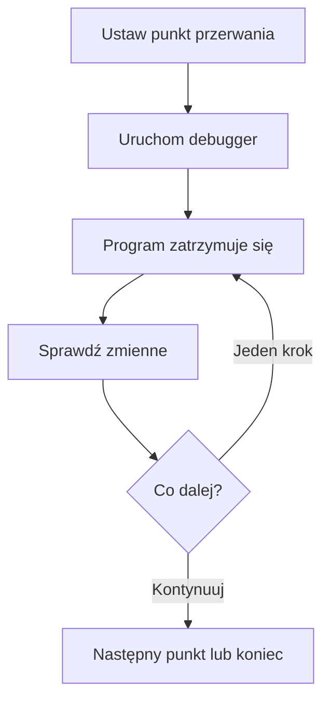

# 04 - Debugger w Code::Blocks

## Cel rozdziału

Nauczysz się praktycznych podstaw debugowania programu w Code::Blocks 25.03 dla Windows z pakietem MinGW i debuggerem GDB.

Rozdział obejmuje tylko najważniejsze czynności: punkty przerwania, uruchomienie programu w debuggerze, pracę krokową, wejście do funkcji, wyjście z funkcji oraz automatyczny podgląd zmiennych.

Debugger pozwala zatrzymać działający program. Dzięki temu możesz sprawdzić, w którym miejscu powstaje błąd i jakie wartości mają zmienne.

Debugger nie naprawia programu automatycznie. Pokazuje tylko, co program naprawdę robi.

> Zwykłe uruchomienie programu przypomina obejrzenie całego filmu. Debugger pozwala zatrzymać film, przejść o jedną scenę dalej i sprawdzić, co dokładnie się wydarzyło.

## Ważne założenia

Materiały zakładają Code::Blocks 25.03 z pakietem MinGW.

Projekt konsolowy utworzony kreatorem Code::Blocks ma zwykle konfigurację `Debug`. W typowej instalacji Code::Blocks z MinGW nie trzeba ręcznie konfigurować GDB. Przed debugowaniem trzeba jednak wybrać konfigurację `Debug`.

Debugowanie wykonujemy w projekcie Code::Blocks. Luźny plik `.cpp`, który nie należy do projektu, może nie działać prawidłowo z debuggerem.

## Najważniejsze pojęcia

Punkt przerwania to miejsce, w którym program ma się zatrzymać.

Strzałka debuggera lub podświetlony wiersz wskazuje zwykle następną instrukcję do wykonania. To ważne: jeżeli program zatrzymał się na danym wierszu, ta instrukcja najczęściej nie została jeszcze wykonana.

Praca krokowa pozwala wykonać jedną instrukcję i ponownie zatrzymać program.

Okno `Watches` w Code::Blocks 25.03 automatycznie pokazuje zmienne lokalne w sekcji `Locals` oraz argumenty aktualnej funkcji w sekcji `Function arguments`.

## Co chcę zrobić?

| Chcę zrobić                                           | Narzędzie debuggera                           |
| ----------------------------------------------------- | --------------------------------------------- |
| Zatrzymać program w wybranym miejscu                  | Punkt przerwania                              |
| Wykonać następną instrukcję bez wchodzenia do funkcji | Przejście do następnego wiersza               |
| Wejść do wywoływanej funkcji                          | Wejście do funkcji                            |
| Opuścić aktualną funkcję                              | Wyjście z funkcji                             |
| Uruchomić program do następnego punktu przerwania     | Kontynuowanie                                 |
| Sprawdzić zmienne lokalne                             | Sekcja `Locals` w oknie `Watches`             |
| Sprawdzić argumenty funkcji                           | Sekcja `Function arguments` w oknie `Watches` |

## Podstawowy przebieg pracy

## Lekcje

1. [Punkty przerwania](01-punkty-przerwania.md)
2. [Praca krokowa i funkcje](02-praca-krokowa-i-funkcje.md)
3. [Automatyczny podgląd zmiennych](03-automatyczny-podglad-zmiennych.md)

## Umiejętności po rozdziale

Po ukończeniu rozdziału będziesz umieć:

- ustawić jeden lub kilka punktów przerwania,
- uruchomić program w debuggerze,
- kontynuować program do następnego punktu przerwania,
- przechodzić przez program krok po kroku,
- wejść do funkcji i wyjść z niej,
- odczytać zmienne lokalne w sekcji `Locals`,
- odczytać argumenty funkcji w sekcji `Function arguments`,
- znaleźć prosty błąd logiczny przez porównanie oczekiwanej i rzeczywistej wartości.

## Gdy debugger nie działa

Najczęstsze problemy są proste:

- plik `.cpp` powinien należeć do projektu Code::Blocks,
- przed debugowaniem wybierz konfigurację `Debug`,
- projekt powinien zostać zbudowany w konfiguracji `Debug`,
- jeżeli punkt przerwania jest ignorowany, ponownie zbuduj projekt,
- instalacja Code::Blocks powinna zawierać MinGW i GDB,
- projekt najlepiej zapisać w prostej ścieżce bez nietypowych znaków.

Nie zaczynaj od zaawansowanych ustawień GDB. Najpierw sprawdź projekt, konfigurację `Debug` i ponowne zbudowanie programu.
