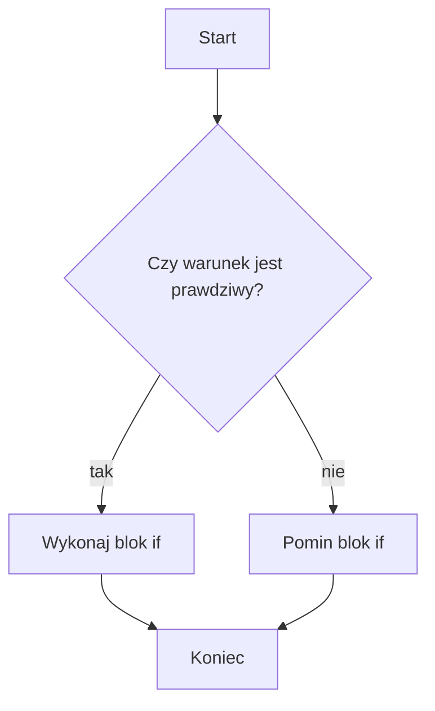

# Instrukcja if

## Cel lekcji

Nauczysz się pisać instrukcję `if`, która wykonuje blok kodu tylko dla prawdziwego warunku.

## Krótkie wprowadzenie

Program bez warunków robi zawsze to samo. Instrukcja `if` pozwala podjąć prostą decyzję.

## Wyjaśnienie idei

`if` sprawdza warunek typu `bool`. Jeśli warunek jest prawdziwy, wykonywany jest blok w klamrach. Jeśli jest fałszywy, blok jest pomijany. W kursie zawsze używamy klamer.

## Składnia

```cpp
if (warunek)
{
    // instrukcje
}
```

## Diagram działania



## Pełny przykład programu

```cpp
#include <iostream>

using namespace std;

int main()
{
    int liczba;

    cout << "Podaj liczbe: ";
    cin >> liczba;

    if (liczba > 0)
    {
        cout << "Liczba jest dodatnia.\n";
    }

    if (liczba % 2 == 0)
    {
        cout << "Liczba jest parzysta.\n";
    }

    cout << "Koniec programu.\n";

    return 0;
}
```

<details markdown="1">
<summary>Pokaż wynik</summary>

```text
Podaj liczbe: Liczba jest dodatnia.
Liczba jest parzysta.
Koniec programu.
```

</details>

## Omówienie programu krok po kroku

Program wczytuje liczbę. Pierwszy `if` sprawdza dodatniość. Drugi `if` sprawdza parzystość. Ostatni komunikat wypisuje się zawsze.

## Kiedy tego użyć?

Użyj `if`, gdy kod ma wykonać się tylko po spełnieniu warunku.

## Kiedy wybrać coś innego?

Jeżeli chcesz wybrać jedną z dwóch dróg, użyj `if-else`.

## Ćwiczenia

### 1. Liczba dodatnia

Wczytaj liczbę. Jeśli jest dodatnia, wypisz komunikat.

Dane wejściowe:

```text
5
```

<details markdown="1">
<summary>Pokaż oczekiwany wynik ćwiczenia 1</summary>

```text
Liczba jest dodatnia.
```

</details>

<details markdown="1">
<summary>Pokaż wskazówkę do ćwiczenia 1</summary>

Warunek to `liczba > 0`.

</details>

<details markdown="1">
<summary>Pokaż rozwiązanie ćwiczenia 1</summary>

```cpp
#include <iostream>

using namespace std;

int main()
{
    int liczba;

    cin >> liczba;

    if (liczba > 0)
    {
        cout << "Liczba jest dodatnia.\n";
    }

    return 0;
}
```

</details>

### 2. Pełnoletność

Wczytaj wiek. Jeśli jest co najmniej `18`, wypisz komunikat.

Dane wejściowe:

```text
18
```

<details markdown="1">
<summary>Pokaż oczekiwany wynik ćwiczenia 2</summary>

```text
Osoba pelnoletnia.
```

</details>

<details markdown="1">
<summary>Pokaż wskazówkę do ćwiczenia 2</summary>

Użyj operatora `>=`.

</details>

<details markdown="1">
<summary>Pokaż rozwiązanie ćwiczenia 2</summary>

```cpp
#include <iostream>

using namespace std;

int main()
{
    int wiek;

    cin >> wiek;

    if (wiek >= 18)
    {
        cout << "Osoba pelnoletnia.\n";
    }

    return 0;
}
```

</details>

### 3. Podzielność przez 3

Wczytaj liczbę. Jeśli jest podzielna przez `3`, wypisz komunikat.

Dane wejściowe:

```text
12
```

<details markdown="1">
<summary>Pokaż oczekiwany wynik ćwiczenia 3</summary>

```text
Liczba jest podzielna przez 3.
```

</details>

<details markdown="1">
<summary>Pokaż wskazówkę do ćwiczenia 3</summary>

Sprawdź `liczba % 3 == 0`.

</details>

<details markdown="1">
<summary>Pokaż rozwiązanie ćwiczenia 3</summary>

```cpp
#include <iostream>

using namespace std;

int main()
{
    int liczba;

    cin >> liczba;

    if (liczba % 3 == 0)
    {
        cout << "Liczba jest podzielna przez 3.\n";
    }

    return 0;
}
```

</details>

## Typowe błędy

- Średnik po `if`.
- Użycie `=` zamiast `==`.
- Brak klamer.
- Warunek trudny do odczytania jako wartość logiczna.

## Podsumowanie

Instrukcja `if` wykonuje blok kodu tylko wtedy, gdy warunek jest prawdziwy.
