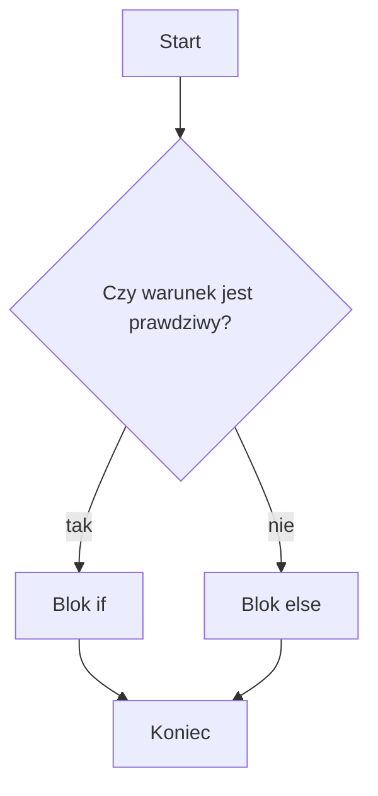

# if-else i else if

## Cel lekcji

Nauczysz się wybierać jedną z dwóch albo jedną z wielu dróg programu.

## Krótkie wprowadzenie

`if` wykonuje kod tylko dla prawdziwego warunku. `else` mówi, co zrobić w przeciwnym przypadku. `else if` pozwala sprawdzać kolejne warunki.

## Wyjaśnienie idei

W `if-else` dokładnie jeden z dwóch bloków zostanie wykonany. W łańcuchu `else if` program sprawdza warunki od góry i zatrzymuje się na pierwszym prawdziwym warunku. Kolejność progów ma znaczenie.

## Składnia

```cpp
if (warunek)
{
    // pierwsza możliwość
}
else if (innyWarunek)
{
    // druga możliwość
}
else
{
    // pozostałe przypadki
}
```

## Diagram działania if-else



## Pełny przykład programu

```cpp
#include <iostream>

using namespace std;

int main()
{
    int punkty;

    cout << "Podaj liczbe punktow: ";
    cin >> punkty;

    if (punkty >= 90)
    {
        cout << "Ocena bardzo dobra.\n";
    }
    else if (punkty >= 75)
    {
        cout << "Ocena dobra.\n";
    }
    else if (punkty >= 50)
    {
        cout << "Ocena dostateczna.\n";
    }
    else
    {
        cout << "Brak zaliczenia.\n";
    }

    return 0;
}
```

<details markdown="1">
<summary>Pokaż wynik</summary>

```text
Podaj liczbe punktow: Ocena dobra.
```

</details>

## Omówienie programu krok po kroku

Najpierw sprawdzany jest najwyższy próg. Dla `82` warunek `punkty >= 90` jest fałszywy, a `punkty >= 75` jest prawdziwy. Dalsze warunki nie są już sprawdzane.

## Kiedy tego użyć?

Używaj `if-else`, gdy wybierasz jedną z dwóch dróg. Używaj `else if`, gdy dróg jest więcej.

## Kiedy wybrać coś innego?

Jeżeli jedna zmienna jest porównywana z konkretnymi stałymi wartościami, rozważ `switch`.

## Ćwiczenia

### 1. Dodatnia, ujemna albo zero

Wczytaj liczbę i sklasyfikuj ją.

Dane wejściowe:

```text
-4
```

<details markdown="1">
<summary>Pokaż oczekiwany wynik ćwiczenia 1</summary>

```text
Liczba jest ujemna.
```

</details>

<details markdown="1">
<summary>Pokaż wskazówkę do ćwiczenia 1</summary>

Użyj `if`, `else if` i `else`.

</details>

<details markdown="1">
<summary>Pokaż rozwiązanie ćwiczenia 1</summary>

```cpp
#include <iostream>

using namespace std;

int main()
{
    int liczba;

    cin >> liczba;

    if (liczba > 0)
    {
        cout << "Liczba jest dodatnia.\n";
    }
    else if (liczba < 0)
    {
        cout << "Liczba jest ujemna.\n";
    }
    else
    {
        cout << "Liczba jest rowna zero.\n";
    }

    return 0;
}
```

</details>

### 2. Progi punktowe

Wczytaj punkty. Co najmniej `90` to bardzo dobre zaliczenie, co najmniej `50` to zaliczenie, niżej brak zaliczenia.

Dane wejściowe:

```text
91
```

<details markdown="1">
<summary>Pokaż oczekiwany wynik ćwiczenia 2</summary>

```text
Zaliczone bardzo dobrze.
```

</details>

<details markdown="1">
<summary>Pokaż wskazówkę do ćwiczenia 2</summary>

Najpierw sprawdź wyższy próg.

</details>

<details markdown="1">
<summary>Pokaż rozwiązanie ćwiczenia 2</summary>

```cpp
#include <iostream>

using namespace std;

int main()
{
    int punkty;

    cin >> punkty;

    if (punkty >= 90)
    {
        cout << "Zaliczone bardzo dobrze.\n";
    }
    else if (punkty >= 50)
    {
        cout << "Zaliczone.\n";
    }
    else
    {
        cout << "Brak zaliczenia.\n";
    }

    return 0;
}
```

</details>

### 3. Porównanie dwóch liczb

Wczytaj dwie liczby i wypisz, która jest większa, albo że są równe.

Dane wejściowe:

```text
8
3
```

<details markdown="1">
<summary>Pokaż oczekiwany wynik ćwiczenia 3</summary>

```text
Pierwsza liczba jest wieksza.
```

</details>

<details markdown="1">
<summary>Pokaż wskazówkę do ćwiczenia 3</summary>

Porównaj najpierw `pierwszaLiczba > drugaLiczba`.

</details>

<details markdown="1">
<summary>Pokaż rozwiązanie ćwiczenia 3</summary>

```cpp
#include <iostream>

using namespace std;

int main()
{
    int pierwszaLiczba;
    int drugaLiczba;

    cin >> pierwszaLiczba;
    cin >> drugaLiczba;

    if (pierwszaLiczba > drugaLiczba)
    {
        cout << "Pierwsza liczba jest wieksza.\n";
    }
    else if (drugaLiczba > pierwszaLiczba)
    {
        cout << "Druga liczba jest wieksza.\n";
    }
    else
    {
        cout << "Liczby sa rowne.\n";
    }

    return 0;
}
```

</details>

## Typowe błędy

- Sprawdzanie progów w złej kolejności.
- Dopisywanie warunku po `else`.
- Używanie wielu osobnych `if`, gdy trzeba wybrać jedną możliwość.
- Brak klamer.

## Podsumowanie

`if-else` wybiera jedną z dwóch dróg, a `else if` pozwala sprawdzać wiele możliwości od góry.
