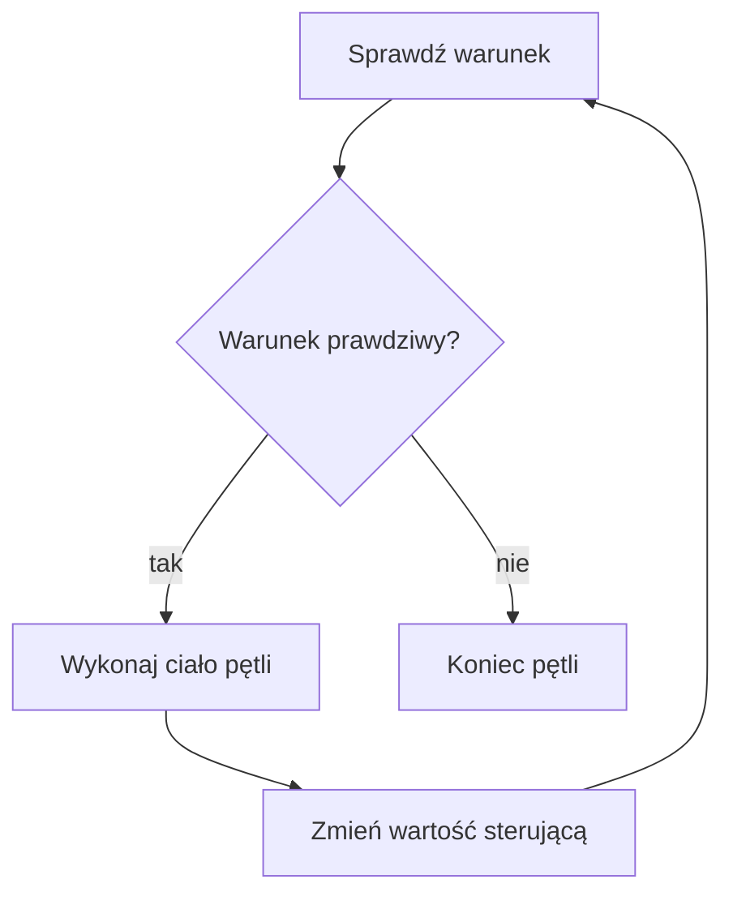

# Pętla while

## Cel lekcji

Nauczysz się powtarzać instrukcje dopóki warunek jest prawdziwy.

## Krótkie wprowadzenie do problemu

Jeżeli program ma wypisać liczby od 1 do 5, można napisać pięć instrukcji `cout`. To działa, ale jest niewygodne. Pętla pozwala zapisać powtarzanie raz.

## Wyjaśnienie idei

`while` najpierw sprawdza warunek. Jeśli warunek jest prawdziwy, wykonuje ciało pętli. Potem wraca do warunku. Jeśli warunek jest fałszywy od początku, ciało nie wykona się ani razu. Zmienna sterująca musi się zmieniać, inaczej łatwo powstaje pętla nieskończona.

## Składnia

```cpp
while (warunek)
{
    // powtarzane instrukcje
}
```

## Diagram działania



## Przykład 1 - liczby od 1 do 5

```cpp
#include <iostream>

using namespace std;

int main()
{
    int liczba = 1;

    while (liczba <= 5)
    {
        cout << liczba << "\n";
        liczba++;
    }

    return 0;
}
```

<details markdown="1">
<summary>Pokaż wynik</summary>

```text
1
2
3
4
5
```

</details>

## Przykład 2 - wartownik kończący wczytywanie

```cpp
#include <iostream>

using namespace std;

int main()
{
    int liczba;

    cout << "Podaj liczbe, 0 konczy: ";
    cin >> liczba;

    while (liczba != 0)
    {
        cout << "Wczytano: " << liczba << "\n";
        cout << "Podaj liczbe, 0 konczy: ";
        cin >> liczba;
    }

    cout << "Koniec.\n";

    return 0;
}
```

<details markdown="1">
<summary>Pokaż wynik</summary>

```text
Podaj liczbe, 0 konczy: Wczytano: 3
Podaj liczbe, 0 konczy: Koniec.
```

</details>

## Omówienie programu krok po kroku

W pierwszym programie zmienna `liczba` steruje pętlą. Po każdym wypisaniu zwiększa się o jeden. Gdy osiągnie `6`, warunek `liczba <= 5` jest fałszywy. W drugim programie wartość `0` jest wartownikiem, czyli umówioną wartością kończącą.

## Kiedy tego użyć?

Użyj `while`, gdy liczba powtórzeń nie jest z góry znana albo zależy od danych.

## Kiedy wybrać inną pętlę?

Jeżeli liczba powtórzeń jest znana, często czytelniejszy będzie `for`. Jeżeli ciało musi wykonać się co najmniej raz, rozważ `do-while`.

## Ćwiczenia

### 1. Zakres liczb

Wczytaj początek i koniec zakresu. Wypisz liczby od początku do końca.

Dane wejściowe:

```text
3
6
```

<details markdown="1">
<summary>Pokaż oczekiwany wynik ćwiczenia 1</summary>

```text
3
4
5
6
```

</details>

<details markdown="1">
<summary>Pokaż wskazówkę do ćwiczenia 1</summary>

Zmienna sterująca zaczyna od początku zakresu i rośnie o `1`.

</details>

<details markdown="1">
<summary>Pokaż rozwiązanie ćwiczenia 1</summary>

```cpp
#include <iostream>

using namespace std;

int main()
{
    int poczatek;
    int koniec;

    cin >> poczatek;
    cin >> koniec;

    int liczba = poczatek;
    while (liczba <= koniec)
    {
        cout << liczba << "\n";
        liczba++;
    }

    return 0;
}
```

</details>

### 2. Liczby parzyste

Wypisz liczby parzyste od `2` do `10`.

<details markdown="1">
<summary>Pokaż oczekiwany wynik ćwiczenia 2</summary>

```text
2
4
6
8
10
```

</details>

<details markdown="1">
<summary>Pokaż wskazówkę do ćwiczenia 2</summary>

Zwiększaj zmienną sterującą o `2`.

</details>

<details markdown="1">
<summary>Pokaż rozwiązanie ćwiczenia 2</summary>

```cpp
#include <iostream>

using namespace std;

int main()
{
    int liczba = 2;

    while (liczba <= 10)
    {
        cout << liczba << "\n";
        liczba += 2;
    }

    return 0;
}
```

</details>

### 3. Odliczanie

Wczytaj liczbę i odliczaj od niej do zera.

Dane wejściowe:

```text
3
```

<details markdown="1">
<summary>Pokaż oczekiwany wynik ćwiczenia 3</summary>

```text
3
2
1
0
```

</details>

<details markdown="1">
<summary>Pokaż wskazówkę do ćwiczenia 3</summary>

Tym razem zmienna sterująca maleje.

</details>

<details markdown="1">
<summary>Pokaż rozwiązanie ćwiczenia 3</summary>

```cpp
#include <iostream>

using namespace std;

int main()
{
    int liczba;

    cin >> liczba;

    while (liczba >= 0)
    {
        cout << liczba << "\n";
        liczba--;
    }

    return 0;
}
```

</details>

### 4. Zatrzymanie po wartości

Wczytuj liczby, dopóki użytkownik nie poda `0`. Wypisuj każdą liczbę różną od zera.

Dane wejściowe:

```text
4
2
0
```

<details markdown="1">
<summary>Pokaż oczekiwany wynik ćwiczenia 4</summary>

```text
4
2
```

</details>

<details markdown="1">
<summary>Pokaż wskazówkę do ćwiczenia 4</summary>

Najpierw wczytaj liczbę przed pętlą, potem ponownie na końcu pętli.

</details>

<details markdown="1">
<summary>Pokaż rozwiązanie ćwiczenia 4</summary>

```cpp
#include <iostream>

using namespace std;

int main()
{
    int liczba;

    cin >> liczba;
    while (liczba != 0)
    {
        cout << liczba << "\n";
        cin >> liczba;
    }

    return 0;
}
```

</details>

## Typowe błędy

- Brak zmiany zmiennej sterującej.
- Warunek, który od początku jest fałszywy, gdy oczekujemy działania.
- Przypadkowa pętla nieskończona.
- Wczytanie kolejnej wartości w złym miejscu.

## Podsumowanie

`while` powtarza kod, dopóki warunek jest prawdziwy. Warunek jest sprawdzany przed każdym wykonaniem ciała.
