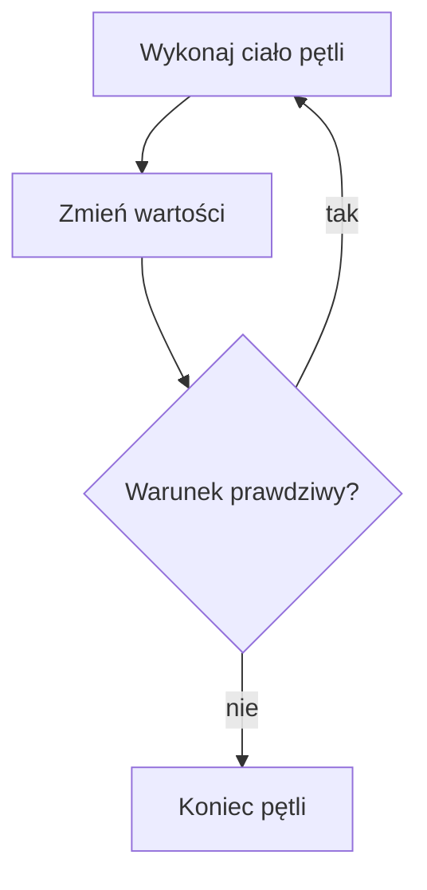

# Pętla do-while

## Cel lekcji

Nauczysz się używać pętli, która wykonuje ciało co najmniej jeden raz.

## Krótkie wprowadzenie do problemu

Czasem program musi najpierw coś pokazać albo wczytać, a dopiero potem sprawdzić, czy powtórzyć działanie. Proste menu jest dobrym przykładem.

## Wyjaśnienie idei

`do-while` najpierw wykonuje ciało pętli, a dopiero potem sprawdza warunek. Dlatego ciało wykona się co najmniej raz. Po `while (warunek)` musi być średnik.

## Składnia

```cpp
do
{
    // powtarzane instrukcje
}
while (warunek);
```

## Diagram działania



## Przykład 1 - pytanie wykonane przynajmniej raz

```cpp
#include <iostream>

using namespace std;

int main()
{
    int liczba;

    do
    {
        cout << "Podaj liczbe od 1 do 10: ";
        cin >> liczba;
    }
    while ((liczba < 1) || (liczba > 10));

    cout << "Poprawna liczba: " << liczba << "\n";

    return 0;
}
```

<details markdown="1">
<summary>Pokaż przykładowe dane i wynik</summary>

Dane wejściowe:

```text
7
```

Wynik:

```text
Podaj liczbe od 1 do 10: Poprawna liczba: 7
```

</details>

## Przykład 2 - menu powtarzane do zera

```cpp
#include <iostream>

using namespace std;

int main()
{
    int wybor;

    do
    {
        cout << "1 - Start\n";
        cout << "0 - Koniec\n";
        cin >> wybor;

        switch (wybor)
        {
            case 1:
                cout << "Start\n";
                break;
            case 0:
                cout << "Koniec\n";
                break;
            default:
                cout << "Nieznana opcja\n";
                break;
        }
    }
    while (wybor != 0);

    return 0;
}
```

<details markdown="1">
<summary>Pokaż przykładowe dane i wynik</summary>

Dane wejściowe:

```text
0
```

Wynik:

```text
1 - Start
0 - Koniec
Koniec
```

</details>

## Omówienie programu krok po kroku

Pierwszy program pyta o liczbę przed sprawdzeniem warunku. To pasuje do walidacji danych. Drugi program pokazuje menu co najmniej raz i kończy działanie po wybraniu `0`.

## Kiedy tego użyć?

Użyj `do-while`, gdy pierwsze wykonanie ma nastąpić bez wcześniejszego sprawdzania warunku.

## Kiedy wybrać inną pętlę?

Jeżeli przed pierwszym wykonaniem trzeba sprawdzić warunek, lepsze będzie `while`. Dla znanej liczby powtórzeń użyj `for`.

## Ćwiczenia

### 1. Walidacja przedziału

Wczytuj liczbę, dopóki nie będzie z przedziału od `1` do `5`.

Dane wejściowe:

```text
8
3
```

<details markdown="1">
<summary>Pokaż oczekiwany wynik ćwiczenia 1</summary>

```text
Poprawna liczba: 3
```

</details>

<details markdown="1">
<summary>Pokaż wskazówkę do ćwiczenia 1</summary>

Warunek powtarzania jest prawdziwy, gdy liczba jest poza przedziałem.

</details>

<details markdown="1">
<summary>Pokaż rozwiązanie ćwiczenia 1</summary>

```cpp
#include <iostream>

using namespace std;

int main()
{
    int liczba;

    do
    {
        cin >> liczba;
    }
    while ((liczba < 1) || (liczba > 5));

    cout << "Poprawna liczba: " << liczba << "\n";

    return 0;
}
```

</details>

### 2. Menu z jedną opcją

Powtarzaj menu, dopóki użytkownik nie wybierze `0`.

Dane wejściowe:

```text
1
0
```

<details markdown="1">
<summary>Pokaż oczekiwany wynik ćwiczenia 2</summary>

```text
Start
Koniec
```

</details>

<details markdown="1">
<summary>Pokaż wskazówkę do ćwiczenia 2</summary>

Użyj `do-while` oraz `switch`.

</details>

<details markdown="1">
<summary>Pokaż rozwiązanie ćwiczenia 2</summary>

```cpp
#include <iostream>

using namespace std;

int main()
{
    int wybor;

    do
    {
        cin >> wybor;
        switch (wybor)
        {
            case 1:
                cout << "Start\n";
                break;
            case 0:
                cout << "Koniec\n";
                break;
            default:
                cout << "Nieznana opcja\n";
                break;
        }
    }
    while (wybor != 0);

    return 0;
}
```

</details>

### 3. Pytanie tak/nie

Wczytuj znak, dopóki nie będzie `t` albo `n`.

Dane wejściowe:

```text
x
t
```

<details markdown="1">
<summary>Pokaż oczekiwany wynik ćwiczenia 3</summary>

```text
Wybrano: t
```

</details>

<details markdown="1">
<summary>Pokaż wskazówkę do ćwiczenia 3</summary>

Warunek powtarzania to znak różny od `t` i różny od `n`.

</details>

<details markdown="1">
<summary>Pokaż rozwiązanie ćwiczenia 3</summary>

```cpp
#include <iostream>

using namespace std;

int main()
{
    char znak;

    do
    {
        cin >> znak;
    }
    while ((znak != 't') && (znak != 'n'));

    cout << "Wybrano: " << znak << "\n";

    return 0;
}
```

</details>

## Typowe błędy

- Brak średnika po `while (warunek);`.
- Mylenie warunku kontynuacji z warunkiem poprawności.
- Użycie `do-while`, gdy pętla nie powinna wykonać się ani razu.
- Brak zmiany wartości użytej w warunku.

## Podsumowanie

`do-while` wykonuje ciało co najmniej raz i dopiero potem sprawdza warunek.
