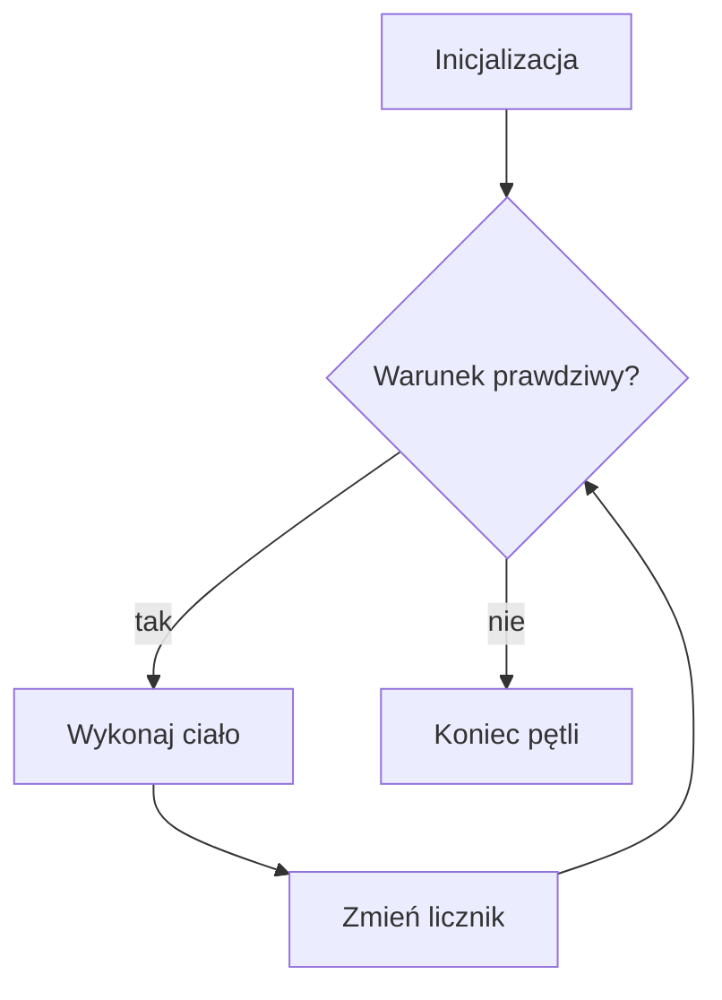

# Pętla for

## Cel lekcji

Nauczysz się używać pętli `for`, gdy sterujesz licznikiem albo znasz liczbę powtórzeń.

## Krótkie wprowadzenie do problemu

Jeżeli chcesz wykonać coś dokładnie 10 razy, `for` pozwala zapisać licznik, warunek i zmianę licznika w jednym miejscu.

## Wyjaśnienie idei

Nagłówek `for` ma trzy części: inicjalizację, warunek i zmianę. Kolejność działania to: inicjalizacja => sprawdzenie warunku => ciało pętli => zmiana licznika => ponowne sprawdzenie warunku.

## Składnia

```cpp
for (inicjalizacja; warunek; zmiana)
{
    // ciało pętli
}
```

## Diagram działania



## Przykład 1 - liczby od 1 do 10

```cpp
#include <iostream>

using namespace std;

int main()
{
    for (int i = 1; i <= 10; i++)
    {
        cout << i << "\n";
    }

    return 0;
}
```

<details markdown="1">
<summary>Pokaż wynik</summary>

```text
1
2
3
4
5
6
7
8
9
10
```

</details>

## Przykład 2 - liczby parzyste od 0 do 20

```cpp
#include <iostream>

using namespace std;

int main()
{
    for (int i = 0; i <= 20; i += 2)
    {
        cout << i << "\n";
    }

    return 0;
}
```

<details markdown="1">
<summary>Pokaż wynik</summary>

```text
0
2
4
6
8
10
12
14
16
18
20
```

</details>

## Omówienie programu krok po kroku

W pierwszym programie `i` zaczyna od `1`, rośnie o `1` i działa dopóki `i <= 10`. W drugim programie licznik rośnie o `2`, dlatego wypisywane są liczby parzyste. Do odliczania w dół używamy `i--`.

## Kiedy tego użyć?

Użyj `for`, gdy liczba powtórzeń jest znana albo naturalnie sterujesz licznikiem.

## Kiedy wybrać inną pętlę?

Gdy liczba powtórzeń zależy od danych i nie jest znana, często wygodniejszy będzie `while`.

## Ćwiczenia

### 1. Liczby od 10 do 1

Wypisz liczby od `10` do `1`.

<details markdown="1">
<summary>Pokaż oczekiwany wynik ćwiczenia 1</summary>

```text
10
9
8
7
6
5
4
3
2
1
```

</details>

<details markdown="1">
<summary>Pokaż wskazówkę do ćwiczenia 1</summary>

Użyj `i--` i warunku `i >= 1`.

</details>

<details markdown="1">
<summary>Pokaż rozwiązanie ćwiczenia 1</summary>

```cpp
#include <iostream>

using namespace std;

int main()
{
    for (int i = 10; i >= 1; i--)
    {
        cout << i << "\n";
    }

    return 0;
}
```

</details>

### 2. Parzyste od 0 do 20

Wypisz liczby parzyste od `0` do `20`.

<details markdown="1">
<summary>Pokaż oczekiwany wynik ćwiczenia 2</summary>

```text
0
2
4
6
8
10
12
14
16
18
20
```

</details>

<details markdown="1">
<summary>Pokaż wskazówkę do ćwiczenia 2</summary>

Zmieniaj licznik o `2`.

</details>

<details markdown="1">
<summary>Pokaż rozwiązanie ćwiczenia 2</summary>

```cpp
#include <iostream>

using namespace std;

int main()
{
    for (int i = 0; i <= 20; i += 2)
    {
        cout << i << "\n";
    }

    return 0;
}
```

</details>

### 3. Określona liczba powtórzeń

Wczytaj `n` i wypisz napis `C++` dokładnie `n` razy.

Dane wejściowe:

```text
3
```

<details markdown="1">
<summary>Pokaż oczekiwany wynik ćwiczenia 3</summary>

```text
C++
C++
C++
```

</details>

<details markdown="1">
<summary>Pokaż wskazówkę do ćwiczenia 3</summary>

Licznik może zaczynać od `1` i działać do `n`.

</details>

<details markdown="1">
<summary>Pokaż rozwiązanie ćwiczenia 3</summary>

```cpp
#include <iostream>

using namespace std;

int main()
{
    int n;

    cin >> n;

    for (int i = 1; i <= n; i++)
    {
        cout << "C++\n";
    }

    return 0;
}
```

</details>

## Typowe błędy

- Błąd o jeden: `i < n` zamiast `i <= n` albo odwrotnie.
- Zła zmiana licznika, która tworzy pętlę nieskończoną.
- Używanie `for`, gdy warunek zakończenia zależy od nieznanych danych.
- Mylenie `i++` i `i--`.

## Podsumowanie

`for` porządkuje inicjalizację, warunek i zmianę licznika w jednym miejscu. Jest bardzo wygodna przy znanej liczbie powtórzeń.
