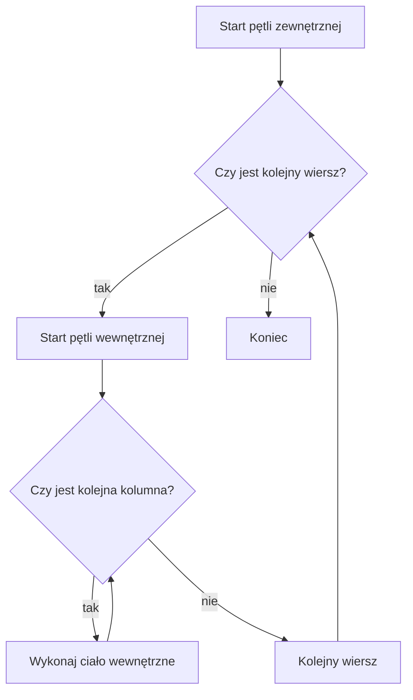

# Pętle zagnieżdżone

## Cel lekcji

Nauczysz się używać jednej pętli wewnątrz drugiej.

## Krótkie wprowadzenie do problemu

Czasem jeden wymiar powtarzania nie wystarcza. Prostokąt ma wiersze i kolumny. Tabliczka mnożenia ma pierwszy i drugi czynnik.

## Wyjaśnienie idei

Pętla zewnętrzna wybiera wiersz. Pętla wewnętrzna przechodzi przez kolumny tego wiersza. Dla każdego kroku pętli zewnętrznej pętla wewnętrzna wykonuje się od początku do końca.

## Składnia

```cpp
for (int wiersz = 1; wiersz <= 3; wiersz++)
{
    for (int kolumna = 1; kolumna <= 4; kolumna++)
    {
        cout << "*";
    }
    cout << "\n";
}
```

## Diagram działania



## Przykład 1 - prostokąt z gwiazdek

```cpp
#include <iostream>

using namespace std;

int main()
{
    for (int wiersz = 1; wiersz <= 3; wiersz++)
    {
        for (int kolumna = 1; kolumna <= 4; kolumna++)
        {
            cout << "*";
        }
        cout << "\n";
    }

    return 0;
}
```

<details markdown="1">
<summary>Pokaż wynik</summary>

```text
****
****
****
```

</details>

## Przykład 2 - pary wiersz i kolumna

```cpp
#include <iostream>

using namespace std;

int main()
{
    for (int wiersz = 1; wiersz <= 2; wiersz++)
    {
        for (int kolumna = 1; kolumna <= 3; kolumna++)
        {
            cout << "(" << wiersz << ", " << kolumna << ")\n";
        }
    }

    return 0;
}
```

<details markdown="1">
<summary>Pokaż wynik</summary>

```text
(1, 1)
(1, 2)
(1, 3)
(2, 1)
(2, 2)
(2, 3)
```

</details>

## Omówienie programu krok po kroku

W prostokącie pętla zewnętrzna tworzy kolejne wiersze. Pętla wewnętrzna wypisuje gwiazdki w jednym wierszu. Dwie pętle po `n` wykonań mogą razem wykonać ciało około `n * n` razy.

## Kiedy tego użyć?

Używaj pętli zagnieżdżonych, gdy problem ma dwa poziomy powtarzania, na przykład wiersze i kolumny.

## Kiedy wybrać inną pętlę?

Jeżeli wystarczy jedno przejście przez dane, nie dodawaj drugiej pętli. Zagnieżdżenie zwiększa liczbę wykonań.

## Ćwiczenia

### 1. Prostokąt 2 na 5

Wypisz prostokąt z `2` wierszy i `5` kolumn gwiazdek.

<details markdown="1">
<summary>Pokaż oczekiwany wynik ćwiczenia 1</summary>

```text
*****
*****
```

</details>

<details markdown="1">
<summary>Pokaż wskazówkę do ćwiczenia 1</summary>

Zewnętrzna pętla odpowiada za wiersze, wewnętrzna za kolumny.

</details>

<details markdown="1">
<summary>Pokaż rozwiązanie ćwiczenia 1</summary>

```cpp
#include <iostream>

using namespace std;

int main()
{
    for (int wiersz = 1; wiersz <= 2; wiersz++)
    {
        for (int kolumna = 1; kolumna <= 5; kolumna++)
        {
            cout << "*";
        }
        cout << "\n";
    }

    return 0;
}
```

</details>

### 2. Tabliczka mnożenia 3 na 3

Wypisz wyniki mnożenia dla liczb od `1` do `3`.

<details markdown="1">
<summary>Pokaż oczekiwany wynik ćwiczenia 2</summary>

```text
1 2 3
2 4 6
3 6 9
```

</details>

<details markdown="1">
<summary>Pokaż wskazówkę do ćwiczenia 2</summary>

Wynik to `wiersz * kolumna`.

</details>

<details markdown="1">
<summary>Pokaż rozwiązanie ćwiczenia 2</summary>

```cpp
#include <iostream>

using namespace std;

int main()
{
    for (int wiersz = 1; wiersz <= 3; wiersz++)
    {
        for (int kolumna = 1; kolumna <= 3; kolumna++)
        {
            cout << wiersz * kolumna << " ";
        }
        cout << "\n";
    }

    return 0;
}
```

</details>

### 3. Pary liczb

Wypisz pary `(wiersz, kolumna)` dla dwóch wierszy i dwóch kolumn.

<details markdown="1">
<summary>Pokaż oczekiwany wynik ćwiczenia 3</summary>

```text
(1, 1)
(1, 2)
(2, 1)
(2, 2)
```

</details>

<details markdown="1">
<summary>Pokaż wskazówkę do ćwiczenia 3</summary>

Wypisuj parę wewnątrz pętli wewnętrznej.

</details>

<details markdown="1">
<summary>Pokaż rozwiązanie ćwiczenia 3</summary>

```cpp
#include <iostream>

using namespace std;

int main()
{
    for (int wiersz = 1; wiersz <= 2; wiersz++)
    {
        for (int kolumna = 1; kolumna <= 2; kolumna++)
        {
            cout << "(" << wiersz << ", " << kolumna << ")\n";
        }
    }

    return 0;
}
```

</details>

## Typowe błędy

- Mylenie pętli zewnętrznej z wewnętrzną.
- Brak wcięć.
- Zbyt duża liczba wykonań przy dużych zakresach.
- Wypisanie nowej linii w złym miejscu.

## Podsumowanie

Pętla zagnieżdżona oznacza pętlę w pętli. Dla każdego kroku zewnętrznego wewnętrzna wykonuje się w całości.
