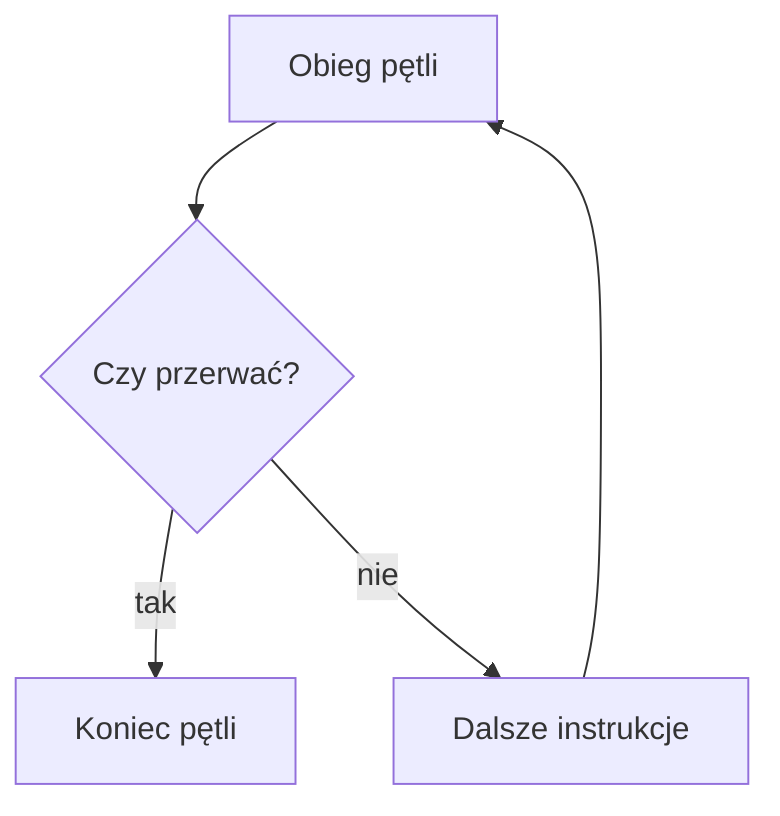
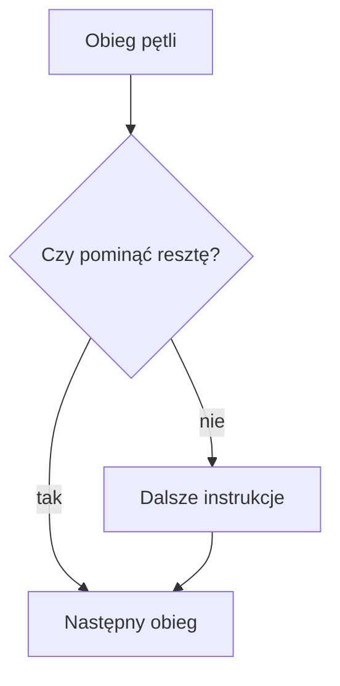

# break i continue

## Cel lekcji

Nauczysz się świadomie przerywać pętlę instrukcją `break` i pomijać bieżący obieg instrukcją `continue`.

## Krótkie wprowadzenie do problemu

Czasem pętla powinna zakończyć się natychmiast po znalezieniu wyniku. Czasem jeden obieg pętli trzeba pominąć, ale sama pętla ma działać dalej.

## Wyjaśnienie idei

`break` kończy najbliższą pętlę. `continue` pomija resztę bieżącego obiegu i wraca do kolejnego sprawdzenia pętli albo zmiany licznika w `for`. Te instrukcje mogą skrócić kod, ale nadużywane pogarszają czytelność.

## Składnia

```cpp
if (warunek)
{
    break;
}

if (innyWarunek)
{
    continue;
}
```

## Diagram break



## Diagram continue



## Przykład 1 - zakończenie po wartości kończącej

```cpp
#include <iostream>

using namespace std;

int main()
{
    while (true)
    {
        int liczba;
        cin >> liczba;

        if (liczba == 0)
        {
            break;
        }

        cout << liczba << "\n";
    }

    cout << "Koniec\n";

    return 0;
}
```

<details markdown="1">
<summary>Pokaż wynik</summary>

```text
4
2
Koniec
```

</details>

## Przykład 2 - pomijanie liczb podzielnych przez 3

```cpp
#include <iostream>

using namespace std;

int main()
{
    for (int i = 1; i <= 8; i++)
    {
        if (i % 3 == 0)
        {
            continue;
        }

        cout << i << "\n";
    }

    return 0;
}
```

<details markdown="1">
<summary>Pokaż wynik</summary>

```text
1
2
4
5
7
8
```

</details>

## Omówienie programu krok po kroku

Pierwszy program kończy pętlę po wczytaniu `0`. Drugi program pomija wypisanie liczby podzielnej przez `3`, ale pętla działa dalej. W pętli zagnieżdżonej `break` kończy tylko najbliższą pętlę.

## Kiedy tego użyć?

Użyj `break`, gdy dalsze powtarzanie nie ma sensu. Użyj `continue`, gdy chcesz pominąć tylko jeden obieg.

## Kiedy wybrać inną pętlę?

Jeżeli warunek pętli można zapisać prosto bez `break`, często taki zapis jest czytelniejszy.

## Ćwiczenia

### 1. Pierwsza liczba większa od 10

Wczytuj liczby do momentu znalezienia pierwszej większej od `10`.

Dane wejściowe:

```text
3
7
12
5
```

<details markdown="1">
<summary>Pokaż oczekiwany wynik ćwiczenia 1</summary>

```text
Pierwsza wieksza od 10: 12
```

</details>

<details markdown="1">
<summary>Pokaż wskazówkę do ćwiczenia 1</summary>

Po znalezieniu liczby wypisz ją i użyj `break`.

</details>

<details markdown="1">
<summary>Pokaż rozwiązanie ćwiczenia 1</summary>

```cpp
#include <iostream>

using namespace std;

int main()
{
    while (true)
    {
        int liczba;
        cin >> liczba;

        if (liczba > 10)
        {
            cout << "Pierwsza wieksza od 10: " << liczba << "\n";
            break;
        }
    }

    return 0;
}
```

</details>

### 2. Pomijanie parzystych

Wypisz liczby od `1` do `7`, ale pomiń parzyste.

<details markdown="1">
<summary>Pokaż oczekiwany wynik ćwiczenia 2</summary>

```text
1
3
5
7
```

</details>

<details markdown="1">
<summary>Pokaż wskazówkę do ćwiczenia 2</summary>

Jeżeli liczba jest parzysta, użyj `continue`.

</details>

<details markdown="1">
<summary>Pokaż rozwiązanie ćwiczenia 2</summary>

```cpp
#include <iostream>

using namespace std;

int main()
{
    for (int i = 1; i <= 7; i++)
    {
        if (i % 2 == 0)
        {
            continue;
        }

        cout << i << "\n";
    }

    return 0;
}
```

</details>

### 3. break w pętli zagnieżdżonej

Pokaż, że `break` kończy tylko pętlę wewnętrzną.

<details markdown="1">
<summary>Pokaż oczekiwany wynik ćwiczenia 3</summary>

```text
Wiersz 1, kolumna 1
Wiersz 2, kolumna 1
```

</details>

<details markdown="1">
<summary>Pokaż wskazówkę do ćwiczenia 3</summary>

W pętli wewnętrznej przerwij działanie, gdy kolumna jest równa `2`.

</details>

<details markdown="1">
<summary>Pokaż rozwiązanie ćwiczenia 3</summary>

```cpp
#include <iostream>

using namespace std;

int main()
{
    for (int wiersz = 1; wiersz <= 2; wiersz++)
    {
        for (int kolumna = 1; kolumna <= 3; kolumna++)
        {
            if (kolumna == 2)
            {
                break;
            }

            cout << "Wiersz " << wiersz << ", kolumna " << kolumna << "\n";
        }
    }

    return 0;
}
```

</details>

## Typowe błędy

- Myślenie, że `break` kończy wszystkie zagnieżdżone pętle.
- Myślenie, że `continue` kończy pętlę.
- Nadużywanie `break` i `continue`.
- W `while` pominięcie aktualizacji przez `continue`.

## Podsumowanie

`break` kończy najbliższą pętlę. `continue` pomija resztę bieżącego obiegu. Obie instrukcje są użyteczne, ale wymagają umiaru.
