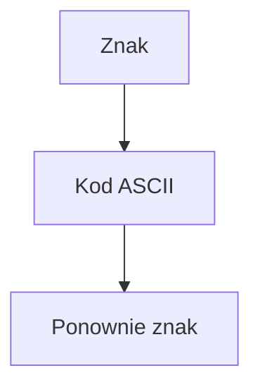

# Kody ASCII i konwersje

## Cel lekcji

Nauczysz się zamieniać znak na kod liczbowy i kod liczbowy na znak.

## Krótkie wprowadzenie do problemu

Dla człowieka `A` jest literą. Dla komputera znak jest zapamiętany jako wartość liczbowa. Dzięki temu można znaki porównywać, przesuwać i zamieniać cyfry zapisane jako znaki na liczby.

## Wyjaśnienie idei metodą Feynmana

ASCII to tabela numerów dla podstawowych znaków. Obejmuje wartości od `0` do `127`. Pierwsze wartości są znakami sterującymi, a znaki widoczne mają własne kody.

Nie trzeba pamiętać całej tabeli. Ważne jest rozumienie ciągłości zakresów.

| Zakres znaków | Zakres kodów |
|---|---|
| `'0'`-`'9'` | `48`-`57` |
| `'A'`-`'Z'` | `65`-`90` |
| `'a'`-`'z'` | `97`-`122` |
| spacja | `32` |

Standard C++ nie wymaga wszędzie identycznego kodowania wszystkich znaków. Typowe środowiska używane w kursie są jednak zgodne z ASCII dla podstawowych liter i cyfr.

## Składnia

```cpp
char znak = 'A';
int kod = (int)znak;

int innyKod = 66;
char innyZnak = (char)innyKod;
```

`(int)znak` oznacza: pokaż kod znaku. `(char)kod` oznacza: potraktuj liczbę jak kod znaku.

## Diagram zależności



## Przykład 1 - znak na kod

```cpp
#include <iostream>

using namespace std;

int main()
{
    char znak = 'A';
    int kod = (int)znak;

    cout << "Znak: " << znak << "\n";
    cout << "Kod: " << kod << "\n";

    return 0;
}
```

<details markdown="1">
<summary>Pokaż wynik</summary>

```text
Znak: A
Kod: 65
```

</details>

## Przykład 2 - kod na znak i znak cyfry

```cpp
#include <iostream>

using namespace std;

int main()
{
    int kod = 66;
    char znak = (char)kod;

    char znakCyfry = '7';
    int cyfra = znakCyfry - '0';

    cout << "Znak o kodzie 66: " << znak << "\n";
    cout << "Cyfra jako liczba: " << cyfra << "\n";

    return 0;
}
```

<details markdown="1">
<summary>Pokaż wynik</summary>

```text
Znak o kodzie 66: B
Cyfra jako liczba: 7
```

</details>

## Omówienie najważniejszego przykładu krok po kroku

`kod` ma wartość `66`. Po konwersji `(char)kod` otrzymujemy znak `B`. `znakCyfry` przechowuje znak `'7'`, a nie liczbę `7`. Wyrażenie `znakCyfry - '0'` działa, bo cyfry w ASCII leżą obok siebie.

Zamiana liczby od `0` do `9` na znak działa odwrotnie:

```cpp
int cyfra = 5;
char znak = (char)('0' + cyfra);
```

## Dlaczego polskie litery wymagają ostrożności?

ASCII nie zawiera liter takich jak `ą`, `ę`, `ł`, `ń`, `ó`, `ś`, `ź`, `ż`. Napis zapisany w UTF-8 może przechowywać polską literę jako więcej niż jeden bajt. Zwykły `char` nie musi reprezentować całej polskiej litery. `tekst.length()` może liczyć bajty, a nie znaki widziane przez człowieka.

Proste algorytmy ASCII w tym rozdziale działają na podstawowych literach alfabetu łacińskiego, na przykład `A`-`Z` i `a`-`z`.

## Kiedy tego użyć?

Użyj kodów znaków, gdy chcesz sprawdzić zakres znaków, zamienić znak cyfry na liczbę albo wykonać prosty algorytm tekstowy.

## Kiedy wybrać coś innego?

Jeżeli program ma obsługiwać pełne Unicode i wiele języków, zwykły `char` i proste ASCII nie wystarczą.

## Ćwiczenia

### 1. Kod podanego znaku

Wczytaj znak i wypisz jego kod liczbowy.

<details markdown="1">
<summary>Pokaż wskazówkę do ćwiczenia 1</summary>

Wczytaj `char`, a potem wypisz `(int)znak`.

</details>

<details markdown="1">
<summary>Pokaż rozwiązanie ćwiczenia 1</summary>

```cpp
#include <iostream>

using namespace std;

int main()
{
    char znak;

    cin >> znak;

    cout << "Kod znaku: " << (int)znak << "\n";

    return 0;
}
```

</details>

### 2. Znak o podanym kodzie

Wczytaj liczbę całkowitą i wypisz znak o takim kodzie.

<details markdown="1">
<summary>Pokaż wskazówkę do ćwiczenia 2</summary>

Wczytaj `int kod`, a potem wypisz `(char)kod`.

</details>

<details markdown="1">
<summary>Pokaż rozwiązanie ćwiczenia 2</summary>

```cpp
#include <iostream>

using namespace std;

int main()
{
    int kod;

    cin >> kod;

    cout << "Znak: " << (char)kod << "\n";

    return 0;
}
```

</details>

### 3. Cyfra jako liczba

Wczytaj znak cyfry i wypisz odpowiadającą mu liczbę.

<details markdown="1">
<summary>Pokaż wskazówkę do ćwiczenia 3</summary>

Od znaku odejmij znak `'0'`.

</details>

<details markdown="1">
<summary>Pokaż rozwiązanie ćwiczenia 3</summary>

```cpp
#include <iostream>

using namespace std;

int main()
{
    char znakCyfry;
    int cyfra;

    cin >> znakCyfry;

    cyfra = znakCyfry - '0';

    cout << "Liczba: " << cyfra << "\n";

    return 0;
}
```

</details>

## Typowe błędy

- Mylenie znaku `'7'` z liczbą `7`.
- Zapamiętywanie kodów bez rozumienia ciągłości zakresów.
- Mylenie prostego zapisu konwersji `(int)` i `(char)`.
- Zakładanie, że polskie litery działają tak samo jak ASCII.
- Myślenie, że `tekst.length()` zawsze liczy znaki widziane przez człowieka.

## Podsumowanie

Znak można potraktować jak liczbę. Dzięki temu można sprawdzać zakresy, zamieniać znaki na kody i budować proste algorytmy tekstowe.