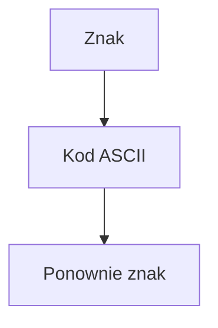

# Kody ASCII i konwersje

## Cel lekcji

Nauczysz się zamieniać znak na kod liczbowy i kod liczbowy na znak.

## Krótkie wprowadzenie do problemu

Dla człowieka `A` jest literą. Dla komputera znak jest zapamiętany jako wartość liczbowa. Dzięki temu można znaki porównywać, przesuwać i zamieniać cyfry zapisane jako znaki na liczby.

## Wyjaśnienie idei

ASCII to tabela numerów dla podstawowych znaków. Standardowy ASCII obejmuje kody od `0` do `127`. Nie każdy kod odpowiada znakowi widocznemu na ekranie. Kody `0`-`31` oraz `127` oznaczają znaki sterujące. Znaki sterujące zwykle nie są widoczne jako normalne znaki na ekranie. Typowe znaki drukowalne mają kody `32`–`126`; spacja (32) nie ma widocznego kształtu. Sama konwersja liczby na `char` nie gwarantuje czytelnego znaku.

Nie trzeba pamiętać całej tabeli. Ważne jest rozumienie ciągłości zakresów.

| Zakres znaków | Zakres kodów |
|---|---|
| `'0'`-`'9'` | `48`-`57` |
| `'A'`-`'Z'` | `65`-`90` |
| `'a'`-`'z'` | `97`-`122` |
| spacja | `32` |

Standard C++ nie wymaga wszędzie identycznego kodowania wszystkich znaków. Typowe środowiska używane w kursie są jednak zgodne z ASCII dla podstawowych liter i cyfr.

## Składnia

```cpp
char znak = 'A';
int kod = (int)znak;

int innyKod = 66;
char innyZnak = (char)innyKod;
```

`(int)znak` oznacza: pokaż kod znaku. `(char)kod` oznacza: potraktuj liczbę jak kod znaku.

## Diagram zależności


```mermaid
flowchart TD
    A[Znak] --> B[Kod ASCII]
    B --> C[Ponownie znak]
```

## Przykład 1 - znak na kod

```cpp
#include <iostream>

using namespace std;

int main()
{
    char znak = 'A';
    int kod = (int)znak;

    cout << "Znak: " << znak << "\n";
    cout << "Kod: " << kod << "\n";

    return 0;
}
```

<details markdown="1">
<summary>Pokaż wynik</summary>

```text
Znak: A
Kod: 65
```

</details>

## Przykład 2 - kod na znak i znak cyfry

```cpp
#include <iostream>

using namespace std;

int main()
{
    int kod = 66;
    char znak = (char)kod;

    char znakCyfry = '7';
    int cyfra = znakCyfry - '0';

    cout << "Znak o kodzie 66: " << znak << "\n";
    cout << "Cyfra jako liczba: " << cyfra << "\n";

    return 0;
}
```

<details markdown="1">
<summary>Pokaż wynik</summary>

```text
Znak o kodzie 66: B
Cyfra jako liczba: 7
```

</details>

## Omówienie najważniejszego przykładu krok po kroku

`kod` ma wartość `66`. Po konwersji `(char)kod` otrzymujemy znak `B`. `znakCyfry` przechowuje znak `'7'`, a nie liczbę `7`. Wyrażenie `znakCyfry - '0'` działa, bo cyfry w ASCII leżą obok siebie.

Zamiana liczby od `0` do `9` na znak działa odwrotnie:

```cpp
int cyfra = 5;
char znak = (char)('0' + cyfra);
```

## Dlaczego polskie litery wymagają ostrożności?

ASCII nie zawiera liter takich jak `ą`, `ę`, `ł`, `ń`, `ó`, `ś`, `ź`, `ż`. Napis zapisany w UTF-8 może przechowywać polską literę jako więcej niż jeden bajt. Zwykły `char` nie musi reprezentować całej polskiej litery. `tekst.length()` może liczyć bajty, a nie znaki widziane przez człowieka.

Proste algorytmy ASCII w tym rozdziale działają na podstawowych literach alfabetu łacińskiego, na przykład `A`-`Z` i `a`-`z`.

## Kiedy tego użyć?

Użyj kodów znaków, gdy chcesz sprawdzić zakres znaków, zamienić znak cyfry na liczbę albo wykonać prosty algorytm tekstowy.

## Kiedy wybrać coś innego?

Jeżeli program ma obsługiwać pełne Unicode i wiele języków, zwykły `char` i proste ASCII nie wystarczą.

## Ćwiczenia

Dane wejściowe mają opisany format. Jeśli polecenie nie wymaga odrzucenia wartości spoza zakresu, przyjmij, że spełniają podane ograniczenia. W wynikach wypisujących listy dodatkowa spacja na końcu wiersza nie ma znaczenia.

### Ćwiczenie 1. Znak, kod i cyfra

Bez uruchamiania przewidź trzy wypisane liczby. Wyjaśnij, dlaczego pierwsza i druga są różne.

```cpp
char znak = '7';
cout << (int)znak << "\n";
cout << znak - '0' << "\n";
cout << (int)'A' << "\n";
```

<details markdown="1">
<summary>Pokaż wskazówkę do ćwiczenia 1</summary>

Odróżnij numer znaku w tabeli od wartości cyfry zapisanej tym znakiem.

</details>

<details markdown="1">
<summary>Pokaż rozwiązanie ćwiczenia 1</summary>

Wynik:

```text
55
7
65
```

Kod znaku `7` to 55. Odejmowanie kodu `0`, czyli 48, daje wartość cyfry: 7. Kod wielkiej litery `A` to 65.

</details>

### Ćwiczenie 2. Bezpieczny podgląd kodu

Napisz program, który wczyta liczbę całkowitą. Dla kodu spoza `0–127` wypisz `Kod poza ASCII.`. Dla kodów `0–31` oraz `127` wypisz `Znak sterujący.`. Dla pozostałych kodów wypisz `Znak: ` i odpowiadający znak. Spacja (kod 32) jest drukowalna, ale nie ma widocznego kształtu. Konwersję wykonaj dopiero po sprawdzeniu kodu.

<details markdown="1">
<summary>Pokaż wskazówkę do ćwiczenia 2</summary>

Najpierw odrzuć liczbę spoza tabeli. Potem rozdziel kody sterujące i drukowalne.

</details>

<details markdown="1">
<summary>Pokaż rozwiązanie ćwiczenia 2</summary>

```cpp
#include <iostream>

using namespace std;

int main()
{
    int kod;
    cin >> kod;
    if (kod < 0 || kod > 127)
    {
        cout << "Kod poza ASCII.\n";
    }
    else if (kod < 32 || kod == 127)
    {
        cout << "Znak sterujący.\n";
    }
    else
    {
        cout << "Znak: " << (char)kod << "\n";
    }
    return 0;
}
```

</details>

<details markdown="1">
<summary>Pokaż przykładowe dane i wynik do ćwiczenia 2</summary>

Dane wejściowe:

```text
65
```

Wynik:

```text
Znak: A
```

Dane wejściowe:

```text
10
```

Wynik:

```text
Znak sterujący.
```

Dane wejściowe:

```text
200
```

Wynik:

```text
Kod poza ASCII.
```

</details>

### Ćwiczenie 3. Napraw konwersję cyfry

Program ma zamieniać pojedynczy znak cyfry na liczbę, lecz dla `A` też wypisuje liczbę:

```cpp
char znak;
cin >> znak;
cout << znak - '0' << "\n";
```

Wyjaśnij błąd i napisz poprawiony, kompletny program. Wczytaj jeden znak bez spacji. Dla cyfry wypisz jej wartość liczbową, a w przeciwnym razie `To nie cyfra.`.

<details markdown="1">
<summary>Pokaż wskazówkę do ćwiczenia 3</summary>

Odejmowanie kodów ma sens dla cyfr dopiero po sprawdzeniu, do jakiego zakresu należy znak.

</details>

<details markdown="1">
<summary>Pokaż rozwiązanie ćwiczenia 3</summary>

Samo odejmowanie nie rozpoznaje cyfry. Dla `A` błędny fragment wypisuje 17, czyli różnicę kodów 65 i 48.

```cpp
#include <iostream>

using namespace std;

int main()
{
    char znak;
    cin >> znak;
    if (znak >= '0' && znak <= '9')
    {
        cout << znak - '0' << "\n";
    }
    else
    {
        cout << "To nie cyfra.\n";
    }
    return 0;
}
```

</details>

<details markdown="1">
<summary>Pokaż przykładowe dane i wynik do ćwiczenia 3</summary>

Dane wejściowe:

```text
7
```

Wynik:

```text
7
```

Dane wejściowe:

```text
A
```

Wynik:

```text
To nie cyfra.
```

Dane wejściowe:

```text
0
```

Wynik:

```text
0
```

</details>

### Ćwiczenie 4. Klasyfikator znaku — ćwiczenie trudniejsze

Program kontroluje znaki wpisywane do prostego identyfikatora. Wczytaj jeden znak drukowalny ASCII bez spacji. Wypisz jedną kategorię: `Cyfra`, `Wielka litera`, `Mała litera` albo `Inny znak`. Nie obsługuj tu polskich liter ani całych napisów. Samodzielnie dobierz testy sprawdzające końce zakresów i znak leżący między zakresami.

<details markdown="1">
<summary>Pokaż wskazówkę do ćwiczenia 4</summary>

Przygotuj osobne przedziały dla cyfr i obu rodzajów liter. Pozostałe znaki nie należą do żadnego z tych przedziałów.

</details>

<details markdown="1">
<summary>Pokaż rozwiązanie ćwiczenia 4</summary>

```cpp
#include <iostream>

using namespace std;

int main()
{
    char znak;
    cin >> znak;
    if (znak >= '0' && znak <= '9')
    {
        cout << "Cyfra\n";
    }
    else if (znak >= 'A' && znak <= 'Z')
    {
        cout << "Wielka litera\n";
    }
    else if (znak >= 'a' && znak <= 'z')
    {
        cout << "Mała litera\n";
    }
    else
    {
        cout << "Inny znak\n";
    }
    return 0;
}
```

</details>

<details markdown="1">
<summary>Pokaż przykładowe dane i wynik do ćwiczenia 4</summary>

Dane wejściowe:

```text
A
```

Wynik:

```text
Wielka litera
```

Dane wejściowe:

```text
z
```

Wynik:

```text
Mała litera
```

Dane wejściowe:

```text
9
```

Wynik:

```text
Cyfra
```

</details>

## Typowe błędy

- Mylenie znaku `'7'` z liczbą `7`.
- Zapamiętywanie kodów bez rozumienia ciągłości zakresów.
- Mylenie prostego zapisu konwersji `(int)` i `(char)`.
- Zakładanie, że polskie litery działają tak samo jak ASCII.
- Myślenie, że `tekst.length()` zawsze liczy znaki widziane przez człowieka.

## Podsumowanie

Znak można potraktować jak liczbę. Dzięki temu można sprawdzać zakresy, zamieniać znaki na kody i budować proste algorytmy tekstowe.
