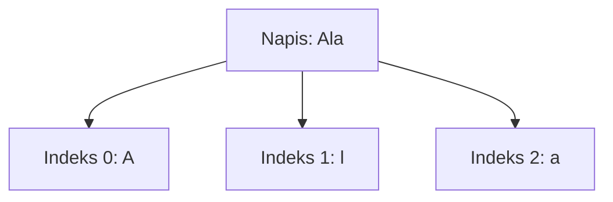

# Indeksy i długość napisu

## Cel lekcji

Nauczysz się pobierać znaki z napisu przez indeks oraz bezpiecznie sprawdzać długość napisu.

## Krótkie wprowadzenie do problemu

Napis składa się z kolejnych znaków. Każdy znak ma swoje miejsce. W C++ pierwsze miejsce ma indeks `0`, a nie `1`.

## Wyjaśnienie idei

Indeks to numer miejsca znaku w napisie. Dla napisu `Ala`:

- `tekst[0]` => `A`,
- `tekst[1]` => `l`,
- `tekst[2]` => `a`.

Długość napisu `Ala` wynosi `3`, ale ostatni indeks to `2`.

## Składnia

```cpp
int dlugosc = (int)tekst.length();
char pierwszyZnak = tekst[0];
char ostatniZnak = tekst[tekst.length() - 1];
```

`length()` i `size()` dla typu `string` dają w praktyce tę samą informację: długość napisu. Przed pobraniem ostatniego znaku trzeba sprawdzić, czy napis nie jest pusty.

## Diagram indeksów



## Przykład 1 - pierwszy i ostatni znak

```cpp
#include <iostream>
#include <string>

using namespace std;

int main()
{
    string tekst;

    cout << "Podaj tekst: ";
    getline(cin >> ws, tekst);

    if (tekst.length() > 0)
    {
        cout << "Dlugosc: " << tekst.length() << "\n";
        cout << "Pierwszy znak: " << tekst[0] << "\n";
        cout << "Ostatni znak: " << tekst[tekst.length() - 1] << "\n";
    }
    else
    {
        cout << "Napis jest pusty.\n";
    }

    return 0;
}
```

<details markdown="1">
<summary>Pokaż przykładowe dane i wynik</summary>

Dane wejściowe:

```text
Ala
```

Wynik:

```text
Podaj tekst: Dlugosc: 3
Pierwszy znak: A
Ostatni znak: a
```

</details>

## Przykład 2 - `length()` i `size()`

```cpp
#include <iostream>
#include <string>

using namespace std;

int main()
{
    string tekst = "program";

    cout << "length: " << tekst.length() << "\n";
    cout << "size: " << tekst.size() << "\n";
    cout << "Znak o indeksie 2: " << tekst[2] << "\n";

    return 0;
}
```

<details markdown="1">
<summary>Pokaż wynik</summary>

```text
length: 7
size: 7
Znak o indeksie 2: o
```

</details>

## Omówienie najważniejszego przykładu krok po kroku

Program wczytuje cały wiersz do zmiennej `tekst`. Potem sprawdza, czy długość jest większa od zera. Dopiero wtedy pobiera pierwszy i ostatni znak. To ważne, bo w pustym napisie nie ma ani pierwszego, ani ostatniego znaku.

Ostatni poprawny indeks to `tekst.length() - 1`.

## Kiedy tego użyć?

Użyj indeksów, gdy potrzebujesz konkretnego znaku z napisu, na przykład pierwszej litery, ostatniego znaku albo znaku na wybranej pozycji.

## Kiedy wybrać coś innego?

Jeżeli chcesz tylko odczytać wszystkie znaki po kolei, możesz użyć pętli zakresowej. Jeżeli chcesz kontrolować pozycję albo zmieniać napis, indeksy są wygodniejsze. Istnieje też metoda `at()`, ale w tym rozdziale ćwiczymy zwykłe indeksowanie.

## Ćwiczenia

### 1. Długość napisu

Wczytaj napis i wypisz jego długość.

<details markdown="1">
<summary>Pokaż wskazówkę do ćwiczenia 1</summary>

Użyj `getline` oraz `tekst.length()`.

</details>

<details markdown="1">
<summary>Pokaż rozwiązanie ćwiczenia 1</summary>

```cpp
#include <iostream>
#include <string>

using namespace std;

int main()
{
    string tekst;

    getline(cin >> ws, tekst);

    cout << "Dlugosc: " << tekst.length() << "\n";

    return 0;
}
```

</details>

### 2. Pierwszy znak

Wczytaj napis. Jeśli nie jest pusty, wypisz pierwszy znak.

<details markdown="1">
<summary>Pokaż wskazówkę do ćwiczenia 2</summary>

Najpierw sprawdź `tekst.length() > 0`.

</details>

<details markdown="1">
<summary>Pokaż rozwiązanie ćwiczenia 2</summary>

```cpp
#include <iostream>
#include <string>

using namespace std;

int main()
{
    string tekst;

    getline(cin >> ws, tekst);

    if (tekst.length() > 0)
    {
        cout << "Pierwszy znak: " << tekst[0] << "\n";
    }
    else
    {
        cout << "Napis jest pusty.\n";
    }

    return 0;
}
```

</details>

### 3. Ostatni znak

Wczytaj napis. Jeśli nie jest pusty, wypisz ostatni znak.

<details markdown="1">
<summary>Pokaż wskazówkę do ćwiczenia 3</summary>

Ostatni indeks to `tekst.length() - 1`.

</details>

<details markdown="1">
<summary>Pokaż rozwiązanie ćwiczenia 3</summary>

```cpp
#include <iostream>
#include <string>

using namespace std;

int main()
{
    string tekst;

    getline(cin >> ws, tekst);

    if (tekst.length() > 0)
    {
        cout << "Ostatni znak: " << tekst[tekst.length() - 1] << "\n";
    }
    else
    {
        cout << "Napis jest pusty.\n";
    }

    return 0;
}
```

</details>

## Typowe błędy

- Myślenie, że pierwszy indeks to `1`.
- Pobieranie `tekst[tekst.length()]`, czyli miejsca za końcem napisu.
- Pobieranie ostatniego znaku z pustego napisu.
- Mylenie długości napisu z ostatnim indeksem.
- Zapominanie, że `length()` przy UTF-8 może liczyć bajty.

## Podsumowanie

Indeks pozwala pobrać znak z konkretnego miejsca. Pierwszy indeks to `0`, a ostatni poprawny indeks to długość napisu minus `1`.