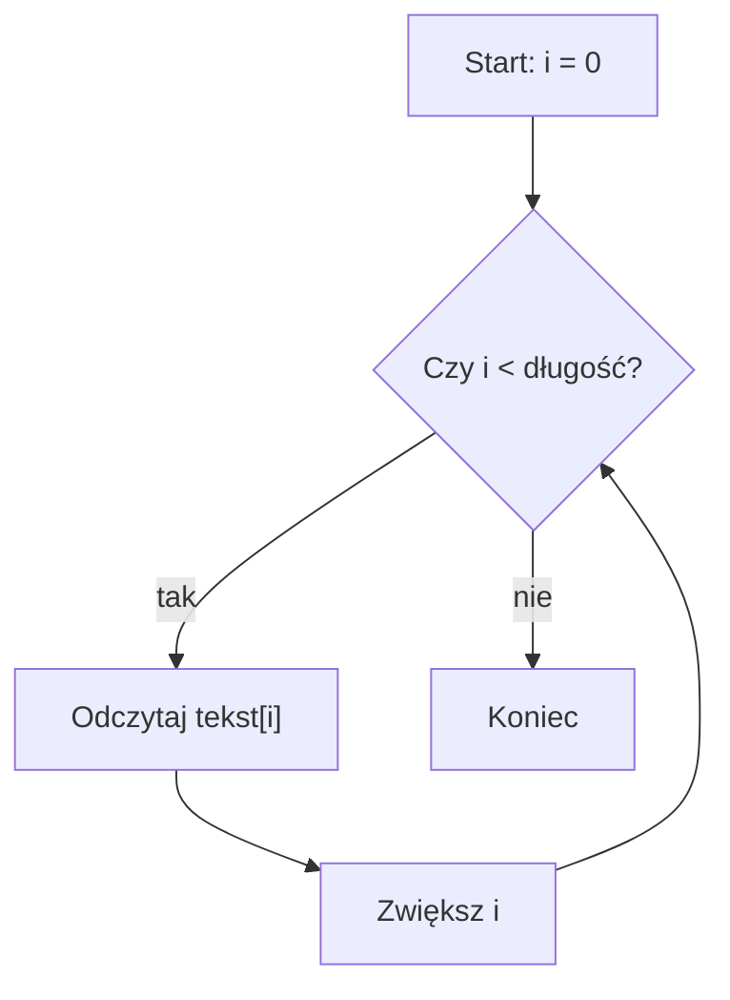

# Przechodzenie i zmienianie napisu

## Cel lekcji

Nauczysz się przechodzić po znakach napisu, liczyć wybrane znaki i zmieniać napis przez indeksy.

## Krótkie wprowadzenie do problemu

Gdy napis ma wiele znaków, często trzeba sprawdzić każdy znak po kolei. Możemy policzyć cyfry, spacje, znaleźć wybraną literę albo zamienić jeden znak na inny.

## Wyjaśnienie idei

Pętla zakresowa jest wygodna, gdy tylko odczytujemy znaki. Pętla indeksowa jest potrzebna, gdy korzystamy z pozycji znaku albo zmieniamy napis.

Zapis `char znak` w pętli zakresowej tworzy kopię znaku. Jeśli zmienisz tę kopię, oryginalny napis się nie zmieni. Referencje będą omówione później, więc tutaj do zmian używamy indeksów.

## Składnia

```cpp
for (char znak : tekst)
{
    cout << znak << "\n";
}
```

```cpp
for (int i = 0; i < (int)tekst.length(); i++)
{
    tekst[i] = '*';
}
```

## Diagram przechodzenia po napisie



## Przykład 1 - liczenie cyfr i spacji

```cpp
#include <iostream>
#include <string>

using namespace std;

int main()
{
    string tekst;
    int liczbaCyfr = 0;
    int liczbaSpacji = 0;

    cout << "Podaj tekst: ";
    getline(cin >> ws, tekst);

    for (char znak : tekst)
    {
        if ((znak >= '0') && (znak <= '9'))
        {
            liczbaCyfr++;
        }
        else if (znak == ' ')
        {
            liczbaSpacji++;
        }
    }

    cout << "Cyfry: " << liczbaCyfr << "\n";
    cout << "Spacje: " << liczbaSpacji << "\n";

    return 0;
}
```

<details markdown="1">
<summary>Pokaż przykładowe dane i wynik</summary>

Dane wejściowe:

```text
Ala ma 2 koty i 1 psa
```

Wynik:

```text
Podaj tekst: Cyfry: 2
Spacje: 6
```

</details>

## Przykład 2 - zamiana znaków i odwracanie napisu

```cpp
#include <iostream>
#include <string>

using namespace std;

int main()
{
    string tekst = "mama";

    for (int i = 0; i < (int)tekst.length(); i++)
    {
        if (tekst[i] == 'a')
        {
            tekst[i] = 'o';
        }
    }

    int lewy = 0;
    int prawy = (int)tekst.length() - 1;

    while (lewy < prawy)
    {
        char pomocniczy = tekst[lewy];
        tekst[lewy] = tekst[prawy];
        tekst[prawy] = pomocniczy;

        lewy++;
        prawy--;
    }

    cout << tekst << "\n";

    return 0;
}
```

<details markdown="1">
<summary>Pokaż wynik</summary>

```text
omom
```

</details>

## Omówienie najważniejszego przykładu krok po kroku

Najpierw program przechodzi po napisie przez indeksy. Gdy znajdzie znak `a`, zamienia go na `o`. Potem ustawia dwa indeksy: jeden na początku, drugi na końcu. Zamienia znaki miejscami i przesuwa indeksy do środka. Dzięki temu odwraca napis bez używania gotowego `reverse`.

## Kiedy tego użyć?

Użyj pętli zakresowej, gdy tylko oglądasz kolejne znaki. Użyj pętli indeksowej, gdy potrzebujesz numeru pozycji albo chcesz zmienić znak w napisie.

## Kiedy wybrać coś innego?

Gdy później poznasz referencje, będzie można zmieniać znaki także pętlą zakresową z referencją. Gdy poznasz gotowe algorytmy, odwracanie będzie można zapisać krócej. Tutaj ćwiczymy mechanizm ręcznie.

## Ćwiczenia

### 1. Liczenie liter `a`

Wczytaj napis i policz, ile razy występuje w nim litera `a`.

<details markdown="1">
<summary>Pokaż wskazówkę do ćwiczenia 1</summary>

Przejdź po napisie pętlą zakresową i zwiększ licznik, gdy `znak == 'a'`.

</details>

<details markdown="1">
<summary>Pokaż rozwiązanie ćwiczenia 1</summary>

```cpp
#include <iostream>
#include <string>

using namespace std;

int main()
{
    string tekst;
    int licznik = 0;

    getline(cin >> ws, tekst);

    for (char znak : tekst)
    {
        if (znak == 'a')
        {
            licznik++;
        }
    }

    cout << "Liczba liter a: " << licznik << "\n";

    return 0;
}
```

</details>

### 2. Zamiana spacji na podkreślenia

Wczytaj napis i zamień każdą spację na znak `_`.

<details markdown="1">
<summary>Pokaż wskazówkę do ćwiczenia 2</summary>

Użyj pętli indeksowej, bo zmieniasz znaki w napisie.

</details>

<details markdown="1">
<summary>Pokaż rozwiązanie ćwiczenia 2</summary>

```cpp
#include <iostream>
#include <string>

using namespace std;

int main()
{
    string tekst;

    getline(cin >> ws, tekst);

    for (int i = 0; i < (int)tekst.length(); i++)
    {
        if (tekst[i] == ' ')
        {
            tekst[i] = '_';
        }
    }

    cout << tekst << "\n";

    return 0;
}
```

</details>

### 3. Odwrócenie napisu

Wczytaj napis i wypisz go odwrócony.

<details markdown="1">
<summary>Pokaż wskazówkę do ćwiczenia 3</summary>

Zamieniaj znaki z początku i końca napisu, aż indeksy się spotkają.

</details>

<details markdown="1">
<summary>Pokaż rozwiązanie ćwiczenia 3</summary>

```cpp
#include <iostream>
#include <string>

using namespace std;

int main()
{
    string tekst;

    getline(cin >> ws, tekst);

    int lewy = 0;
    int prawy = (int)tekst.length() - 1;

    while (lewy < prawy)
    {
        char pomocniczy = tekst[lewy];
        tekst[lewy] = tekst[prawy];
        tekst[prawy] = pomocniczy;

        lewy++;
        prawy--;
    }

    cout << tekst << "\n";

    return 0;
}
```

</details>

## Typowe błędy

- Używanie pętli zakresowej z `char znak`, a potem oczekiwanie, że zmieni ona napis.
- Wyjście poza ostatni indeks napisu.
- Zapomnienie o rzutowaniu długości przy porównaniu z licznikiem typu `int`.
- Użycie gotowego `reverse`, mimo że ćwiczymy ręczną zamianę znaków.
- Zliczanie tylko pierwszego znalezionego znaku zamiast wszystkich wystąpień.

## Podsumowanie

Do odczytu znaków wygodna jest pętla zakresowa. Do zmiany napisu najprościej użyć pętli indeksowej i zapisu `tekst[i]`.