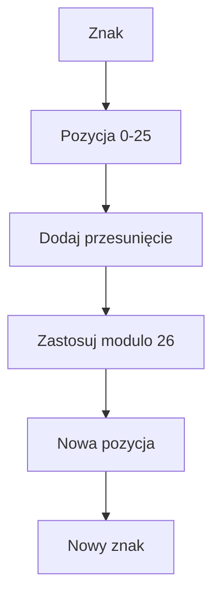

# Szyfr Cezara

## Cel lekcji

Nauczysz się zbudować prosty szyfr Cezara, który przesuwa litery w alfabecie.

## Krótkie wprowadzenie do problemu

Szyfr Cezara to klasyczny algorytm edukacyjny. Każdą literę przesuwamy o ustaloną liczbę miejsc. Przy przesunięciu `3` litera `A` przechodzi w `D`.

Ten szyfr ma znaczenie historyczne i dydaktyczne. Nie zapewnia współczesnego bezpieczeństwa. Nie wolno używać go do ochrony haseł ani poufnych danych.

## Wyjaśnienie idei

Alfabet można wyobrazić sobie jako koło. Każda litera ma pozycję od `0` do `25`. Po literze `Z` wracamy do `A`, a po literze `z` wracamy do `a`.

```text
litera => kod ASCII => pozycja 0-25 => przesunięcie => nowa pozycja => nowa litera
```

## Diagram działania



## Składnia

Dla wielkiej litery:

```cpp
int pozycja = znak - 'A';
int nowaPozycja = (pozycja + przesuniecie) % 26;
char nowyZnak = (char)('A' + nowaPozycja);
```

Przesunięcie normalizujemy tak:

```cpp
przesuniecie %= 26;

if (przesuniecie < 0)
{
    przesuniecie += 26;
}
```

## Przykład 1 - jedna wielka litera

```cpp
#include <iostream>

using namespace std;

int main()
{
    char znak = 'Z';
    int przesuniecie = 3;

    int pozycja = znak - 'A';
    int nowaPozycja = (pozycja + przesuniecie) % 26;
    char nowyZnak = (char)('A' + nowaPozycja);

    cout << znak << " => " << nowyZnak << "\n";

    return 0;
}
```

<details markdown="1">
<summary>Pokaż wynik</summary>

```text
Z => C
```

</details>

## Przykład 2 - szyfrowanie całego napisu

```cpp
#include <iostream>
#include <string>

using namespace std;

int main()
{
    string tekst;
    int przesuniecie;

    cout << "Podaj tekst: ";
    getline(cin >> ws, tekst);

    cout << "Podaj przesuniecie: ";
    cin >> przesuniecie;

    przesuniecie %= 26;

    if (przesuniecie < 0)
    {
        przesuniecie += 26;
    }

    for (int i = 0; i < (int)tekst.length(); i++)
    {
        char znak = tekst[i];

        if ((znak >= 'A') && (znak <= 'Z'))
        {
            int pozycja = znak - 'A';
            int nowaPozycja = (pozycja + przesuniecie) % 26;
            tekst[i] = (char)('A' + nowaPozycja);
        }
        else if ((znak >= 'a') && (znak <= 'z'))
        {
            int pozycja = znak - 'a';
            int nowaPozycja = (pozycja + przesuniecie) % 26;
            tekst[i] = (char)('a' + nowaPozycja);
        }
    }

    cout << "Szyfrogram: " << tekst << "\n";

    return 0;
}
```

<details markdown="1">
<summary>Pokaż przykładowe dane i wynik</summary>

Dane wejściowe:

```text
Ala ma 2 koty!
3
```

Wynik:

```text
Podaj tekst: Podaj przesuniecie: Szyfrogram: Dod pd 2 nrwb!
```

</details>

## Przykład 3 - odszyfrowanie napisu

```cpp
#include <iostream>
#include <string>

using namespace std;

int main()
{
    string tekst;
    int przesuniecie;

    cout << "Podaj szyfrogram: ";
    getline(cin >> ws, tekst);

    cout << "Podaj przesuniecie: ";
    cin >> przesuniecie;

    przesuniecie %= 26;

    if (przesuniecie < 0)
    {
        przesuniecie += 26;
    }

    for (int i = 0; i < (int)tekst.length(); i++)
    {
        char znak = tekst[i];

        if ((znak >= 'A') && (znak <= 'Z'))
        {
            int pozycja = znak - 'A';
            int nowaPozycja = (pozycja - przesuniecie + 26) % 26;
            tekst[i] = (char)('A' + nowaPozycja);
        }
        else if ((znak >= 'a') && (znak <= 'z'))
        {
            int pozycja = znak - 'a';
            int nowaPozycja = (pozycja - przesuniecie + 26) % 26;
            tekst[i] = (char)('a' + nowaPozycja);
        }
    }

    cout << "Tekst jawny: " << tekst << "\n";

    return 0;
}
```

<details markdown="1">
<summary>Pokaż przykładowe dane i wynik</summary>

Dane wejściowe:

```text
Dod pd 2 nrwb!
3
```

Wynik:

```text
Podaj szyfrogram: Podaj przesuniecie: Tekst jawny: Ala ma 2 koty!
```

</details>

## Omówienie najważniejszego przykładu krok po kroku

Program wczytuje tekst i przesunięcie. Potem sprowadza przesunięcie do zakresu od `0` do `25`. Każdy znak napisu jest sprawdzany osobno. Wielkie litery są liczone względem `'A'`, a małe względem `'a'`. Spacje, cyfry i znaki specjalne nie spełniają warunków, więc zostają bez zmian.

Przy odszyfrowaniu odejmujemy przesunięcie. Dodajemy `26` przed operacją `%`, aby uniknąć ujemnej pozycji.

## Kiedy tego użyć?

Użyj szyfru Cezara jako ćwiczenia z kodów znaków, indeksowania napisu, pętli i operatora `%`.

## Kiedy wybrać coś innego?

Do prawdziwego bezpieczeństwa wybiera się współczesne algorytmy kryptograficzne. Szyfr Cezara jest za prosty i można go łatwo złamać.

## Ćwiczenia

### 1. Zaszyfruj jedną wielką literę

Wczytaj wielką literę i przesunięcie. Wypisz zaszyfrowaną literę.

<details markdown="1">
<summary>Pokaż wskazówkę do ćwiczenia 1</summary>

Oblicz pozycję względem `'A'`, dodaj przesunięcie i użyj `% 26`.

</details>

<details markdown="1">
<summary>Pokaż rozwiązanie ćwiczenia 1</summary>

```cpp
#include <iostream>

using namespace std;

int main()
{
    char znak;
    int przesuniecie;

    cin >> znak;
    cin >> przesuniecie;

    przesuniecie %= 26;

    if (przesuniecie < 0)
    {
        przesuniecie += 26;
    }

    int pozycja = znak - 'A';
    int nowaPozycja = (pozycja + przesuniecie) % 26;
    char nowyZnak = (char)('A' + nowaPozycja);

    cout << nowyZnak << "\n";

    return 0;
}
```

</details>

### 2. Zaszyfruj napis

Wczytaj napis i przesunięcie. Zaszyfruj wielkie i małe litery. Inne znaki zostaw bez zmian.

<details markdown="1">
<summary>Pokaż wskazówkę do ćwiczenia 2</summary>

Przejdź po napisie pętlą indeksową i osobno obsłuż zakresy `'A'`-`'Z'` oraz `'a'`-`'z'`.

</details>

<details markdown="1">
<summary>Pokaż rozwiązanie ćwiczenia 2</summary>

```cpp
#include <iostream>
#include <string>

using namespace std;

int main()
{
    string tekst;
    int przesuniecie;

    getline(cin >> ws, tekst);
    cin >> przesuniecie;

    przesuniecie %= 26;

    if (przesuniecie < 0)
    {
        przesuniecie += 26;
    }

    for (int i = 0; i < (int)tekst.length(); i++)
    {
        char znak = tekst[i];

        if ((znak >= 'A') && (znak <= 'Z'))
        {
            int pozycja = znak - 'A';
            tekst[i] = (char)('A' + (pozycja + przesuniecie) % 26);
        }
        else if ((znak >= 'a') && (znak <= 'z'))
        {
            int pozycja = znak - 'a';
            tekst[i] = (char)('a' + (pozycja + przesuniecie) % 26);
        }
    }

    cout << tekst << "\n";

    return 0;
}
```

</details>

### 3. Odszyfruj napis

Wczytaj szyfrogram i przesunięcie. Odszyfruj tekst.

<details markdown="1">
<summary>Pokaż wskazówkę do ćwiczenia 3</summary>

Przy nowej pozycji użyj `(pozycja - przesuniecie + 26) % 26`.

</details>

<details markdown="1">
<summary>Pokaż rozwiązanie ćwiczenia 3</summary>

```cpp
#include <iostream>
#include <string>

using namespace std;

int main()
{
    string tekst;
    int przesuniecie;

    getline(cin >> ws, tekst);
    cin >> przesuniecie;

    przesuniecie %= 26;

    if (przesuniecie < 0)
    {
        przesuniecie += 26;
    }

    for (int i = 0; i < (int)tekst.length(); i++)
    {
        char znak = tekst[i];

        if ((znak >= 'A') && (znak <= 'Z'))
        {
            int pozycja = znak - 'A';
            tekst[i] = (char)('A' + (pozycja - przesuniecie + 26) % 26);
        }
        else if ((znak >= 'a') && (znak <= 'z'))
        {
            int pozycja = znak - 'a';
            tekst[i] = (char)('a' + (pozycja - przesuniecie + 26) % 26);
        }
    }

    cout << tekst << "\n";

    return 0;
}
```

</details>

## Typowe błędy

- Brak zawijania po literze `Z` albo `z`.
- Zapomnienie o osobnej obsłudze małych liter.
- Zmienianie spacji i cyfr, mimo że miały zostać bez zmian.
- Brak normalizacji przesunięcia większego niż `26`.
- Odszyfrowanie przez dodawanie zamiast odejmowania przesunięcia.
- Pominięcie `+ 26` przy odszyfrowaniu.

## Podsumowanie

Szyfr Cezara łączy znaki, kody ASCII, indeksy napisu, pętle i operator `%`. Najpierw warto zrozumieć jedną literę, a dopiero potem zastosować algorytm do całego napisu.