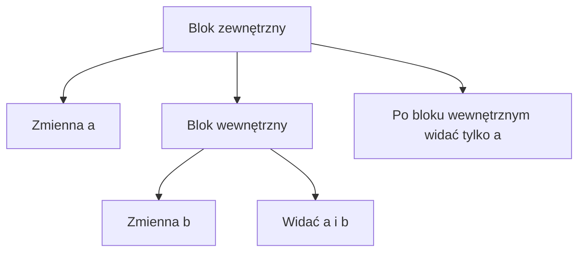

# Zmienne lokalne i zakres

## Cel lekcji

Nauczysz się rozumieć, gdzie w programie można użyć zmiennej.

## Krótkie wprowadzenie do problemu

Zmienna nie jest widoczna wszędzie. Jeśli utworzysz ją w jednym bloku kodu, nie zawsze możesz użyć jej poza tym blokiem.

## Wyjaśnienie idei prostymi słowami

Zakres zmiennej to część programu, w której zmienna jest dostępna. Blok kodu ograniczają nawiasy `{ }`.

Zmienna zadeklarowana w bloku jest dostępna od miejsca deklaracji do końca tego bloku. Blok wewnętrzny widzi zmienne bloku zewnętrznego. Blok zewnętrzny nie widzi zmiennych utworzonych tylko w bloku wewnętrznym.

Zakres zmiennej to nie to samo co jej wartość. Wartość mówi, co zmienna przechowuje. Zakres mówi, gdzie można jej użyć.

## Składnia

```cpp
int liczba = 10;

if (liczba > 0)
{
    int pomocnicza = 5;
    cout << pomocnicza << "\n";
}
```

`pomocnicza` istnieje tylko w bloku instrukcji `if`.

## Diagram zakresu



## Przykład 1 - zmienna w `main` i w bloku `if`

```cpp
#include <iostream>

using namespace std;

int main()
{
    int liczba = 12;

    if (liczba > 0)
    {
        int podwojona = liczba * 2;
        cout << "Podwojona: " << podwojona << "\n";
    }

    cout << "Liczba: " << liczba << "\n";

    return 0;
}
```

<details markdown="1">
<summary>Pokaż wynik</summary>

```text
Podwojona: 24
Liczba: 12
```

</details>

## Przykład 2 - zmienna w pętli

```cpp
#include <iostream>

using namespace std;

int main()
{
    int suma = 0;

    for (int i = 1; i <= 3; i++)
    {
        int kwadrat = i * i;
        suma += kwadrat;
        cout << "Kwadrat: " << kwadrat << "\n";
    }

    cout << "Suma: " << suma << "\n";

    return 0;
}
```

<details markdown="1">
<summary>Pokaż wynik</summary>

```text
Kwadrat: 1
Kwadrat: 4
Kwadrat: 9
Suma: 14
```

</details>

## Omówienie najważniejszego przykładu krok po kroku

W pierwszym przykładzie zmienna `liczba` powstaje w bloku funkcji `main`. Dlatego widać ją także w bloku `if`. Zmienna `podwojona` powstaje wewnątrz `if`, więc działa tylko tam. Po wyjściu z bloku `if` nie można jej już użyć.

Celowo błędny fragment:

```cpp
if (liczba > 0)
{
    int podwojona = liczba * 2;
}

cout << podwojona << "\n"; // błąd: zmienna poza zakresem
```

## Kiedy tego użyć?

Zmienną twórz tam, gdzie jest naprawdę potrzebna. Dzięki temu program jest czytelniejszy i trudniej przypadkowo użyć starej wartości.

## Kiedy wybrać coś innego?

Jeśli ta sama wartość jest potrzebna w wielu miejscach jednego bloku, utwórz zmienną w bloku zewnętrznym. Nie przenoś jej jednak wyżej bez potrzeby.

## Typowe błędy

- Użycie zmiennej poza jej zakresem.
- Myślenie, że zmienna z bloku `if` działa po zakończeniu `if`.
- Mylenie zakresu zmiennej z jej wartością.
- Tworzenie zmiennej za wcześnie, daleko od miejsca użycia.
- Próba użycia zmiennej `i` z pętli `for` po zakończeniu pętli.

## Ćwiczenia

### 1. Zmienna w bloku `if`

Wczytaj liczbę. Jeżeli jest dodatnia, utwórz w bloku `if` zmienną `podwojona` i wypisz jej wartość.

<details markdown="1">
<summary>Pokaż wskazówkę do ćwiczenia 1</summary>

Zmienną `podwojona` zadeklaruj dopiero wewnątrz bloku `if`.

</details>

<details markdown="1">
<summary>Pokaż rozwiązanie ćwiczenia 1</summary>

```cpp
#include <iostream>

using namespace std;

int main()
{
    int liczba;

    cin >> liczba;

    if (liczba > 0)
    {
        int podwojona = liczba * 2;
        cout << podwojona << "\n";
    }

    return 0;
}
```

</details>

### 2. Suma kwadratów

Oblicz sumę kwadratów liczb od `1` do `n`. Zmienną `kwadrat` utwórz wewnątrz pętli.

<details markdown="1">
<summary>Pokaż wskazówkę do ćwiczenia 2</summary>

`kwadrat` jest potrzebny tylko w jednym obiegu pętli, więc może być zmienną lokalną pętli.

</details>

<details markdown="1">
<summary>Pokaż rozwiązanie ćwiczenia 2</summary>

```cpp
#include <iostream>

using namespace std;

int main()
{
    int n;
    int suma = 0;

    cin >> n;

    for (int i = 1; i <= n; i++)
    {
        int kwadrat = i * i;
        suma += kwadrat;
    }

    cout << suma << "\n";

    return 0;
}
```

</details>

### 3. Popraw zakres zmiennej

Napisz program, który wczyta liczbę, obliczy jej połowę i wypisze ją po instrukcji `if`. Zmienna z wynikiem musi być dostępna po `if`.

<details markdown="1">
<summary>Pokaż wskazówkę do ćwiczenia 3</summary>

Jeśli chcesz użyć zmiennej po `if`, zadeklaruj ją przed blokiem `if`.

</details>

<details markdown="1">
<summary>Pokaż rozwiązanie ćwiczenia 3</summary>

```cpp
#include <iostream>

using namespace std;

int main()
{
    int liczba;
    int polowa = 0;

    cin >> liczba;

    if (liczba > 0)
    {
        polowa = liczba / 2;
    }

    cout << polowa << "\n";

    return 0;
}
```

</details>

## Podsumowanie

Zmienna lokalna jest dostępna tylko w swoim zakresie. Bloki wewnętrzne widzą zmienne z zewnątrz, ale blok zewnętrzny nie widzi zmiennych utworzonych wewnątrz.