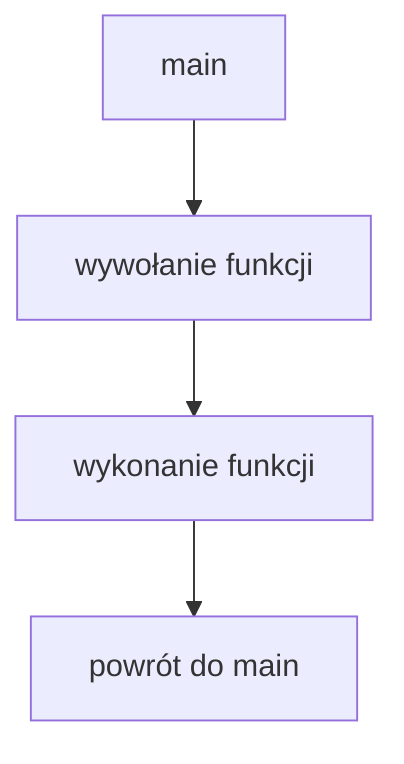

# Pierwsze funkcje

## Cel lekcji

Nauczysz się tworzyć pierwsze funkcje bez parametrów i wywoływać je z `main`.

## Krótkie wprowadzenie do problemu

Gdy program rośnie, jedna długa funkcja `main` staje się trudna do czytania. Funkcja pozwala nazwać fragment programu i użyć go wtedy, gdy jest potrzebny.

## Wyjaśnienie idei prostymi słowami

Funkcja to nazwany fragment programu wykonujący jedno zadanie. Funkcja `void` niczego nie zwraca. Ma nazwę, nawiasy `()` i ciało w `{ }`.

Definicja mówi, co funkcja robi. Wywołanie uruchamia funkcję. Po zakończeniu funkcji program wraca do miejsca wywołania.

## Składnia

```cpp
#include <iostream>

using namespace std;

void pokazKomunikat()
{
    cout << "Czesc\n";
}

int main()
{
    pokazKomunikat();

    return 0;
}
```

Kompilator musi znać funkcję przed jej wywołaniem. Można zdefiniować funkcję przed `main` albo podać wcześniej jej deklarację, nazywaną też prototypem.

## Diagram kolejności



## Przykład 1 - definicja przed `main`

```cpp
#include <iostream>

using namespace std;

void pokazNaglowek()
{
    cout << "Program demonstracyjny\n";
    cout << "---------------------\n";
}

int main()
{
    pokazNaglowek();
    cout << "Dalsza czesc programu\n";

    return 0;
}
```

<details markdown="1">
<summary>Pokaż wynik</summary>

```text
Program demonstracyjny
---------------------
Dalsza czesc programu
```

</details>

## Przykład 2 - deklaracja przed `main`, definicja po `main`

```cpp
#include <iostream>

using namespace std;

void pokazPozegnanie();

int main()
{
    cout << "Start\n";
    pokazPozegnanie();

    return 0;
}

void pokazPozegnanie()
{
    cout << "Koniec programu\n";
}
```

<details markdown="1">
<summary>Pokaż wynik</summary>

```text
Start
Koniec programu
```

</details>

## Omówienie najważniejszego przykładu krok po kroku

W pierwszym przykładzie funkcja `pokazNaglowek` jest zdefiniowana przed `main`, więc kompilator zna ją przed wywołaniem. W `main` wywołujemy funkcję przez `pokazNaglowek();`. Po wykonaniu jej instrukcji program wraca do następnej instrukcji w `main`.

Celowo błędny fragment:

```cpp
pokazNaglowek;
```

Brakuje nawiasów `()`, więc to nie jest poprawne wywołanie funkcji.

## Kiedy tego użyć?

Twórz funkcję, gdy fragment programu ma jasne zadanie i dobrą nazwę, na przykład pokazanie nagłówka albo wypisanie podsumowania.

## Kiedy wybrać coś innego?

Jeśli fragment kodu pojawia się tylko raz i ma jedną prostą instrukcję, osobna funkcja może być niepotrzebna. Nie dziel programu na funkcje na siłę.

## Typowe błędy

- Wywołanie funkcji przed jej zadeklarowaniem.
- Brak nawiasów `()` przy wywołaniu.
- Mylenie definicji funkcji z jej wywołaniem.
- Umieszczanie definicji funkcji wewnątrz `main`.
- Tworzenie funkcji o nazwie, która nie mówi, co funkcja robi.

## Ćwiczenia

### 1. Funkcja z powitaniem

Napisz funkcję `pokazPowitanie`, która wypisuje jeden komunikat. Wywołaj ją w `main`.

<details markdown="1">
<summary>Pokaż wskazówkę do ćwiczenia 1</summary>

Funkcja ma typ `void` i nie przyjmuje parametrów.

</details>

<details markdown="1">
<summary>Pokaż rozwiązanie ćwiczenia 1</summary>

```cpp
#include <iostream>

using namespace std;

void pokazPowitanie()
{
    cout << "Witaj w programie\n";
}

int main()
{
    pokazPowitanie();

    return 0;
}
```

</details>

### 2. Funkcja wywołana trzy razy

Napisz funkcję `pokazLinie`, która wypisuje `---`. Wywołaj ją trzy razy.

<details markdown="1">
<summary>Pokaż wskazówkę do ćwiczenia 2</summary>

Tę samą funkcję możesz wywołać kilka razy z rzędu.

</details>

<details markdown="1">
<summary>Pokaż rozwiązanie ćwiczenia 2</summary>

```cpp
#include <iostream>

using namespace std;

void pokazLinie()
{
    cout << "---\n";
}

int main()
{
    pokazLinie();
    pokazLinie();
    pokazLinie();

    return 0;
}
```

</details>

### 3. Prototyp funkcji

Napisz program z deklaracją funkcji przed `main` i definicją po `main`.

<details markdown="1">
<summary>Pokaż wskazówkę do ćwiczenia 3</summary>

Przed `main` wpisz sam nagłówek funkcji zakończony średnikiem.

</details>

<details markdown="1">
<summary>Pokaż rozwiązanie ćwiczenia 3</summary>

```cpp
#include <iostream>

using namespace std;

void pokazKoniec();

int main()
{
    cout << "Praca programu\n";
    pokazKoniec();

    return 0;
}

void pokazKoniec()
{
    cout << "Koniec\n";
}
```

</details>

## Podsumowanie

Funkcja pozwala nazwać fragment programu. Definicja opisuje działanie, a wywołanie uruchamia funkcję. Kompilator musi poznać funkcję przed miejscem wywołania.