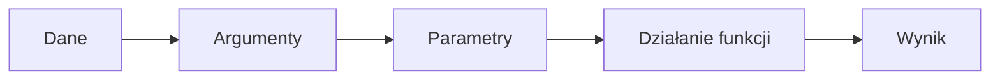

# Parametry i wartości zwracane

## Cel lekcji

Nauczysz się przekazywać dane do funkcji i odbierać wynik przez `return`.

## Krótkie wprowadzenie do problemu

Funkcja bez parametrów zawsze robi to samo. Często chcemy jednak przekazać jej dane, na przykład długość i szerokość prostokąta.

## Wyjaśnienie idei prostymi słowami

Argument to wartość podana przy wywołaniu funkcji. Parametr to zmienna w nagłówku funkcji, która tę wartość odbiera.

Funkcję można czytać jak prosty proces:

```text
dane wejściowe => obliczenia => wynik
```

Jeśli funkcja ma zwrócić wynik, wpisujemy typ wyniku przed nazwą funkcji i używamy `return`.

## Składnia

```cpp
int dodaj(int a, int b)
{
    return a + b;
}
```

`a` i `b` to parametry. W wywołaniu `dodaj(3, 4)` liczby `3` i `4` są argumentami.

## Diagram przepływu danych



## Przykład 1 - pole prostokąta

```cpp
#include <iostream>

using namespace std;

int poleProstokata(int dlugosc, int szerokosc)
{
    return dlugosc * szerokosc;
}

int main()
{
    int wynik = poleProstokata(8, 4);

    cout << "Pole: " << wynik << "\n";

    return 0;
}
```

<details markdown="1">
<summary>Pokaż wynik</summary>

```text
Pole: 32
```

</details>

## Przykład 2 - większa z dwóch liczb

```cpp
#include <iostream>

using namespace std;

int wiekszaLiczba(int pierwsza, int druga)
{
    if (pierwsza > druga)
    {
        return pierwsza;
    }

    return druga;
}

int main()
{
    int a;
    int b;

    cin >> a;
    cin >> b;

    cout << "Wieksza: " << wiekszaLiczba(a, b) << "\n";
    cout << "Wieksza plus 10: " << wiekszaLiczba(a, b) + 10 << "\n";

    return 0;
}
```

<details markdown="1">
<summary>Pokaż przykładowe dane i wynik</summary>

Dane wejściowe:

```text
12
7
```

Wynik:

```text
Wieksza: 12
Wieksza plus 10: 22
```

</details>

## Omówienie najważniejszego przykładu krok po kroku

Funkcja `poleProstokata` ma dwa parametry: `dlugosc` i `szerokosc`. Przy wywołaniu `poleProstokata(8, 4)` argument `8` trafia do parametru `dlugosc`, a argument `4` do parametru `szerokosc`. Instrukcja `return` zwraca wynik mnożenia do miejsca wywołania.

Funkcja `void` niczego nie zwraca. Funkcja typu `int` musi zwrócić wartość typu `int`.

Celowo błędny fragment:

```cpp
int dodaj(int a, int b)
{
    cout << a + b << "\n";
}
```

Ta funkcja ma zwracać `int`, ale brakuje `return`.

## Kiedy tego użyć?

Użyj parametrów, gdy funkcja ma wykonać to samo działanie dla różnych danych. Użyj `return`, gdy wynik funkcji ma być dalej używany.

## Kiedy wybrać coś innego?

Jeśli funkcja ma tylko coś wypisać i nie potrzebujesz wyniku w dalszych obliczeniach, wystarczy `void`.

## Typowe błędy

- Pomylenie argumentu z parametrem.
- Niezgodna liczba argumentów.
- Niezgodny typ argumentu.
- Brak `return` w funkcji zwracającej wartość.
- Próba zwrócenia wartości z funkcji `void`.
- Ignorowanie wyniku funkcji, mimo że był potrzebny.

## Ćwiczenia

### 1. Suma dwóch liczb

Napisz funkcję `suma`, która przyjmuje dwie liczby całkowite i zwraca ich sumę.

<details markdown="1">
<summary>Pokaż wskazówkę do ćwiczenia 1</summary>

Funkcja powinna mieć typ `int` i dwa parametry typu `int`.

</details>

<details markdown="1">
<summary>Pokaż rozwiązanie ćwiczenia 1</summary>

```cpp
#include <iostream>

using namespace std;

int suma(int pierwsza, int druga)
{
    return pierwsza + druga;
}

int main()
{
    int a;
    int b;

    cin >> a;
    cin >> b;

    cout << suma(a, b) << "\n";

    return 0;
}
```

</details>

### 2. Pole prostokąta

Napisz funkcję obliczającą pole prostokąta dla dwóch boków.

<details markdown="1">
<summary>Pokaż wskazówkę do ćwiczenia 2</summary>

Zwróć wynik mnożenia dwóch parametrów.

</details>

<details markdown="1">
<summary>Pokaż rozwiązanie ćwiczenia 2</summary>

```cpp
#include <iostream>

using namespace std;

int poleProstokata(int dlugosc, int szerokosc)
{
    return dlugosc * szerokosc;
}

int main()
{
    int dlugosc;
    int szerokosc;

    cin >> dlugosc;
    cin >> szerokosc;

    cout << poleProstokata(dlugosc, szerokosc) << "\n";

    return 0;
}
```

</details>

### 3. Czy liczba jest dodatnia?

Napisz funkcję `czyDodatnia`, która zwraca `true`, gdy liczba jest większa od zera.

<details markdown="1">
<summary>Pokaż wskazówkę do ćwiczenia 3</summary>

Funkcja może mieć typ `bool`.

</details>

<details markdown="1">
<summary>Pokaż rozwiązanie ćwiczenia 3</summary>

```cpp
#include <iostream>

using namespace std;

bool czyDodatnia(int liczba)
{
    return liczba > 0;
}

int main()
{
    int liczba;

    cin >> liczba;

    if (czyDodatnia(liczba))
    {
        cout << "Dodatnia\n";
    }
    else
    {
        cout << "Niedodatnia\n";
    }

    return 0;
}
```

</details>

## Podsumowanie

Parametry przekazują dane do funkcji. `return` przekazuje wynik z funkcji do miejsca wywołania. Dzięki temu funkcja może być małym, samodzielnym obliczeniem.