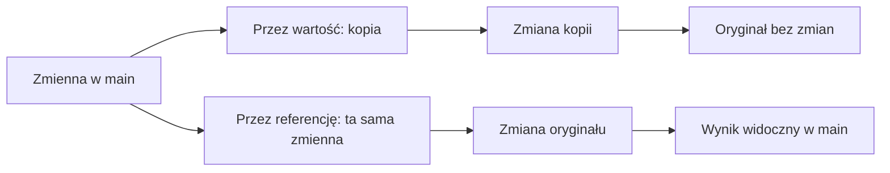

# Przekazywanie przez wartość i referencję

## Cel lekcji

Celem lekcji jest zrozumienie, dlaczego funkcja czasem dostaje tylko kopię wartości, a czasem może zmienić oryginalną zmienną z programu.

## Wprowadzenie

Gdy przekazujemy dane do funkcji, w C++ musimy wiedzieć, czy funkcja pracuje na kopii, czy na tej samej zmiennej. To ważne, bo od tego zależy, czy po wywołaniu funkcji zmienna w `main()` zostanie zmieniona.

## Proste wyjaśnienie

Przekazywanie przez wartość działa jak zrobienie kserokopii kartki. Funkcja może pisać po kopii, ale oryginał zostaje bez zmian.

Przekazywanie przez referencję działa tak, jakby funkcja dostała dostęp do oryginalnej kartki. Jeśli coś zmieni, zmiana zostaje widoczna po powrocie do `main()`.

## Schemat



## Przekazywanie przez wartość

Gdy parametr zapisujemy zwyczajnie, funkcja dostaje kopię wartości.

```cpp
void zwiekszKopie(int liczba)
{
    liczba = liczba + 1;
    cout << "W funkcji: " << liczba << "\n";
}
```

Parametr `liczba` jest kopią. Zmiana tej kopii nie zmienia zmiennej przekazanej z `main()`.

## Program 1 - kopia wartości

```cpp
#include <iostream>

using namespace std;

void zwiekszKopie(int liczba)
{
    liczba = liczba + 1;
    cout << "W funkcji: " << liczba << "\n";
}

int main()
{
    int liczba = 5;

    zwiekszKopie(liczba);

    cout << "W main: " << liczba << "\n";

    return 0;
}
```

<details markdown="1">
<summary>Pokaż wynik działania</summary>

```text
W funkcji: 6
W main: 5
```

</details>

### Omówienie programu

- w `main()` tworzymy zmienną `liczba` z wartością `5`,
- funkcja `zwiekszKopie()` dostaje kopię tej wartości,
- w funkcji kopia zwiększa się do `6`,
- po powrocie do `main()` oryginalna zmienna nadal ma wartość `5`.

## Przekazywanie przez referencję

Gdy przy parametrze dopiszemy znak `&`, funkcja pracuje na oryginalnej zmiennej.

```cpp
void zwieksz(int &liczba)
{
    liczba = liczba + 1;
}
```

Parametr `liczba` odnosi się do tej samej zmiennej, która została przekazana do funkcji.

## Program 2 - zmiana oryginalnej zmiennej

```cpp
#include <iostream>

using namespace std;

void zwieksz(int &liczba)
{
    liczba = liczba + 1;
}

int main()
{
    int liczba = 5;

    zwieksz(liczba);

    cout << "Po funkcji: " << liczba << "\n";

    return 0;
}
```

<details markdown="1">
<summary>Pokaż wynik działania</summary>

```text
Po funkcji: 6
```

</details>

### Omówienie programu

- zmienna `liczba` w `main()` ma wartość `5`,
- funkcja `zwieksz()` dostaje dostęp do oryginalnej zmiennej,
- instrukcja `liczba = liczba + 1` zmienia tę zmienną,
- po powrocie do `main()` widzimy wartość `6`.

## Program 3 - zamiana dwóch wartości

Referencja jest przydatna, gdy funkcja ma zmienić więcej niż jedną zmienną.

```cpp
#include <iostream>

using namespace std;

void zamien(int &pierwsza, int &druga)
{
    int pomocnicza = pierwsza;
    pierwsza = druga;
    druga = pomocnicza;
}

int main()
{
    int a = 3;
    int b = 9;

    cout << "Przed: " << a << " " << b << "\n";

    zamien(a, b);

    cout << "Po: " << a << " " << b << "\n";

    return 0;
}
```

<details markdown="1">
<summary>Pokaż wynik działania</summary>

```text
Przed: 3 9
Po: 9 3
```

</details>

### Omówienie programu

- `a` ma wartość `3`, a `b` ma wartość `9`,
- funkcja `zamien()` dostaje obie zmienne przez referencję,
- zmienna `pomocnicza` przechowuje chwilowo pierwszą wartość,
- potem wartości zostają zamienione miejscami,
- zmiana jest widoczna po powrocie do `main()`.

## Kiedy używać wartości, a kiedy referencji?

Przekazywanie przez wartość jest dobre, gdy funkcja ma tylko skorzystać z danych i nie musi ich zmieniać.

Przekazywanie przez referencję jest dobre, gdy funkcja ma celowo zmienić zmienną z programu głównego, na przykład zwiększyć licznik albo zamienić dwie wartości miejscami.

## Typowe błędy

- Uczeń oczekuje, że funkcja zmieni zmienną, ale przekazuje ją przez wartość.
- Uczeń dopisuje `&` bez zrozumienia, przez co funkcja zmienia dane w `main()`.
- Uczeń myli parametr funkcji ze zmienną lokalną.
- Uczeń zapomina, że referencja może zmienić oryginalną zmienną.
- Uczeń próbuje zamienić dwie liczby bez zmiennej pomocniczej.

## Ćwiczenia

### Ćwiczenie 1

Napisz funkcję `podwojKopie(int liczba)`, która podwaja swoją kopię i wypisuje ją w funkcji. W `main()` wypisz wartość zmiennej po wywołaniu funkcji.

<details markdown="1">
<summary>Pokaż wskazówkę</summary>

Przekaż parametr bez znaku `&`. Wtedy funkcja dostanie kopię.

</details>

<details markdown="1">
<summary>Pokaż rozwiązanie</summary>

```cpp
#include <iostream>

using namespace std;

void podwojKopie(int liczba)
{
    liczba = liczba * 2;
    cout << "W funkcji: " << liczba << "\n";
}

int main()
{
    int liczba = 8;

    podwojKopie(liczba);

    cout << "W main: " << liczba << "\n";

    return 0;
}
```

</details>

### Ćwiczenie 2

Napisz funkcję `podwoj(int &liczba)`, która podwaja oryginalną zmienną.

<details markdown="1">
<summary>Pokaż wskazówkę</summary>

Przy parametrze funkcji użyj znaku `&`.

</details>

<details markdown="1">
<summary>Pokaż rozwiązanie</summary>

```cpp
#include <iostream>

using namespace std;

void podwoj(int &liczba)
{
    liczba = liczba * 2;
}

int main()
{
    int liczba = 8;

    podwoj(liczba);

    cout << "Po funkcji: " << liczba << "\n";

    return 0;
}
```

</details>

### Ćwiczenie 3

Napisz funkcję `zamien(int &pierwsza, int &druga)`, która zamienia wartości dwóch zmiennych miejscami.

<details markdown="1">
<summary>Pokaż wskazówkę</summary>

Użyj trzeciej zmiennej pomocniczej.

</details>

<details markdown="1">
<summary>Pokaż rozwiązanie</summary>

```cpp
#include <iostream>

using namespace std;

void zamien(int &pierwsza, int &druga)
{
    int pomocnicza = pierwsza;
    pierwsza = druga;
    druga = pomocnicza;
}

int main()
{
    int pierwsza = 4;
    int druga = 11;

    zamien(pierwsza, druga);

    cout << pierwsza << " " << druga << "\n";

    return 0;
}
```

</details>

## Podsumowanie

Przekazywanie przez wartość daje funkcji kopię danych. Przekazywanie przez referencję pozwala funkcji zmienić oryginalną zmienną. Referencji używamy wtedy, gdy taka zmiana jest naprawdę celem programu.