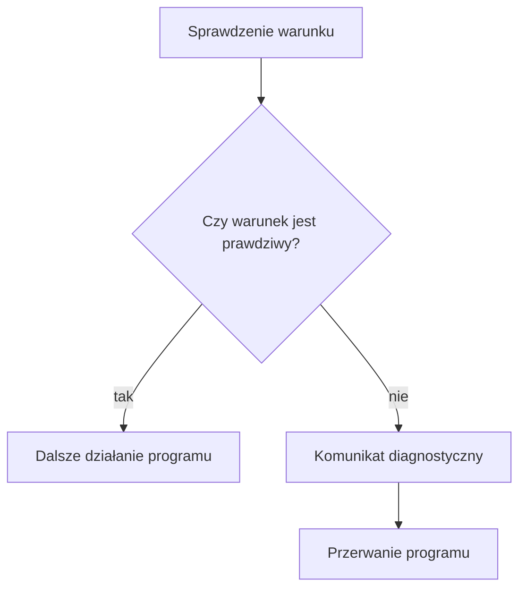

# Asercje - sprawdzanie założeń programu

> Materiał dodatkowy. Znajomość asercji nie jest konieczna do zrozumienia kolejnych rozdziałów, ale może bardzo ułatwić wykrywanie błędów i sprawdzanie poprawności funkcji.

## Cel lekcji

Po tej lekcji będziesz umieć:

- sprawdzać założenia i wyniki funkcji za pomocą `assert()`,
- dołączać potrzebny nagłówek `<cassert>`,
- odróżniać asercję od zwykłego `if` i obsługi błędów użytkownika,
- rozpoznawać operacje, których nie wolno umieszczać wewnątrz asercji,
- sprawdzać, czy zdefiniowano `NDEBUG`,
- włączać i wyłączać asercje w prostym programie oraz w projekcie Code::Blocks,
- korzystać z asercji podczas szukania błędu w debuggerze.

## Problem: funkcja dostała dane, których nie powinna dostać

Funkcja obliczająca pole prostokąta zakłada dodatnie wymiary. Programista przez pomyłkę przekazuje jej szerokość `-3`. Mnożenie nadal zostaje wykonane, a ujemny wynik może trafić do dalszych obliczeń. Błąd powstał wcześniej niż jego widoczne skutki.

Możemy zostawić w funkcji alarm: „w tym miejscu szerokość musi być dodatnia”. Takim alarmem jest **asercja**.

- Jeżeli założenie jest spełnione, program działa dalej.
- Jeżeli założenie jest fałszywe, aktywna asercja informuje o problemie i przerywa program.

Asercja nie naprawia danych. Pokazuje programiście, że wystąpił stan sprzeczny z założeniami programu. W większym programie pozwala wykryć pomyłkę bliżej jej przyczyny.

## Składnia i dokładne działanie

```cpp
#include <cassert>

assert(warunek);
```

`assert` jest **makrem** udostępnianym przez nagłówek `<cassert>`. Wygląda jak wywołanie funkcji, ale jego działanie zależy od ustawienia preprocesora, czyli etapu przygotowania kodu przed kompilacją.

Gdy asercje są aktywne, makro sprawdza warunek. Prawda pozwala kontynuować program. Fałsz powoduje wypisanie informacji diagnostycznej i przerwanie programu. Komunikat zwykle wskazuje warunek oraz miejsce w kodzie. Jego dokładny wygląd zależy od kompilatora i środowiska.

Nieudana asercja nie jest wyjątkiem przeznaczonym do przechwycenia przez `try` i `catch`. Nie pisz takiej obsługi. Znajdź przyczynę niespełnionego założenia.

## Jak działa aktywna asercja?



## Przykład 1 - dodatnie wymiary prostokąta

**Założenie funkcji** to warunek, który powinien być spełniony przed wykonaniem jej obliczeń. Tutaj oba wymiary mają być dodatnie.

```cpp
#include <cassert>
#include <iostream>

using namespace std;

int obliczPole(int szerokosc, int wysokosc)
{
    assert(szerokosc > 0);
    assert(wysokosc > 0);

    return szerokosc * wysokosc;
}

int main()
{
    cout << "Pole: " << obliczPole(4, 3) << "\n";

    // Odkomentuj osobno, aby sprawdzić błędne wywołanie:
    // obliczPole(-3, 4);

    return 0;
}
```

<details markdown="1">
<summary>Pokaż wynik i wyjaśnienie przykładu 1</summary>

Program nie pobiera danych. Dla wymiarów 4 i 3 wypisuje:

```text
Pole: 12
```

Wywołanie `obliczPole(-3, 4)` łamie pierwsze założenie. Przy aktywnych asercjach program zatrzyma się przed mnożeniem. Asercja nie zmieni `-3` na dodatnią liczbę.

</details>

Najpierw sprawdzamy szerokość, potem wysokość, a dopiero na końcu mnożymy. W przykładzie używamy małych liczb. Sama dodatniość nie chroni przed przepełnieniem typu `int`: wynik również musi mieścić się w jego zakresie.

## Przykład 2 - dzielnik różny od zera

```cpp
#include <cassert>
#include <iostream>

using namespace std;

int podzielCalkowicie(int dzielna, int dzielnik)
{
    assert(dzielnik != 0);

    return dzielna / dzielnik;
}

int main()
{
    cout << "Iloraz: " << podzielCalkowicie(17, 5) << "\n";

    // Testuj tylko przy aktywnych asercjach:
    // podzielCalkowicie(17, 0);

    return 0;
}
```

<details markdown="1">
<summary>Pokaż wynik i wyjaśnienie przykładu 2</summary>

Dla argumentów 17 i 5 wynik dzielenia całkowitego wynosi:

```text
Iloraz: 3
```

Wywołanie z dzielnikiem 0 narusza założenie funkcji. Aktywna asercja zatrzymuje program **przed** niedozwolonym dzieleniem.

</details>

Nie wyłączaj asercji, aby uruchamiać ten błędny przypadek. Po ich wyłączeniu nadal nie wolno dzielić przez zero. W tej lekcji testujemy małe argumenty z zakresu `-1000–1000`. Dla pełnego zakresu `int` trzeba także uwzględnić przypadek najmniejszej wartości typu dzielonej przez `-1`: wynik nie mieści się w typie.

## Przykład 3 - poprawny zakres punktów

```cpp
#include <cassert>
#include <iostream>

using namespace std;

double obliczProcent(int zdobytePunkty, int maksymalnePunkty)
{
    assert(maksymalnePunkty > 0);
    assert(zdobytePunkty >= 0);
    assert(zdobytePunkty <= maksymalnePunkty);

    return 100.0 * zdobytePunkty / maksymalnePunkty;
}

int main()
{
    cout << "Procent: " << obliczProcent(18, 24) << "\n";

    // Przykład naruszenia założenia:
    // obliczProcent(25, 24);

    return 0;
}
```

Każda asercja pilnuje innej własności:

- `maksymalnePunkty > 0` => istnieje dodatnia liczba punktów do zdobycia i nie dzielimy przez zero;
- `zdobytePunkty >= 0` => zdobyte punkty nie są ujemne;
- `zdobytePunkty <= maksymalnePunkty` => wynik nie przekracza maksimum.

<details markdown="1">
<summary>Pokaż wynik i testy przykładu 3</summary>

Program nie korzysta z `cin`. W `main()` przekazano 18 zdobytych punktów i maksimum 24:

```text
Procent: 75
```

Po zastąpieniu wywołania przez `obliczProcent(0, 24)` otrzymasz `Procent: 0`, a dla `obliczProcent(24, 24)` — `Procent: 100`.

Przy aktywnych asercjach `(25, 24)` narusza trzeci warunek, `(-1, 24)` drugi, a `(0, 0)` pierwszy. Każdy błędny przypadek sprawdzaj w osobnym uruchomieniu.

</details>

## Przykład 4 - sprawdzenie wyniku funkcji

Asercja może także sprawdzać stan **po** wykonaniu operacji. Wykorzystamy referencje poznane wcześniej w tym rozdziale.

```cpp
#include <cassert>
#include <iostream>

using namespace std;

void uporzadkujDwieLiczby(int &pierwsza, int &druga)
{
    if (pierwsza > druga)
    {
        int pomocnicza = pierwsza;
        pierwsza = druga;
        druga = pomocnicza;
    }

    assert(pierwsza <= druga);
}

int main()
{
    int pierwsza = 9;
    int druga = 2;

    uporzadkujDwieLiczby(pierwsza, druga);
    cout << pierwsza << " " << druga << "\n";

    return 0;
}
```

<details markdown="1">
<summary>Pokaż wynik i wyjaśnienie przykładu 4</summary>

Dla początkowych wartości 9 i 2 wynik to:

```text
2 9
```

Instrukcja `if` i przypisania wykonują porządkowanie. Asercja jedynie sprawdza, czy otrzymany stan spełnia warunek. Dla dwóch równych wartości nie trzeba nic zamieniać i asercja także jest prawdziwa.

</details>

Taki test może wykryć błędną zmianę funkcji w przyszłości. Nie dowodzi jednak całkowitej poprawności: warunek `pierwsza <= druga` nie wykryje na przykład omyłkowego zastąpienia obu wartości zerami. Dobieraj sprawdzenia do własności, na których Ci zależy.

## Asercja nie służy do sprawdzania zwykłych błędów użytkownika

Użytkownik może wpisać ujemny wiek. To przewidywalna pomyłka, na którą program powinien normalnie zareagować.

Błędne podejście:

```cpp
int wiek;
cin >> wiek;
assert(wiek >= 0);
```

Przy aktywnej asercji taki program przerywa działanie zamiast wyjaśnić problem. Po wyłączeniu asercji nie kontroluje wieku wcale.

Poprawny fragment dla poprawnie wczytanej liczby całkowitej:

```cpp
int wiek;
cin >> wiek;

if (wiek < 0)
{
    cout << "Wiek nie może być ujemny.\n";
    return 1;
}
```

Jeżeli dopuszczamy również wpisanie tekstu zamiast liczby, trzeba osobno sprawdzić powodzenie `cin`. Ćwiczenie 4 pokazuje kompletny program z obiema kontrolami.

| Sytuacja | Właściwe rozwiązanie |
|---|---|
| Użytkownik podał błędne dane | `if` i komunikat |
| Plik może nie istnieć | Sprawdzenie stanu strumienia |
| Programista przekazał funkcji niedozwolony argument | `assert` może być właściwe |
| Funkcja po wykonaniu powinna spełniać określony warunek | `assert` może sprawdzić wynik |
| Błąd można normalnie obsłużyć podczas działania programu | Zwykła obsługa błędu |

Dane z klawiatury, pliku lub sieci mogą być niepoprawne. Nie są sytuacją „niemożliwą”. Pliki poznasz później; na razie zapamiętaj zasadę. Dane z zewnątrz sprawdzaj przed wywołaniem funkcji. Asercje wewnątrz funkcji mogą dodatkowo kontrolować, czy programista dotrzymał jej założeń.

## Czy działający debugger automatycznie włącza asercje?

Nie. Debugger i asercje to dwa różne mechanizmy. Debugger pozwala zatrzymywać program i oglądać zmienne niezależnie od tego, czy asercje są aktywne.

Asercje są aktywne, jeśli przed dołączeniem `<cassert>` **nie zdefiniowano makra `NDEBUG`**. Sama nazwa konfiguracji `Debug` nie jest formalnym przełącznikiem `assert`.

- W typowej konfiguracji Debug `NDEBUG` nie jest zdefiniowane, więc asercje działają.
- W konfiguracji Release `NDEBUG` może być zdefiniowane, ale zależy to od ustawień projektu.
- Nie zakładaj, że każda wersja Code::Blocks i każdy projekt ustawią to identycznie.

Prosty program do sprawdzenia zachowania:

```cpp
#include <cassert>
#include <iostream>

using namespace std;

int main()
{
    cout << "Przed asercją" << endl;

    assert(false);

    cout << "Po asercji\n";

    return 0;
}
```

`endl` kończy wiersz i opróżnia bufor wyjścia, aby pierwszy komunikat został wysłany przed przerwaniem programu. Sam znak `\n` nie gwarantuje opróżnienia bufora.

<details markdown="1">
<summary>Pokaż zachowanie programu testowego</summary>

Przy aktywnych asercjach pojawi się `Przed asercją` oraz komunikat diagnostyczny. Program zostanie przerwany. Wiersz `Po asercji` nie zostanie wykonany.

Po wyłączeniu asercji program wypisze:

```text
Przed asercją
Po asercji
```

Nie oczekuj identycznej treści diagnozy ani identycznego kodu zakończenia na każdym komputerze.

</details>

Podczas pracy w Code::Blocks wybierz Debug, ustaw punkt przerwania przed asercją i uruchom debugger. Przejdź do kolejnej instrukcji. Dla asercji zależnej od zmiennych obejrzyj ich wartości i ustal, dlaczego warunek jest fałszywy. W powyższym teście `false` jest celowo zawsze fałszywe; ćwiczenie 8 pozwoli zbadać rzeczywistą pomyłkę w obliczeniach.

## Jak włączyć asercje?

Asercje są włączone, jeśli `NDEBUG` nie jest zdefiniowane przed dołączeniem `<cassert>`. W prostym pliku usuń ewentualne `#define NDEBUG` i przebuduj program. Sprawdź również opcje kompilatora: definicja może pochodzić z ustawień projektu.

Ten program pokazuje konfigurację:

```cpp
#include <cassert>
#include <iostream>

using namespace std;

int main()
{
#ifdef NDEBUG
    cout << "Asercje są wyłączone.\n";
#else
    cout << "Asercje są włączone.\n";
#endif

    return 0;
}
```

`#ifdef` sprawdza, czy makro jest zdefiniowane. `#else` wybiera drugi wariant, a `#endif` kończy wybór. To wybór podczas przygotowania kodu do kompilacji, a nie zwykły `if` wykonywany przez uruchomiony program. Nie zmieniaj definicji `NDEBUG` między nagłówkiem a tym testem.

<details markdown="1">
<summary>Pokaż wyniki sprawdzania konfiguracji</summary>

Bez definicji `NDEBUG`:

```text
Asercje są włączone.
```

Z definicją `NDEBUG`:

```text
Asercje są wyłączone.
```

</details>

W Code::Blocks:

1. Wybierz konfigurację `Debug`.
2. Otwórz `Project -> Build options`.
3. Zaznacz właściwy projekt lub jego konfigurację `Debug`.
4. W ustawieniach kompilatora znajdź definicje preprocesora, często w zakładce `#defines`. Nazwy i rozmieszczenie zakładek mogą różnić się między wersjami.
5. Jeśli widzisz `NDEBUG`, usuń tę definicję dla Debug. Sprawdź też opcje dziedziczone z poziomu projektu oraz dodatkowe opcje kompilatora: mogą zawierać `-DNDEBUG`.
6. Wykonaj pełne przebudowanie przez `Rebuild`, a następnie uruchom program sprawdzający konfigurację.

Opcja kompilatora `-DNDEBUG` definiuje makro `NDEBUG`. Liczy się sam fakt zdefiniowania: także `NDEBUG=0` wyłącza asercje.

## Jak wyłączyć asercje?

### Sposób 1 - tylko w jednym pliku

```cpp
#define NDEBUG
#include <cassert>
#include <iostream>

using namespace std;

int main()
{
    assert(false);

    cout << "Program działa dalej, ponieważ asercje są wyłączone.\n";

    return 0;
}
```

`#define NDEBUG` musi znajdować się przed `#include <cassert>`. Po zdefiniowaniu `NDEBUG` wywołania `assert()` nie sprawdzają warunku: **wyrażenie przekazane do asercji nie jest wykonywane**. Po zmianie przebuduj program. Definicja w jednym pliku źródłowym nie jest ustawieniem całego projektu z wieloma osobno kompilowanymi plikami.

<details markdown="1">
<summary>Pokaż wynik programu z lokalnym NDEBUG</summary>

```text
Program działa dalej, ponieważ asercje są wyłączone.
```

Po usunięciu pierwszej linii, przy braku `NDEBUG` w opcjach kompilatora, program przerwie działanie na `assert(false)`.

</details>

### Sposób 2 - dla konfiguracji projektu

1. Otwórz `Project -> Build options`.
2. Wybierz konfigurację `Release`.
3. Dodaj `NDEBUG` do definicji preprocesora albo dodaj `-DNDEBUG` do opcji kompilatora.
4. Wykonaj `Rebuild` i sprawdź konfigurację programem z poprzedniej sekcji.

Nie dodawaj tej samej definicji jednocześnie w pliku i w ustawieniach bez potrzeby. Do porównania konfiguracji użyj programu bez lokalnego `#define NDEBUG`.

Najczęściej w Debug pozostawiamy asercje aktywne. W Release można je wyłączyć. Podczas nauki i szukania błędów nie musisz ich wyłączać. **Wyłączenie asercji nie naprawia programu** — może tylko ukryć sygnał błędu.

## Nie umieszczaj operacji ubocznych w assert

Operacja uboczna zmienia stan programu, na przykład wartość zmiennej. Błędny zapis:

```cpp
assert(licznik++ < limit);
```

Przy aktywnych asercjach `licznik` zostanie zwiększony, a porównanie użyje jego poprzedniej wartości. Po wyłączeniu asercji całe wyrażenie nie zostanie wykonane: licznik nie wzrośnie.

Poprawny zapis, gdy licznik ma wzrosnąć, a następnie nie przekraczać limitu:

```cpp
licznik++;
assert(licznik <= limit);
```

Wykonanie operacji nie zależy teraz od ustawień asercji. Używamy małych wartości, dla których zwiększenie licznika mieści się w typie.

Nie umieszczaj wewnątrz `assert`:

- wczytywania, na przykład `cin >> liczba`,
- wypisywania lub innego zapisywania danych,
- zwiększania lub zmniejszania zmiennej,
- wywołania funkcji zmieniającej stan, na przykład poznanej wcześniej funkcji z parametrem przez referencję.

Właściwą operację wykonaj osobno. Asercja ma sprawdzać stan bez jego zmieniania.

## Kiedy tego użyć?

Użyj asercji, gdy chcesz sprawdzić założenie wewnętrznej funkcji, oczekiwany stan po operacji albo wynik podczas testowania. To przydatne szczególnie po podziale programu na funkcje: każda może jasno określić swoje wymagania.

## Kiedy wybrać coś innego?

Użyj `if` i zwykłej obsługi błędu, gdy niepoprawna sytuacja może wystąpić podczas normalnej pracy, zwłaszcza po wczytaniu danych użytkownika. Kontrola, od której zależy poprawne działanie programu, nie może znikać po zdefiniowaniu `NDEBUG`.

## Ćwiczenia

Ćwiczenia z celowo fałszywą asercją uruchamiaj osobno, z aktywnymi asercjami. Przerwanie programu jest wtedy oczekiwane. Nie uruchamiaj błędnego dzielenia po wyłączeniu asercji.

### Ćwiczenie 1. Które wywołanie przejdzie dalej?

Przeanalizuj funkcję bez uruchamiania programu:

```cpp
int ostatniaCyfra(int liczba)
{
    assert(liczba >= 0);
    return liczba % 10;
}
```

Dla wywołań `ostatniaCyfra(47)`, `ostatniaCyfra(0)` i `ostatniaCyfra(-3)` podaj wynik albo wskaż niespełnione założenie. Każde wywołanie rozpatrz niezależnie przy aktywnych asercjach. Czy usunięcie kontroli sprawi, że ujemny argument stanie się zgodny z założeniem funkcji?

<details markdown="1">
<summary>Pokaż wskazówkę do ćwiczenia 1</summary>

Najpierw oceń warunek. Dopiero dla argumentów, które go spełniają, oblicz resztę z dzielenia.

</details>

<details markdown="1">
<summary>Pokaż rozwiązanie ćwiczenia 1</summary>

- 47 spełnia warunek; wynik to 7.
- 0 spełnia warunek; wynik to 0.
- -3 nie spełnia warunku; program zostanie przerwany przed `return`.

Wyłączenie sprawdzenia nie zmienia umowy funkcji: nadal miała przyjmować liczby nieujemne. Po wyłączeniu asercji dla -3 wykonane zostałoby `%`, lecz nie jest to naprawa błędnego wywołania.

</details>

### Ćwiczenie 2. Średnia z sumy punktów

Napisz funkcję `double obliczSrednia(int sumaPunktow, int liczbaWynikow)`. Każdy wynik mieści się w zakresie `0–10`, a liczba wyników ma należeć do `1–100`. Sprawdź asercjami te ograniczenia oraz możliwy zakres sumy, zanim wykonasz dzielenie. Zwróć średnią z częścią ułamkową.

W kompletnym programie wywołaj funkcję dla sumy 17 i dwóch wyników. Przygotuj osobne testy dla zerowej sumy oraz dla liczby wyników równej zero. Dane w tym ćwiczeniu ustala programista w kodzie.

<details markdown="1">
<summary>Pokaż wskazówkę do ćwiczenia 2</summary>

Od liczby wyników zależy największa możliwa suma. Przypomnij sobie różnicę między dzieleniem całkowitym a rzeczywistym.

</details>

<details markdown="1">
<summary>Pokaż rozwiązanie ćwiczenia 2</summary>

```cpp
#include <cassert>
#include <iostream>

using namespace std;

double obliczSrednia(int sumaPunktow, int liczbaWynikow)
{
    assert(liczbaWynikow >= 1 && liczbaWynikow <= 100);
    assert(sumaPunktow >= 0);
    assert(sumaPunktow <= 10 * liczbaWynikow);

    return (double)sumaPunktow / liczbaWynikow;
}

int main()
{
    cout << obliczSrednia(17, 2) << "\n";
    return 0;
}
```

Program nie wczytuje danych. Dla `(17, 2)` wypisuje `8.5`, dla `(0, 2)` wypisuje `0`. Wywołanie `(0, 0)` przerywa program na pierwszej asercji. Wywołanie `(21, 2)` narusza maksymalną sumę. Nie testuj dzielenia przez zero po zdefiniowaniu `NDEBUG`.

</details>

### Ćwiczenie 3. Godzina ma dwa niezależne zakresy

Uzupełnij funkcję zamieniającą godzinę i minutę na liczbę minut od północy. Dodaj asercje kontrolujące oba argumenty, ale nie zmieniaj ich wartości:

```cpp
int minutyOdPolnocy(int godzina, int minuta)
{
    // Sprawdź założenia.
    return 60 * godzina + minuta;
}
```

Godzina ma należeć do `0–23`, a minuta do `0–59`. Napisz kompletny program z wywołaniem dla 13:05. Wskaż testy obu końców poprawnego zakresu i po jednym błędnym teście każdego argumentu.

<details markdown="1">
<summary>Pokaż wskazówkę do ćwiczenia 3</summary>

Poprawna godzina nie gwarantuje poprawnej minuty. Każdy argument ma własną dolną i górną granicę.

</details>

<details markdown="1">
<summary>Pokaż rozwiązanie ćwiczenia 3</summary>

```cpp
#include <cassert>
#include <iostream>

using namespace std;

int minutyOdPolnocy(int godzina, int minuta)
{
    assert(godzina >= 0 && godzina <= 23);
    assert(minuta >= 0 && minuta <= 59);
    return 60 * godzina + minuta;
}

int main()
{
    cout << minutyOdPolnocy(13, 5) << "\n";
    return 0;
}
```

Wynik dla `(13, 5)` to `785`. Dolna granica `(0, 0)` daje `0`, górna `(23, 59)` daje `1439`. Przy aktywnych asercjach `(24, 0)` nie przechodzi pierwszej kontroli, a `(12, 60)` drugiej.

</details>

### Ćwiczenie 4. Błędne dane z klawiatury

Program ma przyjąć liczbę rezerwowanych miejsc od 1 do 30. Uczeń napisał:

```cpp
int liczbaMiejsc;
cin >> liczbaMiejsc;
assert(liczbaMiejsc >= 1 && liczbaMiejsc <= 30);
cout << "Przyjęto rezerwację.\n";
```

Napisz poprawiony kompletny program. Dla tekstu zamiast liczby wypisz `Podaj liczbę całkowitą.`, a dla liczby poza zakresem `Liczba miejsc musi należeć do zakresu 1-30.`. W obu przypadkach zakończ program kodem 1. Dla poprawnej liczby wypisz `Przyjęto rezerwację.` i zakończ kodem 0. Nie używaj asercji do tej kontroli.

Sprawdzamy pojedynczy wpis: liczbę całkowitą albo tekst, którego nie da się odczytać jako liczby. Nie wymagamy analizy dodatkowych znaków po poprawnie odczytanej liczbie.

<details markdown="1">
<summary>Pokaż wskazówkę do ćwiczenia 4</summary>

Kontrolę podziel na dwa etapy: powodzenie wczytania i zakres wartości. Zapis `if (!(cin >> liczbaMiejsc))` rozpoznaje nieudane wczytanie; nie korzystaj wtedy z wartości zmiennej.

</details>

<details markdown="1">
<summary>Pokaż rozwiązanie ćwiczenia 4</summary>

```cpp
#include <iostream>

using namespace std;

int main()
{
    int liczbaMiejsc;
    if (!(cin >> liczbaMiejsc))
    {
        cout << "Podaj liczbę całkowitą.\n";
        return 1;
    }
    if (liczbaMiejsc < 1 || liczbaMiejsc > 30)
    {
        cout << "Liczba miejsc musi należeć do zakresu 1-30.\n";
        return 1;
    }
    cout << "Przyjęto rezerwację.\n";
    return 0;
}
```

| Dane wejściowe | Wynik | Kod zakończenia |
|---|---|---|
| `2` | `Przyjęto rezerwację.` | 0 |
| `0` | `Liczba miejsc musi należeć do zakresu 1-30.` | 1 |
| `abc` | `Podaj liczbę całkowitą.` | 1 |

Program zachowuje się tak samo z `NDEBUG` i bez niego. Zwykła kontrola błędów nie znika.

</details>

### Ćwiczenie 5. Znikająca zmiana licznika

Przeanalizuj fragment:

```cpp
int pozostaleProby = 2;
assert(--pozostaleProby >= 0);
cout << pozostaleProby << "\n";
```

Podaj wynik z aktywnymi asercjami i z `NDEBUG`. Napisz kompletny poprawiony program: jedna próba ma być zużywana niezależnie od konfiguracji, a asercja ma tylko sprawdzać, czy licznik po tej operacji jest nieujemny.

<details markdown="1">
<summary>Pokaż wskazówkę do ćwiczenia 5</summary>

Znajdź instrukcję, która zmienia dane. Nie może ona znikać razem z kontrolą diagnostyczną.

</details>

<details markdown="1">
<summary>Pokaż rozwiązanie ćwiczenia 5</summary>

Błędny fragment wypisze 1 przy aktywnych asercjach, a 2 po zdefiniowaniu `NDEBUG`.

```cpp
#include <cassert>
#include <iostream>

using namespace std;

int main()
{
    int pozostaleProby = 2;
    pozostaleProby--;
    assert(pozostaleProby >= 0);
    cout << pozostaleProby << "\n";
    return 0;
}
```

Poprawiony program wypisuje 1 w obu konfiguracjach. Gdy programista ustawi początkowo zero prób, aktywna asercja wykryje zejście do -1. Wyłączenie alarmu nie naprawia błędu w liczeniu prób.

</details>

### Ćwiczenie 6. Ile pełnych opakowań potrzeba?

Napisz funkcję `int liczbaOpakowan(int liczbaSztuk, int pojemnosc)`. Pierwszy argument ma należeć do `0–1000`, drugi do `1–100`. Sprawdź oba zakresy asercjami przed obliczeniem. Zwróć najmniejszą liczbę opakowań mieszczących wszystkie sztuki. Ostatnie opakowanie może być niepełne. Dla zera sztuk wynik ma wynosić zero.

Napisz kompletny program z wywołaniem dla 13 sztuk i pojemności 5. Sprawdź też dokładną wielokrotność pojemności i brak sztuk. Argumenty ustala programista w kodzie, a nie użytkownik przez `cin`.

<details markdown="1">
<summary>Pokaż wskazówkę do ćwiczenia 6</summary>

Dzielenie całkowite policzy pełne opakowania. Reszta z dzielenia powie, czy potrzebne jest jeszcze jedno.

</details>

<details markdown="1">
<summary>Pokaż rozwiązanie ćwiczenia 6</summary>

```cpp
#include <cassert>
#include <iostream>

using namespace std;

int liczbaOpakowan(int liczbaSztuk, int pojemnosc)
{
    assert(liczbaSztuk >= 0 && liczbaSztuk <= 1000);
    assert(pojemnosc >= 1 && pojemnosc <= 100);

    int opakowania = liczbaSztuk / pojemnosc;
    if (liczbaSztuk % pojemnosc != 0)
    {
        opakowania++;
    }
    return opakowania;
}

int main()
{
    cout << liczbaOpakowan(13, 5) << "\n";
    return 0;
}
```

| Argumenty | Oczekiwany wynik |
|---|---|
| `(13, 5)` | 3 |
| `(10, 5)` | 2 |
| `(0, 5)` | 0 |
| `(1000, 1)` | 1000 |
| `(13, 0)` | Przerwanie na asercji przy aktywnych kontrolach |

Nie uruchamiaj ostatniego przypadku z wyłączonymi asercjami.

</details>

### Ćwiczenie 7. Sprawdź stan po przeniesieniu

Napisz funkcję `void przeniesJednaSztuke(int &pierwszyZapas, int &drugiZapas)`. Otrzymuje dwie różne zmienne: pierwszy zapas z zakresu `1–100`, drugi z zakresu `0–100`. Ma zmniejszyć pierwszy zapas o jeden i zwiększyć drugi o jeden.

Sprawdź zakresy przed operacją. Po niej sprawdź asercjami, że oba zapasy są nieujemne oraz że ich suma nie zmieniła się. Zapamiętaj poprzednią sumę. W kompletnym programie pokaż przeniesienie dla zapasów 3 i 5, wypisz zapasy oraz sumę przed i po. Nie umieszczaj samego przenoszenia wewnątrz asercji.

<details markdown="1">
<summary>Pokaż wskazówkę do ćwiczenia 7</summary>

Warunek po operacji potrzebuje informacji o wcześniejszym stanie. Zachowaj ją, zanim zmienisz którąkolwiek zmienną.

</details>

<details markdown="1">
<summary>Pokaż rozwiązanie ćwiczenia 7</summary>

```cpp
#include <cassert>
#include <iostream>

using namespace std;

void przeniesJednaSztuke(int &pierwszyZapas, int &drugiZapas)
{
    assert(pierwszyZapas >= 1 && pierwszyZapas <= 100);
    assert(drugiZapas >= 0 && drugiZapas <= 100);
    int sumaPrzed = pierwszyZapas + drugiZapas;

    pierwszyZapas--;
    drugiZapas++;

    int sumaPo = pierwszyZapas + drugiZapas;
    assert(pierwszyZapas >= 0 && drugiZapas >= 0);
    assert(sumaPo == sumaPrzed);
    cout << "Suma przed: " << sumaPrzed << ", po: " << sumaPo << "\n";
}

int main()
{
    int pierwszyZapas = 3;
    int drugiZapas = 5;
    przeniesJednaSztuke(pierwszyZapas, drugiZapas);
    cout << pierwszyZapas << " " << drugiZapas << "\n";
    return 0;
}
```

Dla zapasów 3 i 5:

```text
Suma przed: 8, po: 8
2 6
```

Dla zapasów 1 i 0:

```text
Suma przed: 1, po: 1
0 1
```

Zapas początkowy 0 w pierwszej zmiennej łamie założenie. Błąd polegający na zwiększeniu obu zapasów wykryje porównanie sum po operacji. Wypisywanie sum jest tu częścią demonstracji; dlatego również po wyłączeniu asercji obie zmienne z sumami są używane.

</details>

### Ćwiczenie 8. Znajdź przyczynę w debuggerze

Użyj poniższego programu w Code::Blocks. Funkcja ma zmniejszyć liczbę dostępnych miejsc o liczbę rezerwowanych. W kodzie celowo pozostawiono błąd.

```cpp
#include <cassert>
#include <iostream>

using namespace std;

void zarezerwuj(int &dostepneMiejsca, int rezerwowaneMiejsca)
{
    assert(dostepneMiejsca >= 0 && dostepneMiejsca <= 100);
    assert(rezerwowaneMiejsca >= 0 && rezerwowaneMiejsca <= dostepneMiejsca);

    dostepneMiejsca = rezerwowaneMiejsca - dostepneMiejsca;
    assert(dostepneMiejsca >= 0);
}

int main()
{
    int dostepneMiejsca = 8;
    zarezerwuj(dostepneMiejsca, 3);
    cout << "Pozostało: " << dostepneMiejsca << "\n";
    return 0;
}
```

1. Wybierz Debug, upewnij się, że `NDEBUG` nie jest zdefiniowane, i wykonaj `Rebuild`.
2. Ustaw punkt przerwania na przypisaniu w funkcji, tuż przed ostatnią asercją.
3. Uruchom debugger i obejrzyj oba argumenty.
4. Wykonaj przypisanie krokowo. Zapisz nową wartość `dostepneMiejsca`.
5. Przejdź do asercji i wyjaśnij powód przerwania programu.
6. Popraw obliczenie i ponownie przebuduj program. Sprawdź rezerwację części miejsc, wszystkich miejsc i zera miejsc.

Na końcu porównaj obie wersje z `NDEBUG`. Wyjaśnij, dlaczego brak przerwania w błędnej wersji nie oznacza poprawności. Tutaj błędne odejmowanie ma określony wynik i nie powoduje dzielenia przez zero.

<details markdown="1">
<summary>Pokaż wskazówkę do ćwiczenia 8</summary>

Sprawdź, od której wartości odejmujesz rezerwację. Asercja wskazuje błędny stan, ale przyczyny szukaj w instrukcji, która ten stan utworzyła.

</details>

<details markdown="1">
<summary>Pokaż rozwiązanie ćwiczenia 8</summary>

Przed przypisaniem debugger pokaże 8 dostępnych i 3 rezerwowane miejsca. Błędne `3 - 8` daje -5. Ostatnia asercja jest fałszywa. Po wyłączeniu asercji błędny program wypisze `Pozostało: -5` zamiast się zatrzymać.

Poprawna wersja:

```cpp
#include <cassert>
#include <iostream>

using namespace std;

void zarezerwuj(int &dostepneMiejsca, int rezerwowaneMiejsca)
{
    assert(dostepneMiejsca >= 0 && dostepneMiejsca <= 100);
    assert(rezerwowaneMiejsca >= 0 && rezerwowaneMiejsca <= dostepneMiejsca);

    dostepneMiejsca = dostepneMiejsca - rezerwowaneMiejsca;
    assert(dostepneMiejsca >= 0);
}

int main()
{
    int dostepneMiejsca = 8;
    zarezerwuj(dostepneMiejsca, 3);
    cout << "Pozostało: " << dostepneMiejsca << "\n";
    return 0;
}
```

| Stan początkowy i rezerwacja | Wynik poprawionego programu |
|---|---|
| 8 miejsc, rezerwacja 3 | `Pozostało: 5` |
| 8 miejsc, rezerwacja 8 | `Pozostało: 0` |
| 8 miejsc, rezerwacja 0 | `Pozostało: 8` |

Te poprawne przypadki działają identycznie z aktywnymi asercjami i z `NDEBUG`. Rezerwacja 9 miejsc przy dostępnych 8 narusza założenie i przy aktywnych asercjach zostanie zatrzymana przed zmianą zapasu.

</details>

## Typowe błędy

- Brak `#include <cassert>`.
- Użycie `assert` zamiast `if` do sprawdzania danych użytkownika.
- Umieszczenie zmiany danych lub wczytywania wewnątrz `assert`.
- Przekonanie, że wyłączenie asercji naprawia błąd.
- Założenie, że uruchomienie debuggera automatycznie włącza asercje.
- Umieszczenie `#define NDEBUG` dopiero po `#include <cassert>`.
- Próba włączenia asercji przez `NDEBUG=0` zamiast usunięcia definicji.
- Brak ponownego zbudowania programu po zmianie konfiguracji.
- Oczekiwanie identycznego komunikatu diagnostycznego na każdym komputerze.
- Próba naprawienia nieudanej asercji przez `try` i `catch`.

## Podsumowanie

Asercja sprawdza założenie programisty albo oczekiwany stan po operacji. Przy aktywnych kontrolach fałsz przerywa program. O aktywności decyduje `NDEBUG` przy dołączaniu `<cassert>`, a nie samo uruchomienie debuggera.

Obsługuj pomyłki użytkownika zwykłym kodem. Operacje potrzebne do działania programu wykonuj poza asercjami. Gdy alarm się uruchomi, znajdź przyczynę, zanim go wyłączysz.

## Dokumentacja do dalszego sprawdzenia

- [Podręcznik Code::Blocks](https://www.codeblocks.org/user-manual/) — konfiguracje projektu i ustawienia kompilatora.
- [Opcje preprocesora GCC](https://gcc.gnu.org/onlinedocs/gcc/Preprocessor-Options.html) — znaczenie opcji `-D`, w tym `-DNDEBUG`.
