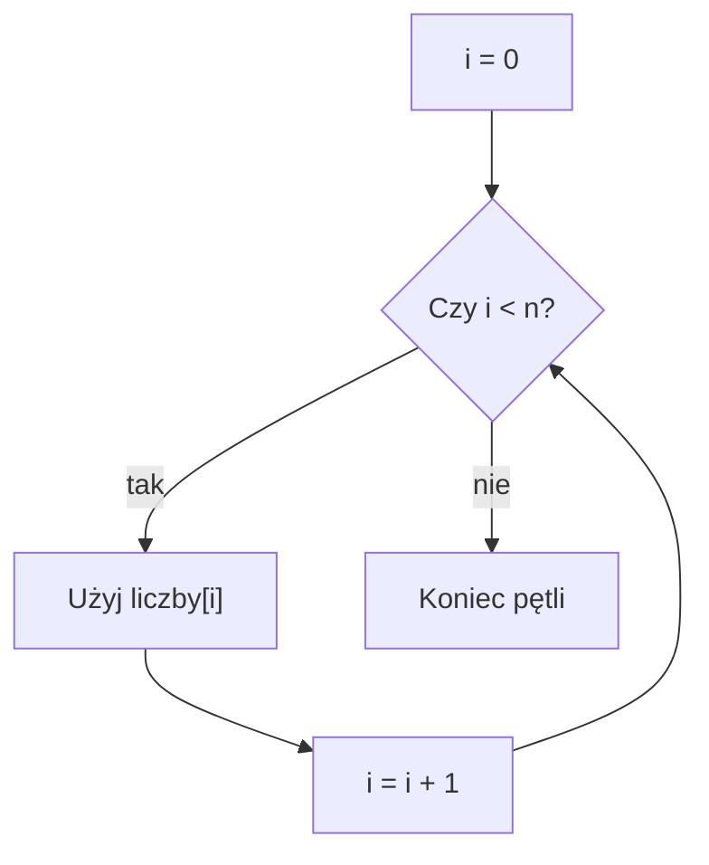

# Wczytywanie i wypisywanie tablicy

## Cel lekcji

Nauczysz się wczytywać elementy tablicy, wypisywać je w kolejności normalnej i odwrotnej oraz używać rozmiaru logicznego `n`.

## Krótkie wprowadzenie do problemu

Tablica ma stałą pojemność, ale użytkownik często podaje mniej danych niż wynosi pojemność. Dlatego potrzebujemy dwóch informacji: ile miejsc tablica ma oraz ile miejsc naprawdę używamy.

## Wyjaśnienie idei

Pojemność tablicy to liczba dostępnych miejsc. Rozmiar logiczny `n` to liczba elementów aktualnie używanych przez program.

Jeżeli `MAKS = 1000`, tablica ma 1000 miejsc. Jeżeli `n = 5`, program używa tylko indeksów od `0` do `4`.

## Składnia

```cpp
const int MAKS = 1000;
int liczby[MAKS];
int n;

cin >> n;

for (int i = 0; i < n; i++)
{
    cin >> liczby[i];
}
```

Warunek `i < n` oznacza: wykonuj pętlę dla indeksów mniejszych od `n`. Dla `n = 5` indeksy to `0`, `1`, `2`, `3`, `4`.

Zapis `i <= n` jest błędny, bo dla `n = 5` dopuści indeks `5`, czyli o jeden element za daleko.

## Diagram przechodzenia po tablicy



## Przykład 1 - wczytanie i wypisanie od początku

```cpp
#include <iostream>

using namespace std;

int main()
{
    const int MAKS = 1000;
    int liczby[MAKS];
    int n;

    cout << "Ile liczb? ";
    cin >> n;

    if (n >= 0 && n <= MAKS)
    {
        for (int i = 0; i < n; i++)
        {
            cin >> liczby[i];
        }

        for (int i = 0; i < n; i++)
        {
            cout << liczby[i] << " ";
        }
        cout << "\n";
    }
    else
    {
        cout << "Niepoprawna liczba elementow.\n";
    }

    return 0;
}
```

<details markdown="1">
<summary>Pokaż przykładowe dane i wynik</summary>

Dane wejściowe:
```text
5
4 7 2 9 1
```

Wynik:
```text
Ile liczb? 4 7 2 9 1 
```

</details>

## Przykład 2 - wypisanie od końca

```cpp
#include <iostream>

using namespace std;

int main()
{
    const int MAKS = 1000;
    int liczby[MAKS];
    int n;

    cin >> n;

    if (n >= 0 && n <= MAKS)
    {
        for (int i = 0; i < n; i++)
        {
            cin >> liczby[i];
        }

        for (int i = n - 1; i >= 0; i--)
        {
            cout << liczby[i] << " ";
        }
        cout << "\n";
    }

    return 0;
}
```

<details markdown="1">
<summary>Pokaż przykładowe dane i wynik</summary>

Dane wejściowe:
```text
4
10 20 30 40
```

Wynik:
```text
40 30 20 10 
```

</details>

## Omówienie przykładu krok po kroku

- `MAKS` określa pojemność tablicy.
- `n` określa liczbę używanych elementów.
- Pierwsza pętla wczytuje wartości do indeksów od `0` do `n - 1`.
- Druga pętla wypisuje te same indeksy.
- Warunek sprawdza, czy `n` mieści się w tablicy.

## Kiedy tego użyć?

Tego schematu używamy, gdy liczba danych jest znana dopiero podczas działania programu, ale istnieje ustalona maksymalna pojemność.

## Kiedy wybrać coś innego?

Jeżeli masz kilka stałych wartości znanych od razu, możesz zainicjalizować tablicę bez wczytywania danych.

## Typowe błędy

- Użycie `i <= n` zamiast `i < n`.
- Brak sprawdzenia, czy `n <= MAKS`.
- Mylenie pojemności tablicy z liczbą używanych elementów.
- Wypisywanie nieużywanych elementów tablicy.
- Próba utworzenia tablicy o rozmiarze podanym przez użytkownika.

## Ćwiczenia

### Ćwiczenie 1

Wczytaj `n` liczb i wypisz je od początku do końca.

<details markdown="1">
<summary>Pokaż wskazówkę do ćwiczenia 1</summary>

Użyj dwóch pętli `for`: jednej do wczytania, drugiej do wypisania.

</details>

<details markdown="1">
<summary>Pokaż rozwiązanie ćwiczenia 1</summary>

```cpp
#include <iostream>

using namespace std;

int main()
{
    const int MAKS = 1000;
    int liczby[MAKS];
    int n;

    cin >> n;

    if (n >= 0 && n <= MAKS)
    {
        for (int i = 0; i < n; i++)
        {
            cin >> liczby[i];
        }

        for (int i = 0; i < n; i++)
        {
            cout << liczby[i] << " ";
        }
        cout << "\n";
    }

    return 0;
}
```

</details>

### Ćwiczenie 2

Wczytaj `n` liczb i wypisz je od końca do początku.

<details markdown="1">
<summary>Pokaż wskazówkę do ćwiczenia 2</summary>

Druga pętla może zaczynać od `n - 1`.

</details>

<details markdown="1">
<summary>Pokaż rozwiązanie ćwiczenia 2</summary>

```cpp
#include <iostream>

using namespace std;

int main()
{
    const int MAKS = 1000;
    int liczby[MAKS];
    int n;

    cin >> n;

    if (n >= 0 && n <= MAKS)
    {
        for (int i = 0; i < n; i++)
        {
            cin >> liczby[i];
        }

        for (int i = n - 1; i >= 0; i--)
        {
            cout << liczby[i] << " ";
        }
        cout << "\n";
    }

    return 0;
}
```

</details>

### Ćwiczenie 3

Wczytaj `n` liczb i wypisz tylko elementy o parzystych indeksach.

<details markdown="1">
<summary>Pokaż wskazówkę do ćwiczenia 3</summary>

Indeksy parzyste spełniają warunek `i % 2 == 0`.

</details>

<details markdown="1">
<summary>Pokaż rozwiązanie ćwiczenia 3</summary>

```cpp
#include <iostream>

using namespace std;

int main()
{
    const int MAKS = 1000;
    int liczby[MAKS];
    int n;

    cin >> n;

    if (n >= 0 && n <= MAKS)
    {
        for (int i = 0; i < n; i++)
        {
            cin >> liczby[i];
        }

        for (int i = 0; i < n; i++)
        {
            if (i % 2 == 0)
            {
                cout << liczby[i] << " ";
            }
        }
        cout << "\n";
    }

    return 0;
}
```

</details>

## Podsumowanie

Do pracy z tablicą najczęściej używamy pętli `for`. Pojemność tablicy jest stała, a `n` mówi, ile elementów aktualnie wykorzystujemy.