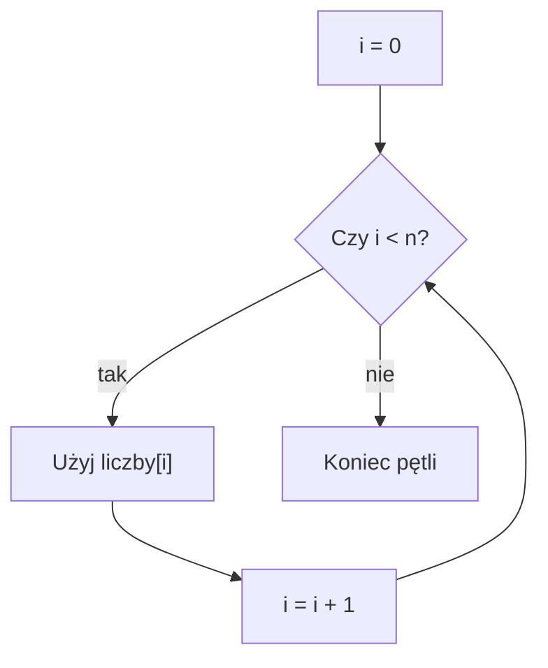

# Wczytywanie i wypisywanie tablicy

## Cel lekcji

Nauczysz się wczytywać elementy tablicy, wypisywać je w kolejności normalnej i odwrotnej oraz używać rozmiaru logicznego `n`.

## Krótkie wprowadzenie do problemu

Tablica ma stałą pojemność, ale użytkownik często podaje mniej danych niż wynosi pojemność. Dlatego potrzebujemy dwóch informacji: ile miejsc tablica ma oraz ile miejsc naprawdę używamy.

## Wyjaśnienie idei

Pojemność tablicy to liczba dostępnych miejsc. Rozmiar logiczny `n` to liczba elementów aktualnie używanych przez program.

Jeżeli `MAKS = 1000`, tablica ma 1000 miejsc. Jeżeli `n = 5`, program używa tylko indeksów od `0` do `4`.

## Składnia

```cpp
const int MAKS = 1000;
int liczby[MAKS];
int n;

cin >> n;

for (int i = 0; i < n; i++)
{
    cin >> liczby[i];
}
```

Warunek `i < n` oznacza: wykonuj pętlę dla indeksów mniejszych od `n`. Dla `n = 5` indeksy to `0`, `1`, `2`, `3`, `4`.

Zapis `i <= n` jest błędny, bo dla `n = 5` dopuści indeks `5`, czyli o jeden element za daleko.

## Materiał nieobowiązkowy - tablica o zmiennym rozmiarze w GNU C++

> **Materiał nieobowiązkowy**
>
> Możesz pominąć tę część. Do wykonania pozostałych lekcji wystarczy standardowy wariant ze stałą pojemnością i rozmiarem logicznym `n`.


Najpierw poznaliśmy wariant zgodny ze standardem ISO C++23:

```cpp
const int MAKS = 1000;
int liczby[MAKS];
int n;
```

W tym wariancie tablica ma stałą pojemność, a `n` mówi, ile miejsc aktualnie używamy.

W szkolnych programach możesz jednak spotkać krótszy zapis:

```cpp
int n;
cin >> n;
int liczby[n];
```

Taki zapis oznacza, że `n` otrzymuje wartość dopiero podczas działania programu, a rozmiar tablicy jest ustalany na podstawie tej wartości. Taka konstrukcja jest nazywana tablicą o zmiennej długości. Można spotkać skrót VLA od `Variable Length Array`.

GCC obsługuje VLA w C++ jako własne rozszerzenie. Dlatego taki program może działać w Code::Blocks z kompilatorem GCC. Nie jest to jednak element standardu ISO C++23. Ten sam program może zostać odrzucony przez inny kompilator albo przez GCC przy ścisłym sprawdzaniu zgodności ze standardem.

Przed utworzeniem takiej tablicy zawsze sprawdzamy wartość `n`. Rozmiar powinien być dodatni i rozsądnie mały. Bardzo duża tablica lokalna może spowodować problem z dostępną pamięcią.

```cpp
#include <iostream>

using namespace std;

int main()
{
    int n;

    cout << "Podaj rozmiar tablicy: ";
    cin >> n;

    if (n < 1 || n > 1000)
    {
        cout << "Nieprawidlowy rozmiar.\n";
        return 0;
    }

    int liczby[n];

    cout << "Podaj elementy tablicy:\n";

    for (int i = 0; i < n; i++)
    {
        cin >> liczby[i];
    }

    cout << "Elementy tablicy:\n";

    for (int i = 0; i < n; i++)
    {
        cout << liczby[i] << " ";
    }

    cout << "\n";

    return 0;
}
```

<details markdown="1">
<summary>Pokaż przykładowe dane i wynik</summary>

Dane wejściowe:
```text
4
5 8 2 7
```

Wynik:
```text
Podaj rozmiar tablicy: Podaj elementy tablicy:
Elementy tablicy:
5 8 2 7
```

</details>

Praktyczna zasada w tym kursie jest prosta:

- w prostych programach wykonywanych w Code::Blocks można świadomie zastosować `int tablica[n]`,
- trzeba wiedzieć, że jest to rozszerzenie GNU,
- gdy program ma być zgodny ze standardem ISO C++23 i przenośny, używamy stałej pojemności oraz osobnego rozmiaru logicznego,
- w zadaniu wymagającym konkretnego standardu stosujemy wymagania tego standardu.

| Właściwość | Stała pojemność i rozmiar logiczny | `int tablica[n]` |
|---|---|---|
| Zgodność z ISO C++23 | tak | nie |
| Działanie w GCC | tak | tak, jako rozszerzenie |
| Przenośność | większa | mniejsza |
| Prostota dla początkującego | wymaga rozróżnienia `MAKS` i `n` | prostszy zapis |
| Kontrola maksymalnego rozmiaru | wynika z `MAKS` | trzeba sprawdzić `n` przed deklaracją |

Nie chodzi o to, że jeden wariant jest zawsze najlepszy. Ważny jest kontekst: standardowy wariant jest przenośny, a wariant GNU bywa prosty i często działa w szkolnym środowisku z GCC.


## Diagram przechodzenia po tablicy



## Przykład 1 - wczytanie i wypisanie od początku

```cpp
#include <iostream>

using namespace std;

int main()
{
    const int MAKS = 1000;
    int liczby[MAKS];
    int n;

    cout << "Ile liczb? ";
    cin >> n;

    if (n >= 0 && n <= MAKS)
    {
        for (int i = 0; i < n; i++)
        {
            cin >> liczby[i];
        }

        for (int i = 0; i < n; i++)
        {
            cout << liczby[i] << " ";
        }
        cout << "\n";
    }
    else
    {
        cout << "Niepoprawna liczba elementow.\n";
    }

    return 0;
}
```

<details markdown="1">
<summary>Pokaż przykładowe dane i wynik</summary>

Dane wejściowe:
```text
5
4 7 2 9 1
```

Wynik:
```text
Ile liczb? 4 7 2 9 1 
```

</details>

## Przykład 2 - wypisanie od końca

```cpp
#include <iostream>

using namespace std;

int main()
{
    const int MAKS = 1000;
    int liczby[MAKS];
    int n;

    cin >> n;

    if (n >= 0 && n <= MAKS)
    {
        for (int i = 0; i < n; i++)
        {
            cin >> liczby[i];
        }

        for (int i = n - 1; i >= 0; i--)
        {
            cout << liczby[i] << " ";
        }
        cout << "\n";
    }

    return 0;
}
```

<details markdown="1">
<summary>Pokaż przykładowe dane i wynik</summary>

Dane wejściowe:
```text
4
10 20 30 40
```

Wynik:
```text
40 30 20 10 
```

</details>

## Omówienie przykładu krok po kroku

- `MAKS` określa pojemność tablicy.
- `n` określa liczbę używanych elementów.
- Pierwsza pętla wczytuje wartości do indeksów od `0` do `n - 1`.
- Druga pętla wypisuje te same indeksy.
- Warunek sprawdza, czy `n` mieści się w tablicy.

## Kiedy tego użyć?

Tego schematu używamy, gdy liczba danych jest znana dopiero podczas działania programu, ale istnieje ustalona maksymalna pojemność.

## Kiedy wybrać coś innego?

Jeżeli masz kilka stałych wartości znanych od razu, możesz zainicjalizować tablicę bez wczytywania danych.

## Typowe błędy

- Użycie `i <= n` zamiast `i < n`.
- Brak sprawdzenia, czy `n <= MAKS`.
- Mylenie pojemności tablicy z liczbą używanych elementów.
- Wypisywanie nieużywanych elementów tablicy.
- Użycie `int liczby[n]` bez świadomości, że jest to rozszerzenie GNU, a nie element ISO C++23.

## Ćwiczenia

### Ćwiczenie 1

Wczytaj `n` liczb i wypisz je od początku do końca.

<details markdown="1">
<summary>Pokaż wskazówkę do ćwiczenia 1</summary>

Użyj dwóch pętli `for`: jednej do wczytania, drugiej do wypisania.

</details>

<details markdown="1">
<summary>Pokaż rozwiązanie ćwiczenia 1</summary>

```cpp
#include <iostream>

using namespace std;

int main()
{
    const int MAKS = 1000;
    int liczby[MAKS];
    int n;

    cin >> n;

    if (n >= 0 && n <= MAKS)
    {
        for (int i = 0; i < n; i++)
        {
            cin >> liczby[i];
        }

        for (int i = 0; i < n; i++)
        {
            cout << liczby[i] << " ";
        }
        cout << "\n";
    }

    return 0;
}
```

</details>

### Ćwiczenie 2

Wczytaj `n` liczb i wypisz je od końca do początku.

<details markdown="1">
<summary>Pokaż wskazówkę do ćwiczenia 2</summary>

Druga pętla może zaczynać od `n - 1`.

</details>

<details markdown="1">
<summary>Pokaż rozwiązanie ćwiczenia 2</summary>

```cpp
#include <iostream>

using namespace std;

int main()
{
    const int MAKS = 1000;
    int liczby[MAKS];
    int n;

    cin >> n;

    if (n >= 0 && n <= MAKS)
    {
        for (int i = 0; i < n; i++)
        {
            cin >> liczby[i];
        }

        for (int i = n - 1; i >= 0; i--)
        {
            cout << liczby[i] << " ";
        }
        cout << "\n";
    }

    return 0;
}
```

</details>

### Ćwiczenie 3

Wczytaj `n` liczb i wypisz tylko elementy o parzystych indeksach.

<details markdown="1">
<summary>Pokaż wskazówkę do ćwiczenia 3</summary>

Indeksy parzyste spełniają warunek `i % 2 == 0`.

</details>

<details markdown="1">
<summary>Pokaż rozwiązanie ćwiczenia 3</summary>

```cpp
#include <iostream>

using namespace std;

int main()
{
    const int MAKS = 1000;
    int liczby[MAKS];
    int n;

    cin >> n;

    if (n >= 0 && n <= MAKS)
    {
        for (int i = 0; i < n; i++)
        {
            cin >> liczby[i];
        }

        for (int i = 0; i < n; i++)
        {
            if (i % 2 == 0)
            {
                cout << liczby[i] << " ";
            }
        }
        cout << "\n";
    }

    return 0;
}
```

</details>


### Ćwiczenie nieobowiązkowe 4

To ćwiczenie celowo wykorzystuje rozszerzenie GNU: tablicę o rozmiarze podanym podczas działania programu.

Wczytaj rozmiar tablicy. Sprawdź, czy mieści się w zakresie od `1` do `100`. Utwórz tablicę `int liczby[n]`, wczytaj jej elementy i wypisz je w odwrotnej kolejności.

<details markdown="1">
<summary>Pokaż wskazówkę do ćwiczenia 4</summary>

Najpierw sprawdź `n`. Dopiero po sprawdzeniu utwórz tablicę `int liczby[n]`. Do wypisania od końca zacznij pętlę od `n - 1`.

</details>

<details markdown="1">
<summary>Pokaż przykładowe dane i wynik do ćwiczenia 4</summary>

Dane wejściowe:
```text
5
1 2 3 4 5
```

Wynik:
```text
5 4 3 2 1
```

</details>

<details markdown="1">
<summary>Pokaż rozwiązanie ćwiczenia 4</summary>

```cpp
#include <iostream>

using namespace std;

int main()
{
    int n;

    cin >> n;

    if (n < 1 || n > 100)
    {
        cout << "Nieprawidlowy rozmiar.\n";
        return 0;
    }

    int liczby[n];

    for (int i = 0; i < n; i++)
    {
        cin >> liczby[i];
    }

    for (int i = n - 1; i >= 0; i--)
    {
        cout << liczby[i] << " ";
    }
    cout << "\n";

    return 0;
}
```

</details>

## Podsumowanie

Do pracy z tablicą najczęściej używamy pętli `for`. Pojemność tablicy jest stała, a `n` mówi, ile elementów aktualnie wykorzystujemy.