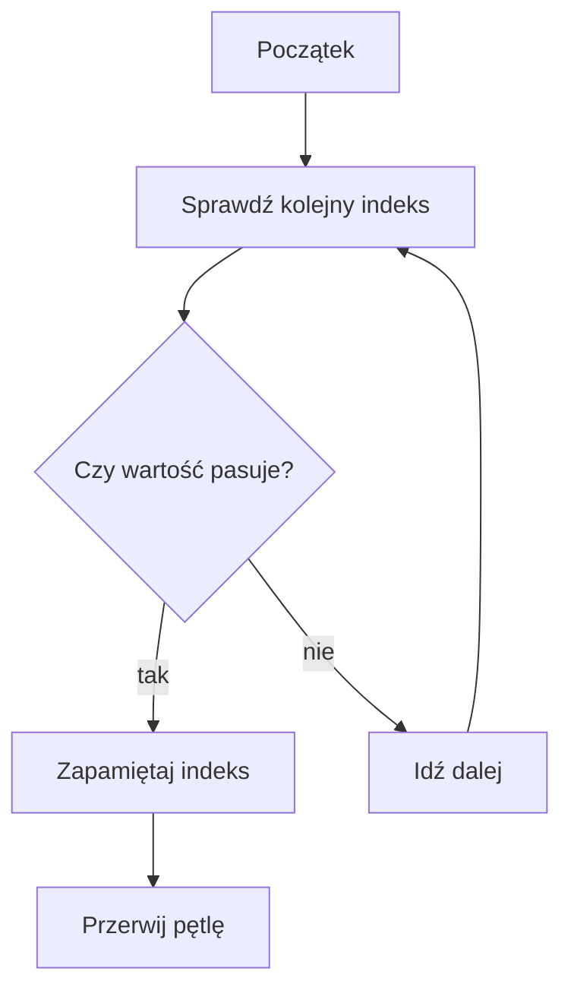

# Wyszukiwanie i zliczanie

## Cel lekcji

Nauczysz się wyszukiwać element w tablicy i zliczać elementy spełniające warunek.

## Krótkie wprowadzenie do problemu

Czasem chcemy wiedzieć, czy dana wartość występuje w tablicy, gdzie występuje albo ile razy występuje.

## Wyjaśnienie idei

Wyszukiwanie liniowe sprawdza kolejne elementy od początku. Jeżeli szukamy pierwszego wystąpienia, możemy zakończyć pętlę przez `break`. Jeżeli liczymy wszystkie wystąpienia, musimy sprawdzić całą tablicę.

Wartość `-1` może oznaczać brak wyniku, bo poprawne indeksy zaczynają się od `0`.

## Składnia

```cpp
int indeks = -1;

for (int i = 0; i < n; i++)
{
    if (liczby[i] == szukana)
    {
        indeks = i;
        break;
    }
}
```

## Diagram wyszukiwania



## Przykład 1 - pierwsze wystąpienie liczby

```cpp
#include <iostream>

using namespace std;

int main()
{
    const int MAKS = 1000;
    int liczby[MAKS];
    int n;
    int szukana;
    int indeks = -1;

    cin >> n;

    if (n >= 0 && n <= MAKS)
    {
        for (int i = 0; i < n; i++)
        {
            cin >> liczby[i];
        }

        cin >> szukana;

        for (int i = 0; i < n; i++)
        {
            if (liczby[i] == szukana)
            {
                indeks = i;
                break;
            }
        }

        cout << "Indeks: " << indeks << "\n";
    }

    return 0;
}
```

<details markdown="1">
<summary>Pokaż przykładowe dane i wynik</summary>

Dane wejściowe:
```text
6
4 8 3 8 2 1
8
```

Wynik:
```text
Indeks: 1
```

</details>

## Przykład 2 - zliczanie wystąpień i liczb parzystych

```cpp
#include <iostream>

using namespace std;

int main()
{
    const int MAKS = 1000;
    int liczby[MAKS];
    int n;
    int szukana;
    int ileSzukanych = 0;
    int ileParzystych = 0;

    cin >> n;

    if (n >= 0 && n <= MAKS)
    {
        for (int i = 0; i < n; i++)
        {
            cin >> liczby[i];
        }

        cin >> szukana;

        for (int i = 0; i < n; i++)
        {
            if (liczby[i] == szukana)
            {
                ileSzukanych++;
            }

            if (liczby[i] % 2 == 0)
            {
                ileParzystych++;
            }
        }

        cout << "Wystapienia: " << ileSzukanych << "\n";
        cout << "Parzyste: " << ileParzystych << "\n";
    }

    return 0;
}
```

<details markdown="1">
<summary>Pokaż przykładowe dane i wynik</summary>

Dane wejściowe:
```text
5
2 7 2 8 9
2
```

Wynik:
```text
Wystapienia: 2
Parzyste: 3
```

</details>

## Omówienie przykładu krok po kroku

- `indeks` zaczyna od `-1`, bo na początku niczego nie znaleziono.
- Pętla sprawdza elementy po kolei.
- Gdy znajdzie szukaną wartość, zapisuje indeks i kończy pętlę.
- Przy zliczaniu nie używamy `break`, bo trzeba sprawdzić wszystkie elementy.

## Kiedy tego użyć?

Wyszukiwanie liniowe jest dobre, gdy tablica nie jest uporządkowana albo gdy chcesz zobaczyć działanie algorytmu krok po kroku.

## Kiedy wybrać coś innego?

Jeżeli tablica jest uporządkowana i znasz inne metody, później można użyć szybszych algorytmów. W tym rozdziale zostajemy przy prostym sprawdzaniu kolejnych elementów.

## Typowe błędy

- Użycie `break` przy zliczaniu wszystkich wystąpień.
- Brak wartości początkowej `-1` dla indeksu.
- Mylenie indeksu z wartością elementu.
- Zwiększanie licznika w złym miejscu.
- Użycie gotowych funkcji zamiast przejścia po tablicy.

## Ćwiczenia

### Ćwiczenie 1

Wczytaj tablicę i liczbę. Wypisz indeks pierwszego wystąpienia tej liczby albo `-1`.

<details markdown="1">
<summary>Pokaż wskazówkę do ćwiczenia 1</summary>

Użyj zmiennej `indeks = -1` i instrukcji `break`.

</details>

<details markdown="1">
<summary>Pokaż rozwiązanie ćwiczenia 1</summary>

```cpp
#include <iostream>

using namespace std;

int main()
{
    const int MAKS = 1000;
    int liczby[MAKS];
    int n;
    int szukana;
    int indeks = -1;

    cin >> n;

    if (n >= 0 && n <= MAKS)
    {
        for (int i = 0; i < n; i++)
        {
            cin >> liczby[i];
        }

        cin >> szukana;

        for (int i = 0; i < n; i++)
        {
            if (liczby[i] == szukana)
            {
                indeks = i;
                break;
            }
        }

        cout << indeks << "\n";
    }

    return 0;
}
```

</details>

### Ćwiczenie 2

Wczytaj tablicę i policz, ile jest w niej liczb dodatnich.

<details markdown="1">
<summary>Pokaż wskazówkę do ćwiczenia 2</summary>

Zwiększ licznik, gdy `liczby[i] > 0`.

</details>

<details markdown="1">
<summary>Pokaż rozwiązanie ćwiczenia 2</summary>

```cpp
#include <iostream>

using namespace std;

int main()
{
    const int MAKS = 1000;
    int liczby[MAKS];
    int n;
    int ile = 0;

    cin >> n;

    if (n >= 0 && n <= MAKS)
    {
        for (int i = 0; i < n; i++)
        {
            cin >> liczby[i];
            if (liczby[i] > 0)
            {
                ile++;
            }
        }

        cout << ile << "\n";
    }

    return 0;
}
```

</details>

### Ćwiczenie 3

Wczytaj tablicę i wartość graniczną. Wypisz pierwszy element większy od tej wartości albo komunikat `brak`.

<details markdown="1">
<summary>Pokaż wskazówkę do ćwiczenia 3</summary>

Użyj zmiennej logicznej `znaleziono`.

</details>

<details markdown="1">
<summary>Pokaż rozwiązanie ćwiczenia 3</summary>

```cpp
#include <iostream>

using namespace std;

int main()
{
    const int MAKS = 1000;
    int liczby[MAKS];
    int n;
    int granica;
    bool znaleziono = false;
    int wynik = 0;

    cin >> n;

    if (n >= 0 && n <= MAKS)
    {
        for (int i = 0; i < n; i++)
        {
            cin >> liczby[i];
        }

        cin >> granica;

        for (int i = 0; i < n; i++)
        {
            if (liczby[i] > granica)
            {
                wynik = liczby[i];
                znaleziono = true;
                break;
            }
        }

        if (znaleziono)
        {
            cout << wynik << "\n";
        }
        else
        {
            cout << "brak\n";
        }
    }

    return 0;
}
```

</details>

## Podsumowanie

Wyszukiwanie pierwszego elementu może zakończyć się przez `break`. Zliczanie wymaga sprawdzenia wszystkich elementów tablicy.