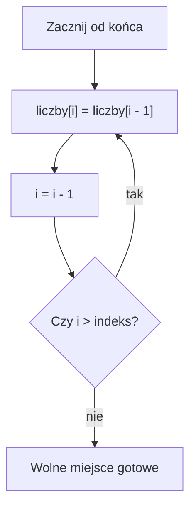

# Przesuwanie elementów tablicy

## Cel lekcji

Nauczysz się przesuwać elementy tablicy w lewo i w prawo oraz rozumieć, dlaczego kolejność przesuwania ma znaczenie.

## Krótkie wprowadzenie do problemu

Gdy chcemy usunąć miejsce po elemencie albo zrobić wolne miejsce w środku tablicy, trzeba przesunąć kilka wartości.

## Wyjaśnienie idei

Przesunięcie w lewo przenosi elementy z większych indeksów na mniejsze. Przesunięcie w prawo przenosi elementy z mniejszych indeksów na większe.

Przy przesuwaniu w prawo trzeba iść od końca. W przeciwnym razie nadpiszemy wartość, której jeszcze potrzebujemy.

| Krok | Indeks 0 | Indeks 1 | Indeks 2 | Indeks 3 |
|---|---|---|---|---|
| Przed | 5 | 8 | 2 | 9 |
| Po przesunięciu od indeksu 1 w lewo | 5 | 2 | 9 | 9 |

Ostatnia wartość zostaje technicznie w tablicy, ale po zmniejszeniu `n` nie należy już do używanego zakresu.

## Składnia

Przesunięcie w lewo:

```cpp
for (int i = indeks; i < n - 1; i++)
{
    liczby[i] = liczby[i + 1];
}
```

Przesunięcie w prawo:

```cpp
for (int i = n; i > indeks; i--)
{
    liczby[i] = liczby[i - 1];
}
```

## Diagram przesunięcia w prawo



## Przykład 1 - przesunięcie w lewo

```cpp
#include <iostream>

using namespace std;

int main()
{
    int liczby[5] = {5, 8, 2, 9, 4};
    int n = 5;
    int indeks = 1;

    for (int i = indeks; i < n - 1; i++)
    {
        liczby[i] = liczby[i + 1];
    }

    n--;

    for (int i = 0; i < n; i++)
    {
        cout << liczby[i] << " ";
    }
    cout << "\n";

    return 0;
}
```

<details markdown="1">
<summary>Pokaż wynik</summary>

```text
5 2 9 4 
```

</details>

## Przykład 2 - przesunięcie w prawo

```cpp
#include <iostream>

using namespace std;

int main()
{
    const int MAKS = 6;
    int liczby[MAKS] = {5, 8, 2, 9};
    int n = 4;
    int indeks = 1;
    int nowa = 100;

    for (int i = n; i > indeks; i--)
    {
        liczby[i] = liczby[i - 1];
    }

    liczby[indeks] = nowa;
    n++;

    for (int i = 0; i < n; i++)
    {
        cout << liczby[i] << " ";
    }
    cout << "\n";

    return 0;
}
```

<details markdown="1">
<summary>Pokaż wynik</summary>

```text
5 100 8 2 9 
```

</details>

## Omówienie przykładu krok po kroku

- `n = 4`, więc używane są indeksy od `0` do `3`.
- Chcemy wstawić nową wartość na indeks `1`.
- Pętla zaczyna od `i = n`, czyli od pierwszego wolnego miejsca.
- Każdy element przesuwa się o jedno miejsce w prawo.
- Dopiero potem wpisujemy nową wartość.

## Kiedy tego użyć?

Przesuwanie jest potrzebne przy ręcznym wstawianiu i usuwaniu elementów w klasycznej tablicy.

## Kiedy wybrać coś innego?

Jeżeli chcesz tylko zamienić dwa elementy miejscami, wystarczy zmienna pomocnicza. Przesuwanie dotyczy większego fragmentu tablicy.

## Typowe błędy

- Przesuwanie w prawo od początku i nadpisanie danych.
- Zapomnienie o zmniejszeniu albo zwiększeniu `n`.
- Mylenie przesunięcia z zamianą dwóch elementów.
- Użycie złego warunku końca pętli.
- Wstawianie bez sprawdzenia wolnego miejsca.

## Ćwiczenia

### Ćwiczenie 1

Usuń logicznie element o indeksie `2` z tablicy pięciu liczb przez przesunięcie w lewo.

<details markdown="1">
<summary>Pokaż wskazówkę do ćwiczenia 1</summary>

Pętla powinna zacząć od usuwanego indeksu.

</details>

<details markdown="1">
<summary>Pokaż rozwiązanie ćwiczenia 1</summary>

```cpp
#include <iostream>

using namespace std;

int main()
{
    int liczby[5] = {1, 2, 3, 4, 5};
    int n = 5;
    int indeks = 2;

    for (int i = indeks; i < n - 1; i++)
    {
        liczby[i] = liczby[i + 1];
    }

    n--;

    for (int i = 0; i < n; i++)
    {
        cout << liczby[i] << " ";
    }
    cout << "\n";

    return 0;
}
```

</details>

### Ćwiczenie 2

Wstaw wartość `99` na początek tablicy przez przesunięcie w prawo.

<details markdown="1">
<summary>Pokaż wskazówkę do ćwiczenia 2</summary>

Przesuwaj od `n` w dół do `1`.

</details>

<details markdown="1">
<summary>Pokaż rozwiązanie ćwiczenia 2</summary>

```cpp
#include <iostream>

using namespace std;

int main()
{
    const int MAKS = 6;
    int liczby[MAKS] = {2, 4, 6, 8};
    int n = 4;

    for (int i = n; i > 0; i--)
    {
        liczby[i] = liczby[i - 1];
    }

    liczby[0] = 99;
    n++;

    for (int i = 0; i < n; i++)
    {
        cout << liczby[i] << " ";
    }
    cout << "\n";

    return 0;
}
```

</details>

### Ćwiczenie 3

Zamień miejscami pierwszy i ostatni używany element tablicy.

<details markdown="1">
<summary>Pokaż wskazówkę do ćwiczenia 3</summary>

To nie jest przesunięcie. Użyj zmiennej pomocniczej.

</details>

<details markdown="1">
<summary>Pokaż rozwiązanie ćwiczenia 3</summary>

```cpp
#include <iostream>

using namespace std;

int main()
{
    int liczby[4] = {3, 6, 9, 12};
    int n = 4;
    int pomocnicza = liczby[0];

    liczby[0] = liczby[n - 1];
    liczby[n - 1] = pomocnicza;

    for (int i = 0; i < n; i++)
    {
        cout << liczby[i] << " ";
    }
    cout << "\n";

    return 0;
}
```

</details>

## Podsumowanie

Przy przesuwaniu w lewo idziemy od mniejszych indeksów do większych. Przy przesuwaniu w prawo idziemy od końca, żeby nie nadpisać danych, których jeszcze potrzebujemy.