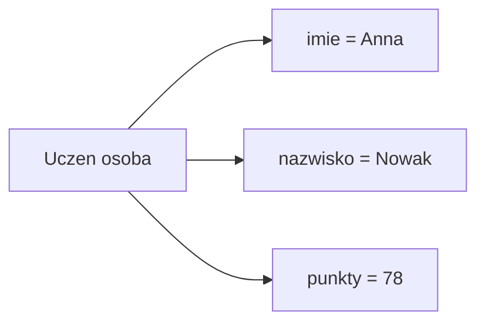

# Pierwsza struktura

## Cel lekcji

Nauczysz się tworzyć prostą strukturę `struct`, zapisywać wartości w jej polach i odczytywać te wartości w programie.

## Krótkie wprowadzenie do problemu

Jedna zmienna przechowuje jedną wartość. Uczeń nie jest jednak tylko jedną wartością. Ma imię, nazwisko i punkty. Produkt może mieć nazwę, cenę i liczbę sztuk.

Struktura pozwala zebrać takie informacje w jeden rekord.

## Wyjaśnienie idei

`struct` tworzy nowy typ danych. Ten typ ma pola. Każde pole przechowuje jedną informację.

Można to porównać do formularza. Formularz ma pola: imię, nazwisko, punkty. Jeden wypełniony formularz opisuje jednego ucznia.



## Składnia

```cpp
struct Uczen
{
    string imie;
    string nazwisko;
    int punkty;
};
```

Po definicji struktury musi być średnik.

```cpp
Uczen osoba;
osoba.imie = "Anna";
osoba.nazwisko = "Nowak";
osoba.punkty = 78;
```

Ważne nazwy:

- `Uczen` => typ,
- `osoba` => konkretna zmienna tego typu,
- `punkty` => pole,
- `osoba.punkty` => wartość pola konkretnej zmiennej.

## Przykład 1 - zapisanie danych ucznia

```cpp
#include <iostream>
#include <string>

using namespace std;

struct Uczen
{
    string imie;
    string nazwisko;
    int punkty;
};

int main()
{
    Uczen osoba;

    osoba.imie = "Anna";
    osoba.nazwisko = "Nowak";
    osoba.punkty = 78;

    cout << "Uczen: " << osoba.imie << " " << osoba.nazwisko << "\n";
    cout << "Punkty: " << osoba.punkty << "\n";

    osoba.punkty = 82;
    cout << "Po poprawie: " << osoba.punkty << "\n";

    return 0;
}
```

<details markdown="1">
<summary>Pokaż wynik</summary>

```text
Uczen: Anna Nowak
Punkty: 78
Po poprawie: 82
```

</details>

## Omówienie przykładu krok po kroku

1. `struct Uczen` tworzy nowy typ danych.
2. Pola `imie`, `nazwisko` i `punkty` opisują jednego ucznia.
3. `Uczen osoba;` tworzy zmienną strukturalną.
4. `osoba.imie = "Anna";` wpisuje tekst do pola `imie` tej konkretnej osoby.
5. `osoba.punkty = 78;` wpisuje liczbę punktów.
6. Operator `.` pozwala dostać się do pola wybranej zmiennej.
7. `osoba.punkty = 82;` zmienia tylko pole `punkty` w zmiennej `osoba`.

## Przykład 2 - inicjalizacja za pomocą `{}`

```cpp
#include <iostream>
#include <string>

using namespace std;

struct Uczen
{
    string imie;
    string nazwisko;
    int punkty;
};

int main()
{
    Uczen pierwszaOsoba = {"Anna", "Nowak", 78};
    Uczen drugaOsoba = {"Jan", "Kowalski", 64};

    cout << pierwszaOsoba.imie << " " << pierwszaOsoba.nazwisko << ": " << pierwszaOsoba.punkty << "\n";
    cout << drugaOsoba.imie << " " << drugaOsoba.nazwisko << ": " << drugaOsoba.punkty << "\n";

    return 0;
}
```

<details markdown="1">
<summary>Pokaż wynik</summary>

```text
Anna Nowak: 78
Jan Kowalski: 64
```

</details>

Wartości w `{}` są wpisywane do pól w kolejności zapisanej w definicji struktury.

## Przykład 3 - tekst ze spacjami

```cpp
#include <iostream>
#include <string>

using namespace std;

struct Ksiazka
{
    string tytul;
    string autor;
    int rok;
};

int main()
{
    Ksiazka ksiazka;

    cout << "Podaj tytul: ";
    getline(cin, ksiazka.tytul);

    cout << "Podaj autora: ";
    getline(cin, ksiazka.autor);

    cout << "Podaj rok: ";
    cin >> ksiazka.rok;

    cout << "Ksiazka: " << ksiazka.tytul << "\n";
    cout << "Autor: " << ksiazka.autor << "\n";
    cout << "Rok: " << ksiazka.rok << "\n";

    return 0;
}
```

<details markdown="1">
<summary>Pokaż przykładowe dane i wynik</summary>

Dane wejściowe:

```text
Pan Tadeusz
Adam Mickiewicz
1834
```

Wynik:

```text
Podaj tytul: Podaj autora: Podaj rok: Ksiazka: Pan Tadeusz
Autor: Adam Mickiewicz
Rok: 1834
```

</details>

`getline()` jest przydatne, gdy tekst może zawierać spacje.

## Kiedy tego użyć?

Użyj `struct`, gdy kilka informacji opisuje jeden obiekt i chcesz mieć czytelne nazwy pól. To dobry wybór dla ucznia, książki, produktu, punktu na planszy albo wyniku zawodnika.

## Kiedy wybrać coś innego?

Jeżeli masz tylko jedną liczbę, wystarczy zwykła zmienna. Jeżeli masz wiele liczb tego samego typu, często wystarczy tablica. Jeżeli potrzebujesz tylko dwóch krótkotrwałych wartości, czasami wystarczy `pair`, ale dla danych z trwałym znaczeniem czytelniejszy jest `struct`.

## Typowe błędy

- Brak średnika po definicji `struct`.
- Próba użycia pola bez operatora `.`.
- Pomylenie nazwy typu z nazwą zmiennej.
- Niezgodna kolejność wartości podczas inicjalizacji przez `{}`.
- Pozostawienie pola bez sensownej wartości.
- Użycie pola `punkty` zamiast `osoba.punkty`.

## Ćwiczenia

### Ćwiczenie 1

Utwórz strukturę `Produkt` z polami `nazwa`, `cena` i `liczbaSztuk`. Wpisz dane na stałe i wypisz je na ekranie.

<details markdown="1">
<summary>Pokaż wskazówkę do ćwiczenia 1</summary>

Najpierw zdefiniuj typ `Produkt`, potem utwórz zmienną `produkt` i użyj operatora `.` do wpisania wartości.

</details>

<details markdown="1">
<summary>Pokaż rozwiązanie ćwiczenia 1</summary>

```cpp
#include <iostream>
#include <string>

using namespace std;

struct Produkt
{
    string nazwa;
    double cena;
    int liczbaSztuk;
};

int main()
{
    Produkt produkt;

    produkt.nazwa = "zeszyt";
    produkt.cena = 4.50;
    produkt.liczbaSztuk = 3;

    cout << "Produkt: " << produkt.nazwa << "\n";
    cout << "Cena: " << produkt.cena << "\n";
    cout << "Liczba sztuk: " << produkt.liczbaSztuk << "\n";

    return 0;
}
```

</details>

### Ćwiczenie 2

Utwórz strukturę `Film` z polami `tytul`, `rezyser` i `rok`. Wczytaj dane od użytkownika i wypisz podsumowanie.

<details markdown="1">
<summary>Pokaż wskazówkę do ćwiczenia 2</summary>

Dla tytułu i reżysera użyj `getline()`, bo te dane mogą zawierać spacje.

</details>

<details markdown="1">
<summary>Pokaż rozwiązanie ćwiczenia 2</summary>

```cpp
#include <iostream>
#include <string>

using namespace std;

struct Film
{
    string tytul;
    string rezyser;
    int rok;
};

int main()
{
    Film film;

    cout << "Podaj tytul: ";
    getline(cin, film.tytul);

    cout << "Podaj rezysera: ";
    getline(cin, film.rezyser);

    cout << "Podaj rok: ";
    cin >> film.rok;

    cout << "Film: " << film.tytul << "\n";
    cout << "Rezyser: " << film.rezyser << "\n";
    cout << "Rok: " << film.rok << "\n";

    return 0;
}
```

</details>

### Ćwiczenie 3

Utwórz dwie zmienne typu `Uczen`, wpisz do nich dane i wypisz ucznia z większą liczbą punktów.

<details markdown="1">
<summary>Pokaż wskazówkę do ćwiczenia 3</summary>

Porównaj pola `punkty` obu zmiennych. Do wypisania użyj pól tego ucznia, który ma większy wynik.

</details>

<details markdown="1">
<summary>Pokaż rozwiązanie ćwiczenia 3</summary>

```cpp
#include <iostream>
#include <string>

using namespace std;

struct Uczen
{
    string imie;
    string nazwisko;
    int punkty;
};

int main()
{
    Uczen pierwszy = {"Anna", "Nowak", 78};
    Uczen drugi = {"Jan", "Kowalski", 84};

    if (pierwszy.punkty > drugi.punkty)
    {
        cout << pierwszy.imie << " " << pierwszy.nazwisko << "\n";
    }
    else
    {
        cout << drugi.imie << " " << drugi.nazwisko << "\n";
    }

    return 0;
}
```

</details>

## Podsumowanie

`struct` pozwala utworzyć własny typ danych z nazwanymi polami. Dzięki temu kilka informacji opisujących jeden obiekt można przechowywać razem i czytać kod jak opis rzeczywistego obiektu.
