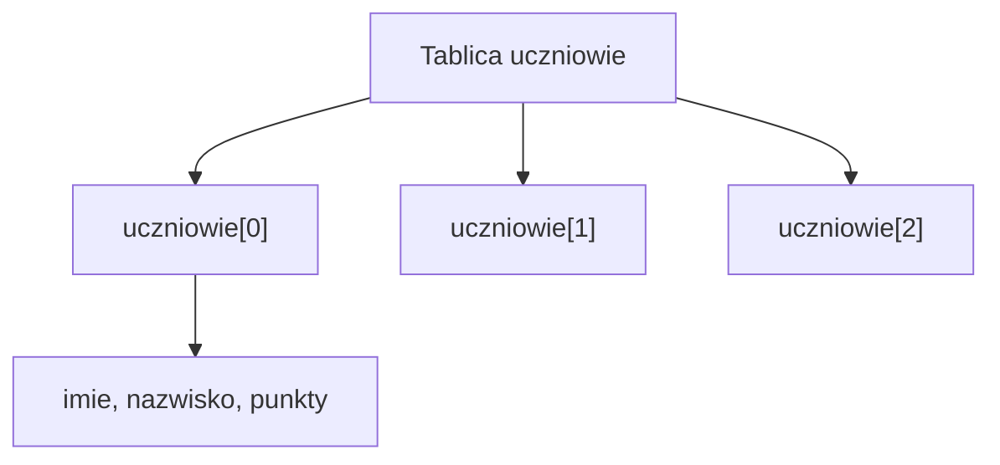
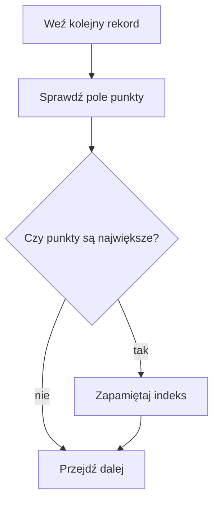

# Tablice struktur

## Cel lekcji

Nauczysz się tworzyć tablice struktur, wczytywać wiele rekordów i wyszukiwać rekord na podstawie wybranego pola.

## Krótkie wprowadzenie do problemu

Jedna struktura opisuje jeden obiekt. Często potrzebujemy wielu obiektów tego samego typu. Przykład: lista uczniów, lista książek albo lista produktów.

Wtedy można utworzyć tablicę struktur.

## Wyjaśnienie idei

Tablica struktur to tablica, w której każdy element jest całym rekordem.

```cpp
const int MAKS = 30;
Uczen uczniowie[MAKS];
int n;
```

`uczniowie[0]` to pierwszy rekord. `uczniowie[0].punkty` to pole `punkty` pierwszego rekordu.



## Składnia

```cpp
uczniowie[i].imie
uczniowie[i].nazwisko
uczniowie[i].punkty
```

Najpierw wybieramy rekord przez indeks `i`, a potem pole przez operator `.`.

## Przykład 1 - wczytanie i wypisanie uczniów

```cpp
#include <iostream>
#include <string>

using namespace std;

struct Uczen
{
    string imie;
    string nazwisko;
    int punkty;
};

int main()
{
    const int MAKS = 30;
    Uczen uczniowie[MAKS];
    int n;

    cout << "Podaj liczbe uczniow: ";
    cin >> n;

    if (n < 1 || n > MAKS)
    {
        cout << "Nieprawidlowa liczba uczniow.\n";
        return 0;
    }

    for (int i = 0; i < n; i++)
    {
        cout << "Imie: ";
        cin >> uczniowie[i].imie;
        cout << "Nazwisko: ";
        cin >> uczniowie[i].nazwisko;
        cout << "Punkty: ";
        cin >> uczniowie[i].punkty;
    }

    cout << "Lista uczniow:\n";
    for (int i = 0; i < n; i++)
    {
        cout << uczniowie[i].imie << " " << uczniowie[i].nazwisko;
        cout << " - " << uczniowie[i].punkty << " pkt\n";
    }

    return 0;
}
```

<details markdown="1">
<summary>Pokaż przykładowe dane i wynik</summary>

Dane wejściowe:

```text
2
Anna
Nowak
78
Jan
Kowalski
64
```

Wynik:

```text
Podaj liczbe uczniow: Imie: Nazwisko: Punkty: Imie: Nazwisko: Punkty: Lista uczniow:
Anna Nowak - 78 pkt
Jan Kowalski - 64 pkt
```

</details>

## Przykład 2 - uczeń z największą liczbą punktów

```cpp
#include <iostream>
#include <string>

using namespace std;

struct Uczen
{
    string imie;
    string nazwisko;
    int punkty;
};

int main()
{
    const int MAKS = 30;
    Uczen uczniowie[MAKS];
    int n;

    cin >> n;

    if (n < 1 || n > MAKS)
    {
        cout << "Nieprawidlowa liczba uczniow.\n";
        return 0;
    }

    for (int i = 0; i < n; i++)
    {
        cin >> uczniowie[i].imie >> uczniowie[i].nazwisko >> uczniowie[i].punkty;
    }

    int indeksNajlepszego = 0;

    for (int i = 1; i < n; i++)
    {
        if (uczniowie[i].punkty > uczniowie[indeksNajlepszego].punkty)
        {
            indeksNajlepszego = i;
        }
    }

    cout << "Najwiecej punktow: ";
    cout << uczniowie[indeksNajlepszego].imie << " ";
    cout << uczniowie[indeksNajlepszego].nazwisko << " - ";
    cout << uczniowie[indeksNajlepszego].punkty << "\n";

    return 0;
}
```

<details markdown="1">
<summary>Pokaż przykładowe dane i wynik</summary>

Dane wejściowe:

```text
3
Anna Nowak 78
Jan Kowalski 64
Ewa Zielinska 91
```

Wynik:

```text
Najwiecej punktow: Ewa Zielinska - 91
```

</details>

## Omówienie najważniejszego przykładu krok po kroku

1. Program tworzy tablicę `uczniowie` o pojemności `MAKS`.
2. Zmienna `n` oznacza liczbę używanych rekordów.
3. Program sprawdza, czy `n` mieści się w zakresie.
4. Pętla wczytuje kolejne rekordy.
5. `uczniowie[i].punkty` oznacza punkty ucznia o indeksie `i`.
6. `indeksNajlepszego` zaczyna od `0`, bo pierwszy uczeń jest pierwszym kandydatem.
7. Program przechodzi od indeksu `1` do `n - 1`.
8. Gdy znajdzie większą liczbę punktów, zapamiętuje indeks tego rekordu.



## Przykład 3 - zliczanie uczniów z wynikiem co najmniej 50

```cpp
#include <iostream>
#include <string>

using namespace std;

struct Uczen
{
    string imie;
    string nazwisko;
    int punkty;
};

int main()
{
    const int MAKS = 30;
    Uczen uczniowie[MAKS];
    int n;

    cin >> n;

    if (n < 1 || n > MAKS)
    {
        cout << "Nieprawidlowa liczba uczniow.\n";
        return 0;
    }

    for (int i = 0; i < n; i++)
    {
        cin >> uczniowie[i].imie >> uczniowie[i].nazwisko >> uczniowie[i].punkty;
    }

    int licznik = 0;

    for (int i = 0; i < n; i++)
    {
        if (uczniowie[i].punkty >= 50)
        {
            licznik++;
        }
    }

    cout << "Liczba uczniow z wynikiem co najmniej 50: " << licznik << "\n";

    return 0;
}
```

<details markdown="1">
<summary>Pokaż przykładowe dane i wynik</summary>

Dane wejściowe:

```text
3
Anna Nowak 78
Jan Kowalski 44
Ewa Zielinska 91
```

Wynik:

```text
Liczba uczniow z wynikiem co najmniej 50: 2
```

</details>

## Kiedy tego użyć?

Użyj tablicy struktur, gdy masz wiele rekordów tego samego typu i chcesz przechodzić po nich pętlą. To pasuje do listy uczniów, zawodników, książek lub produktów.

## Kiedy wybrać coś innego?

Jeżeli masz tylko jeden rekord, wystarczy jedna zmienna strukturalna. Jeżeli dane są jednorazowe i składają się tylko z dwóch wartości, czasami wystarczy `pair`. Jeżeli liczba rekordów ma często rosnąć, później wygodniejszy będzie `vector`.

## Typowe błędy

- Pomylenie `uczniowie[i].punkty` z `uczniowie.punkty[i]`.
- Użycie indeksu poza zakresem.
- Pomylenie pojemności `MAKS` z liczbą używanych rekordów `n`.
- Rozpoczęcie wyszukiwania maksimum od przypadkowej wartości.
- Brak sprawdzenia, czy `n > 0`.
- Problemy z `getline()` po wcześniejszym `cin`.

## Ćwiczenia

### Ćwiczenie 1

Wczytaj dane kilku produktów: nazwę, cenę i liczbę sztuk. Wypisz wszystkie produkty.

<details markdown="1">
<summary>Pokaż wskazówkę do ćwiczenia 1</summary>

Utwórz strukturę `Produkt` i tablicę `Produkt produkty[MAKS];`. W pętli wczytaj pola każdego produktu.

</details>

<details markdown="1">
<summary>Pokaż rozwiązanie ćwiczenia 1</summary>

```cpp
#include <iostream>
#include <string>

using namespace std;

struct Produkt
{
    string nazwa;
    double cena;
    int liczbaSztuk;
};

int main()
{
    const int MAKS = 20;
    Produkt produkty[MAKS];
    int n;

    cin >> n;

    if (n < 1 || n > MAKS)
    {
        cout << "Nieprawidlowa liczba produktow.\n";
        return 0;
    }

    for (int i = 0; i < n; i++)
    {
        cin >> produkty[i].nazwa >> produkty[i].cena >> produkty[i].liczbaSztuk;
    }

    for (int i = 0; i < n; i++)
    {
        cout << produkty[i].nazwa << " ";
        cout << produkty[i].cena << " ";
        cout << produkty[i].liczbaSztuk << "\n";
    }

    return 0;
}
```

</details>

### Ćwiczenie 2

Wczytaj dane uczniów i wypisz ucznia z najmniejszą liczbą punktów.

<details markdown="1">
<summary>Pokaż wskazówkę do ćwiczenia 2</summary>

Zacznij od `int indeksNajmniejszego = 0;`, a potem porównuj kolejne pole `punkty` z aktualnie zapamiętanym rekordem.

</details>

<details markdown="1">
<summary>Pokaż rozwiązanie ćwiczenia 2</summary>

```cpp
#include <iostream>
#include <string>

using namespace std;

struct Uczen
{
    string imie;
    string nazwisko;
    int punkty;
};

int main()
{
    const int MAKS = 30;
    Uczen uczniowie[MAKS];
    int n;

    cin >> n;

    if (n < 1 || n > MAKS)
    {
        cout << "Nieprawidlowa liczba uczniow.\n";
        return 0;
    }

    for (int i = 0; i < n; i++)
    {
        cin >> uczniowie[i].imie >> uczniowie[i].nazwisko >> uczniowie[i].punkty;
    }

    int indeksNajmniejszego = 0;

    for (int i = 1; i < n; i++)
    {
        if (uczniowie[i].punkty < uczniowie[indeksNajmniejszego].punkty)
        {
            indeksNajmniejszego = i;
        }
    }

    cout << uczniowie[indeksNajmniejszego].imie << " ";
    cout << uczniowie[indeksNajmniejszego].nazwisko << "\n";

    return 0;
}
```

</details>

### Ćwiczenie 3

Wczytaj dane kilku książek: tytuł bez spacji, rok wydania i liczbę stron. Policz książki wydane po 2000 roku.

<details markdown="1">
<summary>Pokaż wskazówkę do ćwiczenia 3</summary>

Użyj licznika. Zwiększ go, gdy pole `rok` jest większe od `2000`.

</details>

<details markdown="1">
<summary>Pokaż rozwiązanie ćwiczenia 3</summary>

```cpp
#include <iostream>
#include <string>

using namespace std;

struct Ksiazka
{
    string tytul;
    int rok;
    int liczbaStron;
};

int main()
{
    const int MAKS = 50;
    Ksiazka ksiazki[MAKS];
    int n;

    cin >> n;

    if (n < 1 || n > MAKS)
    {
        cout << "Nieprawidlowa liczba ksiazek.\n";
        return 0;
    }

    for (int i = 0; i < n; i++)
    {
        cin >> ksiazki[i].tytul >> ksiazki[i].rok >> ksiazki[i].liczbaStron;
    }

    int licznik = 0;

    for (int i = 0; i < n; i++)
    {
        if (ksiazki[i].rok > 2000)
        {
            licznik++;
        }
    }

    cout << "Ksiazki po 2000 roku: " << licznik << "\n";

    return 0;
}
```

</details>

## Podsumowanie

Tablica struktur pozwala przechowywać wiele rekordów tego samego typu. Najpierw wybierasz element tablicy przez indeks, a potem pole przez operator `.`.
