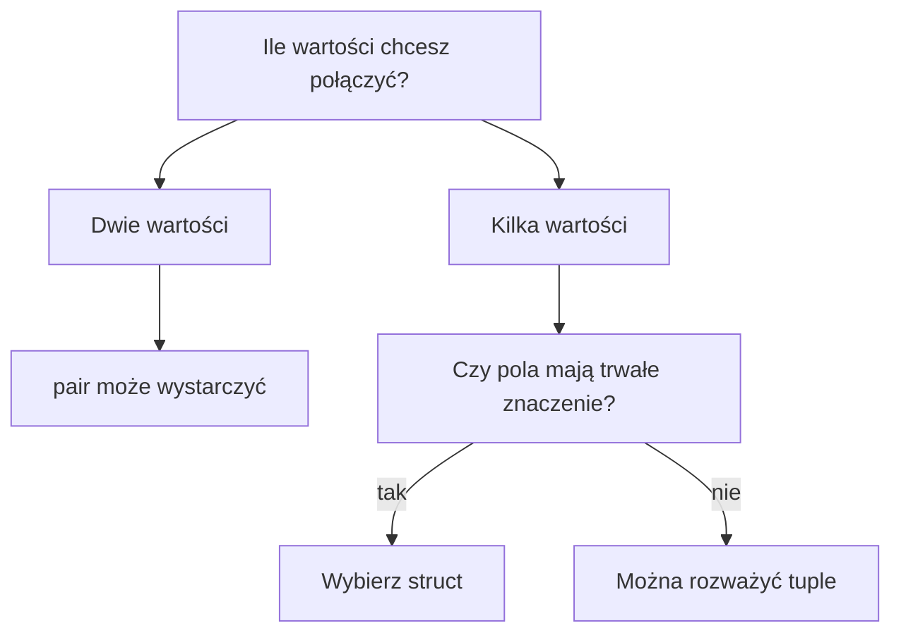

# `tuple` i rozpakowywanie - materiał nieobowiązkowy

> **Materiał nieobowiązkowy**
>
> Ta lekcja pokazuje sposób łączenia i zwracania kilku wartości. Nie musisz jej teraz wykonywać, aby przejść do rozdziału o `vector`.

[Pomiń materiał i przejdź do rozdziału 12 - vector](../12-vector/)

## Cel lekcji

Poznasz `tuple`, czyli sposób zapisania kilku wartości w jednej zmiennej, oraz proste rozpakowanie tych wartości do osobnych nazw.

## Krótkie wprowadzenie do problemu

`pair` przechowuje dwie wartości. Czasami funkcja ma zwrócić trzy wyniki, na przykład minimum, maksimum i średnią.

Do tego można użyć `tuple`. To materiał dodatkowy, bo wymaga mniej oczywistej składni.

## Wyjaśnienie idei

`tuple` to krotka. Może przechowywać kilka wartości różnych typów.

```cpp
tuple<string, int, double> wynik = {"Anna", 78, 4.5};
```

Do pól można dostać się przez `get<0>()`, `get<1>()`, `get<2>()`. Numerowanie zaczyna się od `0`.

## Składnia

```cpp
#include <tuple>

tuple<string, int, double> wynik = {"Anna", 78, 4.5};

cout << get<0>(wynik) << "\n";
cout << get<1>(wynik) << "\n";
cout << get<2>(wynik) << "\n";
```

Można też rozpakować wartości:

```cpp
auto [imie, punkty, srednia] = wynik;
```

`auto` pozwala kompilatorowi ustalić typ każdej zmiennej. Nazwy po lewej stronie wybiera programista. Kolejność musi odpowiadać kolejności wartości w `tuple`.

## Przykład 1 - odczyt przez `get<>()`

```cpp
#include <iostream>
#include <string>
#include <tuple>

using namespace std;

int main()
{
    tuple<string, int, double> wynik = {"Anna", 78, 4.5};

    cout << get<0>(wynik) << "\n";
    cout << get<1>(wynik) << "\n";
    cout << get<2>(wynik) << "\n";

    return 0;
}
```

<details markdown="1">
<summary>Pokaż wynik</summary>

```text
Anna
78
4.5
```

</details>

## Przykład 2 - rozpakowanie krotki

```cpp
#include <iostream>
#include <string>
#include <tuple>

using namespace std;

int main()
{
    tuple<string, int, double> wynik = {"Anna", 78, 4.5};

    auto [imie, punkty, srednia] = wynik;

    cout << imie << "\n";
    cout << punkty << "\n";
    cout << srednia << "\n";

    return 0;
}
```

<details markdown="1">
<summary>Pokaż wynik</summary>

```text
Anna
78
4.5
```

</details>

## Omówienie najważniejszego przykładu krok po kroku

1. Program tworzy zmienną `wynik` typu `tuple<string, int, double>`.
2. Krotka przechowuje tekst, liczbę całkowitą i liczbę rzeczywistą.
3. `auto [imie, punkty, srednia] = wynik;` tworzy trzy osobne zmienne.
4. `imie` dostaje pierwszą wartość.
5. `punkty` dostaje drugą wartość.
6. `srednia` dostaje trzecią wartość.

## Przykład 3 - funkcja zwracająca minimum, maksimum i średnią

```cpp
#include <iostream>
#include <tuple>

using namespace std;

tuple<int, int, double> obliczStatystyki(const int tablica[], int n)
{
    int minimum = tablica[0];
    int maksimum = tablica[0];
    int suma = 0;

    for (int i = 0; i < n; i++)
    {
        if (tablica[i] < minimum)
        {
            minimum = tablica[i];
        }

        if (tablica[i] > maksimum)
        {
            maksimum = tablica[i];
        }

        suma += tablica[i];
    }

    double srednia = (double)suma / n;

    return {minimum, maksimum, srednia};
}

int main()
{
    const int MAKS = 100;
    int liczby[MAKS];
    int n;

    cin >> n;

    if (n < 1 || n > MAKS)
    {
        cout << "Nieprawidlowy rozmiar.\n";
        return 0;
    }

    for (int i = 0; i < n; i++)
    {
        cin >> liczby[i];
    }

    auto [minimum, maksimum, srednia] = obliczStatystyki(liczby, n);

    cout << "Minimum: " << minimum << "\n";
    cout << "Maksimum: " << maksimum << "\n";
    cout << "Srednia: " << srednia << "\n";

    return 0;
}
```

<details markdown="1">
<summary>Pokaż przykładowe dane i wynik</summary>

Dane wejściowe:

```text
4
2 8 4 6
```

Wynik:

```text
Minimum: 2
Maksimum: 8
Srednia: 5
```

</details>

## `tuple`, `pair` czy `struct`?



| Konstrukcja | Dobry przypadek | Uwaga |
| ----------- | --------------- | ----- |
| `struct` | Rekord z nazwanymi polami | Najczytelniejszy dla trwałych danych |
| `pair` | Dokładnie dwie wartości | Pola nazywają się `first` i `second` |
| `tuple` | Kilka krótkotrwałych wyników | Indeksy `get<0>()` są mniej czytelne |

## Kiedy tego użyć?

Użyj `tuple`, gdy funkcja ma zwrócić kilka krótkotrwałych wyników, a tworzenie osobnej struktury byłoby przesadą.

## Kiedy wybrać coś innego?

Jeżeli dane mają własne znaczenie i będą używane w wielu miejscach programu, wybierz `struct`. Jeżeli są tylko dwie wartości, często wystarczy `pair`.

## Typowe błędy

- Brak nagłówka `<tuple>`.
- Mylenie numerów w `get<0>()`, `get<1>()`, `get<2>()`.
- Zła kolejność nazw przy rozpakowaniu.
- Używanie `tuple`, gdy `struct` byłby czytelniejszy.
- Próba odczytu pola, które nie istnieje.
- Brak sprawdzenia `n > 0` przed obliczaniem statystyk.

## Ćwiczenia nieobowiązkowe

### Ćwiczenie nieobowiązkowe 1

Utwórz `tuple` zawierający tytuł książki, rok wydania i cenę. Wypisz wartości przez `get<>()`.

<details markdown="1">
<summary>Pokaż wskazówkę do ćwiczenia 1</summary>

Użyj typu `tuple<string, int, double>` i pamiętaj, że pierwszy element ma indeks `0`.

</details>

<details markdown="1">
<summary>Pokaż wynik do ćwiczenia 1</summary>

```text
Lalka
1890
39.99
```

</details>

<details markdown="1">
<summary>Pokaż rozwiązanie ćwiczenia 1</summary>

```cpp
#include <iostream>
#include <string>
#include <tuple>

using namespace std;

int main()
{
    tuple<string, int, double> ksiazka = {"Lalka", 1890, 39.99};

    cout << get<0>(ksiazka) << "\n";
    cout << get<1>(ksiazka) << "\n";
    cout << get<2>(ksiazka) << "\n";

    return 0;
}
```

</details>

### Ćwiczenie nieobowiązkowe 2

Rozpakuj krotkę opisującą książkę do zmiennych `tytul`, `rok` i `cena`, a potem wypisz te zmienne.

<details markdown="1">
<summary>Pokaż wskazówkę do ćwiczenia 2</summary>

Użyj zapisu `auto [tytul, rok, cena] = ksiazka;`.

</details>

<details markdown="1">
<summary>Pokaż wynik do ćwiczenia 2</summary>

```text
Lalka 1890 39.99
```

</details>

<details markdown="1">
<summary>Pokaż rozwiązanie ćwiczenia 2</summary>

```cpp
#include <iostream>
#include <string>
#include <tuple>

using namespace std;

int main()
{
    tuple<string, int, double> ksiazka = {"Lalka", 1890, 39.99};
    auto [tytul, rok, cena] = ksiazka;

    cout << tytul << " " << rok << " " << cena << "\n";

    return 0;
}
```

</details>

### Ćwiczenie nieobowiązkowe 3

Napisz funkcję, która dla trzech liczb zwraca ich sumę, iloczyn i średnią w `tuple`.

<details markdown="1">
<summary>Pokaż wskazówkę do ćwiczenia 3</summary>

Funkcja może zwracać `tuple<int, int, double>`. Średnią oblicz przez `(double)suma / 3`.

</details>

<details markdown="1">
<summary>Pokaż wynik do ćwiczenia 3</summary>

```text
Suma: 9
Iloczyn: 24
Srednia: 3
```

</details>

<details markdown="1">
<summary>Pokaż rozwiązanie ćwiczenia 3</summary>

```cpp
#include <iostream>
#include <tuple>

using namespace std;

tuple<int, int, double> oblicz(int a, int b, int c)
{
    int suma = a + b + c;
    int iloczyn = a * b * c;
    double srednia = (double)suma / 3;

    return {suma, iloczyn, srednia};
}

int main()
{
    auto [suma, iloczyn, srednia] = oblicz(2, 3, 4);

    cout << "Suma: " << suma << "\n";
    cout << "Iloczyn: " << iloczyn << "\n";
    cout << "Srednia: " << srednia << "\n";

    return 0;
}
```

</details>

## Podsumowanie

`tuple` pozwala połączyć kilka wartości i wygodnie je zwrócić z funkcji. Jest to materiał nieobowiązkowy. Gdy dane mają trwałe znaczenie, zwykle wybieraj `struct`, bo nazwy pól są wtedy czytelniejsze.
