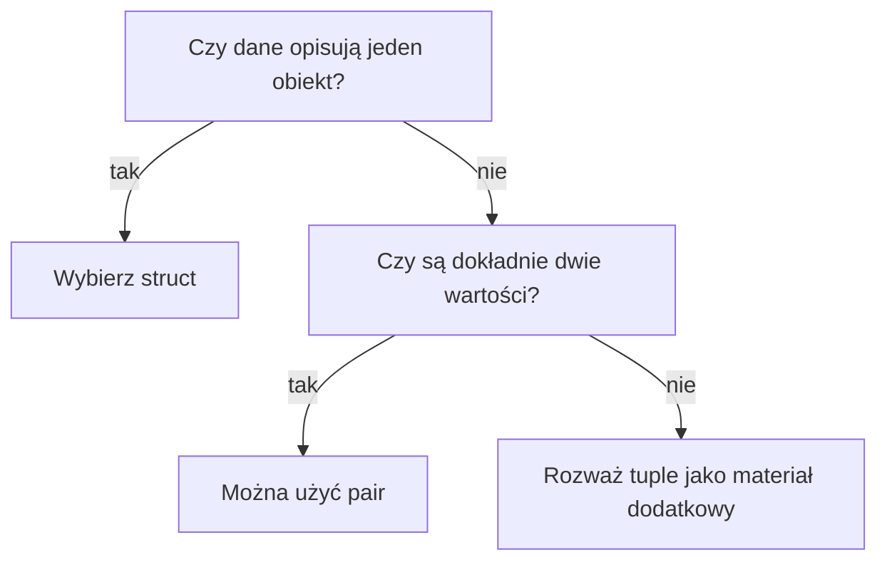

# 11 - Dane złożone

W poprzednich rozdziałach przechowywaliśmy pojedyncze liczby, napisy i tablice wartości tego samego typu. Czasami to za mało.

Uczeń może mieć imię, nazwisko i liczbę punktów. Te informacje opisują jedną osobę. Można trzymać je w trzech osobnych zmiennych, ale wtedy łatwo stracić porządek. Wygodniej utworzyć jeden rekord, czyli jedną wartość złożoną z kilku pól.

## Po co są dane złożone?

Dane złożone pomagają opisać jeden obiekt kilkoma informacjami.

```cpp
string imie = "Anna";
string nazwisko = "Nowak";
int punkty = 78;
```

W strukturze te dane są razem:

```cpp
Uczen osoba;
osoba.imie = "Anna";
osoba.nazwisko = "Nowak";
osoba.punkty = 78;
```

## Cele rozdziału

Po tym rozdziale potrafisz:

- utworzyć prostą strukturę `struct`,
- zapisać kilka informacji w jednym rekordzie,
- korzystać z pól struktury przez operator `.`,
- tworzyć tablice struktur,
- przekazywać struktury do funkcji,
- zwracać strukturę z funkcji,
- używać `pair`, gdy potrzebne są dokładnie dwie powiązane wartości,
- rozumieć, kiedy lepszy jest `struct`, a kiedy wystarczy `pair`,
- świadomie pominąć materiał nieobowiązkowy o `tuple`, jeśli nie jest teraz potrzebny.

## Kolejność nauki

Najpierw poznasz `struct`, czyli czytelny sposób opisywania obiektów. Potem zobaczysz tablice struktur i funkcje pracujące na strukturach. Na końcu materiału podstawowego pojawi się `pair`, czyli krótki sposób połączenia dwóch wartości.

Materiał o `tuple` jest nieobowiązkowy. Pokazuje dodatkowe możliwości, ale nie jest potrzebny do przejścia do rozdziału 12.

## Materiał podstawowy

1. [Pierwsza struktura](01-pierwsza-struktura.md)
2. [Tablice struktur](02-tablice-struktur.md)
3. [Struktury i funkcje](03-struktury-i-funkcje.md)
4. [`pair` i dwie wartości](04-pair-dwie-wartosci.md)

## Materiał nieobowiązkowy

- [`tuple` i rozpakowywanie - materiał nieobowiązkowy](05-tuple-i-rozpakowywanie-material-nieobowiazkowy.md)

## Jak wybrać konstrukcję?

| Konstrukcja | Kiedy jej użyć? | Główna zaleta | Główne ograniczenie |
| ----------- | --------------- | ------------- | ------------------- |
| `struct` | Gdy dane opisują jeden obiekt i pola mają znaczenie | Czytelne nazwy pól | Trzeba wcześniej zdefiniować typ |
| `pair` | Gdy potrzebujemy dokładnie dwóch powiązanych wartości | Krótki zapis | Pola `first` i `second` niewiele mówią o znaczeniu danych |
| `tuple` | Gdy chwilowo łączymy kilka wartości lub zwracamy kilka wyników | Może przechowywać wiele różnych typów | Łatwo stracić czytelność |

Prosta zasada:

- dane mają własne znaczenie i nazwy pól => wybierz `struct`,
- potrzebujesz dokładnie dwóch prostych wartości => można wybrać `pair`,
- potrzebujesz kilku krótkotrwałych wyników => można rozważyć `tuple`,
- dane mają być długo przechowywane i przetwarzane => zwykle wybierz `struct`.



## Po rozdziale

Po rozdziale umiesz traktować kilka powiązanych danych jako jedną całość. To ważny krok przed rozdziałem o `vector`, bo później często będziemy przechowywać wiele rekordów i przetwarzać je w wygodniejszy sposób.
