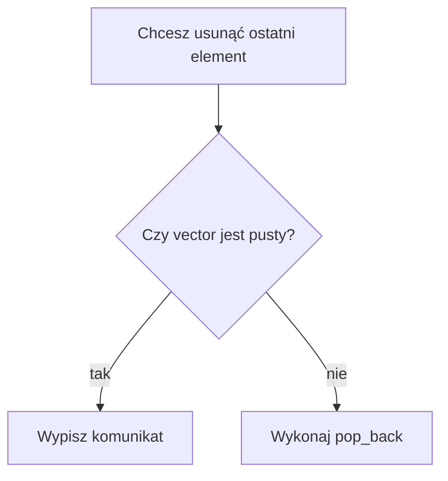

# Dodawanie i usuwanie elementów

## Krótkie wprowadzenie do problemu

W zwykłej tablicy liczba używanych elementów jest ustalana przez programistę. W `vector` możemy wygodnie dopisywać elementy na końcu i usuwać ostatni element.

## Proste wyjaśnienie idei

`push_back()` dopisuje element na końcu. `pop_back()` usuwa ostatni element. Przed odczytem pierwszego, ostatniego albo usunięciem ostatniego elementu trzeba sprawdzić, czy `vector` nie jest pusty.

## Składnia

```cpp
liczby.push_back(10);
liczby.pop_back();
liczby.front();
liczby.back();
liczby.clear();
liczby.resize(5);
```



## Przykład 1 - zbieranie wyników

```cpp
#include <iostream>
#include <vector>

using namespace std;

int main()
{
    vector<int> wyniki;
    int wynik;

    cin >> wynik;

    while (wynik != -1)
    {
        wyniki.push_back(wynik);
        cin >> wynik;
    }

    cout << "Liczba wynikow: " << wyniki.size() << "\n";

    if (!wyniki.empty())
    {
        cout << "Pierwszy: " << wyniki.front() << "\n";
        cout << "Ostatni: " << wyniki.back() << "\n";
    }

    return 0;
}
```

<details markdown="1">
<summary>Pokaż przykładowe dane i wynik</summary>

Dane wejściowe:

```text
12 18 9 20 -1
```

Wynik:

```text
Liczba wynikow: 4
Pierwszy: 12
Ostatni: 20
```

</details>

## Omówienie programu krok po kroku

1. Program tworzy pusty `vector`.
2. Wczytuje pierwszą wartość.
3. Dopóki wartość nie jest równa `-1`, dopisuje ją przez `push_back()`.
4. Po zakończeniu wypisuje liczbę elementów.
5. Przed użyciem `front()` i `back()` sprawdza `empty()`.

## Przykład 2 - bezpieczne usunięcie ostatniego elementu

```cpp
#include <iostream>
#include <vector>

using namespace std;

int main()
{
    vector<int> liczby = {3, 6, 9};

    if (!liczby.empty())
    {
        liczby.pop_back();
    }

    for (int liczba : liczby)
    {
        cout << liczba << " ";
    }
    cout << "\n";

    liczby.clear();
    cout << "Po clear: " << liczby.size() << "\n";

    return 0;
}
```

<details markdown="1">
<summary>Pokaż wynik</summary>

```text
3 6
Po clear: 0
```

</details>

## Kiedy tego użyć?

Użyj tych operacji, gdy dane pojawiają się stopniowo: wyniki, ceny, pomiary, kolejne odpowiedzi użytkownika.

## Kiedy wybrać coś innego?

Jeżeli często usuwasz z początku albo często wstawiasz w środku bardzo dużego zbioru, później można rozważyć inny kontener. Na tym etapie `vector` jest najlepszym wyborem do nauki.

## Typowe błędy

- `pop_back()` na pustym `vector`.
- `front()` albo `back()` bez sprawdzenia `empty()`.
- Mylenie `clear()` z usunięciem jednego elementu.
- Myślenie, że `resize()` dopisuje tylko jedną wartość.
- Utrata danych przez niepotrzebne `clear()`.

## Ćwiczenia

### Ćwiczenie 1

Wczytuj ceny do momentu podania `0`. Zapisz je w `vector` i wypisz liczbę cen.

<details markdown="1">
<summary>Pokaż wskazówkę do ćwiczenia 1</summary>

Wczytaj pierwszą cenę przed pętlą. W pętli użyj `push_back()`.

</details>

<details markdown="1">
<summary>Pokaż rozwiązanie ćwiczenia 1</summary>

```cpp
#include <iostream>
#include <vector>

using namespace std;

int main()
{
    vector<double> ceny;
    double cena;

    cin >> cena;

    while (cena != 0)
    {
        ceny.push_back(cena);
        cin >> cena;
    }

    cout << "Liczba cen: " << ceny.size() << "\n";

    return 0;
}
```

</details>

### Ćwiczenie 2

Usuń ostatni element tylko wtedy, gdy `vector` nie jest pusty.

<details markdown="1">
<summary>Pokaż wskazówkę do ćwiczenia 2</summary>

Warunek to `if (!liczby.empty())`.

</details>

<details markdown="1">
<summary>Pokaż rozwiązanie ćwiczenia 2</summary>

```cpp
#include <iostream>
#include <vector>

using namespace std;

int main()
{
    vector<int> liczby = {5, 10, 15};

    if (!liczby.empty())
    {
        liczby.pop_back();
    }

    for (int liczba : liczby)
    {
        cout << liczba << " ";
    }
    cout << "\n";

    return 0;
}
```

</details>

### Ćwiczenie 3

Wypisz pierwszy i ostatni wynik, ale tylko wtedy, gdy są dostępne dane.

<details markdown="1">
<summary>Pokaż wskazówkę do ćwiczenia 3</summary>

Użyj `front()` i `back()` dopiero po sprawdzeniu `empty()`.

</details>

<details markdown="1">
<summary>Pokaż rozwiązanie ćwiczenia 3</summary>

```cpp
#include <iostream>
#include <vector>

using namespace std;

int main()
{
    vector<int> wyniki = {18, 12, 20};

    if (!wyniki.empty())
    {
        cout << "Pierwszy: " << wyniki.front() << "\n";
        cout << "Ostatni: " << wyniki.back() << "\n";
    }

    return 0;
}
```

</details>

### Ćwiczenie 4

Utwórz `vector` z kilkoma liczbami, wyczyść go i wypisz jego rozmiar.

<details markdown="1">
<summary>Pokaż wskazówkę do ćwiczenia 4</summary>

Do wyczyszczenia użyj `clear()`.

</details>

<details markdown="1">
<summary>Pokaż rozwiązanie ćwiczenia 4</summary>

```cpp
#include <iostream>
#include <vector>

using namespace std;

int main()
{
    vector<int> liczby = {1, 2, 3, 4};

    liczby.clear();

    cout << "Rozmiar: " << liczby.size() << "\n";

    return 0;
}
```

</details>

### Ćwiczenie 5

Utwórz `vector` z trzema wartościami, zmień rozmiar na pięć i wypisz elementy.

<details markdown="1">
<summary>Pokaż wskazówkę do ćwiczenia 5</summary>

Użyj `resize(5)`. Nowe elementy typu `int` otrzymają wartość `0`.

</details>

<details markdown="1">
<summary>Pokaż rozwiązanie ćwiczenia 5</summary>

```cpp
#include <iostream>
#include <vector>

using namespace std;

int main()
{
    vector<int> liczby = {7, 8, 9};

    liczby.resize(5);

    for (int liczba : liczby)
    {
        cout << liczba << " ";
    }
    cout << "\n";

    return 0;
}
```

</details>

## Podsumowanie

`push_back()` i `pop_back()` pozwalają zmieniać koniec `vector`. `clear()` usuwa wszystkie elementy, a `resize()` ustawia nowy rozmiar.
