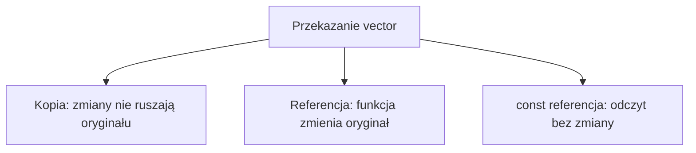

# `vector` i funkcje

## Krótkie wprowadzenie do problemu

Program z `vector` często ma kilka zadań: utworzyć dane, wypisać je, policzyć sumę i zmienić elementy. Warto podzielić te zadania na funkcje.

## Proste wyjaśnienie idei

`vector` można przekazać do funkcji jako kopię, przez referencję albo przez stałą referencję.

## Składnia

```cpp
void wyswietl(const vector<int> &liczby);
void zwieksz(vector<int> &liczby);
vector<int> utworzLiczby(int ile);
```

- `const vector<int> &` => funkcja czyta dane bez kopiowania i bez ich zmiany.
- `vector<int> &` => funkcja może zmienić oryginalny `vector`.
- `vector<int>` jako wynik => funkcja może utworzyć i zwrócić cały zestaw danych.
- przekazanie przez wartość => powstaje osobna kopia.



## Przykład 1 - kilka funkcji dla `vector`

```cpp
#include <iostream>
#include <vector>

using namespace std;

vector<int> utworzLiczby(int ile)
{
    vector<int> liczby;

    for (int i = 1; i <= ile; i++)
    {
        liczby.push_back(i);
    }

    return liczby;
}

void wyswietl(const vector<int> &liczby)
{
    for (int liczba : liczby)
    {
        cout << liczba << " ";
    }
    cout << "\n";
}

int obliczSume(const vector<int> &liczby)
{
    int suma = 0;

    for (int liczba : liczby)
    {
        suma += liczba;
    }

    return suma;
}

void zwieksz(vector<int> &liczby)
{
    for (int &liczba : liczby)
    {
        liczba++;
    }
}

int main()
{
    vector<int> liczby = utworzLiczby(5);

    wyswietl(liczby);
    cout << "Suma: " << obliczSume(liczby) << "\n";

    zwieksz(liczby);
    wyswietl(liczby);

    return 0;
}
```

<details markdown="1">
<summary>Pokaż wynik</summary>

```text
1 2 3 4 5
Suma: 15
2 3 4 5 6
```

</details>

## Omówienie programu krok po kroku

1. `utworzLiczby()` tworzy nowy `vector` i zwraca go przez wartość.
2. `wyswietl()` dostaje stałą referencję, więc nie kopiuje danych i ich nie zmienia.
3. `obliczSume()` tylko czyta dane.
4. `zwieksz()` dostaje referencję i zmienia oryginalne elementy.

## Przykład 2 - kopia nie zmienia oryginału

```cpp
#include <iostream>
#include <vector>

using namespace std;

void zmienKopie(vector<int> liczby)
{
    liczby[0] = 100;
}

int main()
{
    vector<int> liczby = {1, 2, 3};

    zmienKopie(liczby);

    cout << liczby[0] << "\n";

    return 0;
}
```

<details markdown="1">
<summary>Pokaż wynik</summary>

```text
1
```

</details>

## Kiedy tego użyć?

Używaj funkcji, gdy chcesz oddzielić zadania: wczytywanie, wypisywanie, obliczanie i modyfikowanie danych.

## Kiedy wybrać coś innego?

Jeżeli program jest bardzo krótki, funkcje mogą być zbędne. Jeżeli dane opisują rekordy, połącz `vector` ze strukturami.

## Typowe błędy

- Przekazanie przez wartość, gdy funkcja miała zmienić oryginał.
- Brak `const` przy funkcji tylko odczytującej dane.
- Zwracanie niepotrzebnych kopii w prostych funkcjach odczytujących.
- Próba zmiany elementu w `const vector<int> &`.
- Brak sprawdzenia pustego `vector`, gdy funkcja odczytuje pierwszy element.

## Ćwiczenia

### Ćwiczenie 1

Napisz funkcję wyświetlającą `vector<int>`.

<details markdown="1">
<summary>Pokaż wskazówkę do ćwiczenia 1</summary>

Parametr powinien mieć postać `const vector<int> &liczby`.

</details>

<details markdown="1">
<summary>Pokaż rozwiązanie ćwiczenia 1</summary>

```cpp
#include <iostream>
#include <vector>

using namespace std;

void wyswietl(const vector<int> &liczby)
{
    for (int liczba : liczby) cout << liczba << " ";
    cout << "\n";
}

int main()
{
    vector<int> liczby = {3, 6, 9};
    wyswietl(liczby);
    return 0;
}
```

</details>

### Ćwiczenie 2

Napisz funkcję obliczającą sumę elementów.

<details markdown="1">
<summary>Pokaż wskazówkę do ćwiczenia 2</summary>

Funkcja zwraca `int` i przechodzi po elementach pętlą.

</details>

<details markdown="1">
<summary>Pokaż rozwiązanie ćwiczenia 2</summary>

```cpp
#include <iostream>
#include <vector>

using namespace std;

int suma(const vector<int> &liczby)
{
    int wynik = 0;
    for (int liczba : liczby) wynik += liczba;
    return wynik;
}

int main()
{
    vector<int> liczby = {1, 2, 3, 4};
    cout << suma(liczby) << "\n";
    return 0;
}
```

</details>

### Ćwiczenie 3

Napisz funkcję zwiększającą każdy element o `1`.

<details markdown="1">
<summary>Pokaż wskazówkę do ćwiczenia 3</summary>

Parametr musi być referencją: `vector<int> &liczby`.

</details>

<details markdown="1">
<summary>Pokaż rozwiązanie ćwiczenia 3</summary>

```cpp
#include <iostream>
#include <vector>

using namespace std;

void zwieksz(vector<int> &liczby)
{
    for (int &liczba : liczby) liczba++;
}

int main()
{
    vector<int> liczby = {5, 6, 7};
    zwieksz(liczby);
    for (int liczba : liczby) cout << liczba << " ";
    cout << "\n";
    return 0;
}
```

</details>

### Ćwiczenie 4

Napisz funkcję zwracającą pierwsze `n` kwadratów liczb: `1, 4, 9...`.

<details markdown="1">
<summary>Pokaż wskazówkę do ćwiczenia 4</summary>

W funkcji utwórz pusty `vector` i dopisuj `i * i`.

</details>

<details markdown="1">
<summary>Pokaż rozwiązanie ćwiczenia 4</summary>

```cpp
#include <iostream>
#include <vector>

using namespace std;

vector<int> kwadraty(int n)
{
    vector<int> wyniki;
    for (int i = 1; i <= n; i++) wyniki.push_back(i * i);
    return wyniki;
}

int main()
{
    vector<int> wyniki = kwadraty(5);
    for (int wynik : wyniki) cout << wynik << " ";
    cout << "\n";
    return 0;
}
```

</details>

### Ćwiczenie 5

Napisz funkcję zwracającą tylko liczby dodatnie z podanego `vector`.

<details markdown="1">
<summary>Pokaż wskazówkę do ćwiczenia 5</summary>

Utwórz nowy `vector`, a dodatnie elementy dopisuj przez `push_back()`.

</details>

<details markdown="1">
<summary>Pokaż rozwiązanie ćwiczenia 5</summary>

```cpp
#include <iostream>
#include <vector>

using namespace std;

vector<int> dodatnie(const vector<int> &liczby)
{
    vector<int> wynik;
    for (int liczba : liczby)
    {
        if (liczba > 0) wynik.push_back(liczba);
    }
    return wynik;
}

int main()
{
    vector<int> liczby = {-2, 5, 0, 7, -1};
    vector<int> wynik = dodatnie(liczby);
    for (int liczba : wynik) cout << liczba << " ";
    cout << "\n";
    return 0;
}
```

</details>

## Podsumowanie

Najczęściej przekazujemy `vector` do odczytu jako `const vector<int> &`, do zmiany jako `vector<int> &`, a jako wynik funkcji zwracamy `vector<int>`.
