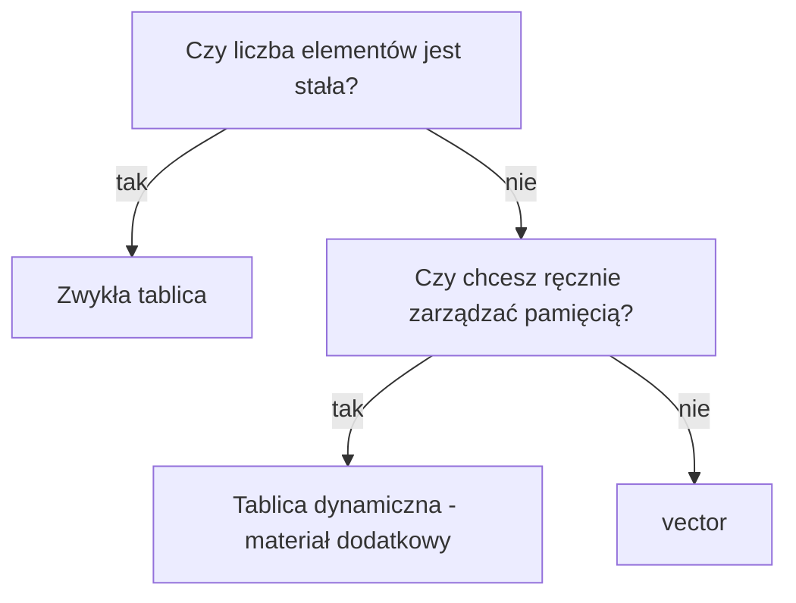

# 12 - vector

`vector` to standardowy kontener C++, który przechowuje wiele elementów tego samego typu. Można go traktować jak tablicę, która potrafi zmieniać rozmiar podczas działania programu.

Zwykła tablica jest dobra, gdy rozmiar znamy wcześniej. `vector` jest wygodniejszy, gdy elementy dopisujemy, usuwamy albo gdy liczba danych zależy od użytkownika.

## Jaki problem rozwiązuje `vector`?

W zwykłej tablicy trzeba znać pojemność z góry. W tablicy dynamicznej z `new[]` trzeba ręcznie pamiętać o `delete[]`. `vector` wykonuje większość tej pracy za programistę i nadal jest częścią standardowego C++.

## Porównanie konstrukcji

| Konstrukcja | Co warto wiedzieć? |
| ----------- | ------------------ |
| Zwykła tablica | Rozmiar jest stały i znany wcześniej. |
| Tablica o rozmiarze podanym podczas działania programu | W C++ jest rozszerzeniem GNU, a nie standardowym rozwiązaniem. |
| Tablica dynamiczna `new[]` | Daje ręczną kontrolę pamięci, ale wymaga `delete[]`. |
| `vector` | Jest standardowy i zwykle najwygodniejszy, gdy liczba elementów może się zmieniać. |

| Sytuacja | Najlepszy wybór |
| -------- | --------------- |
| Rozmiar jest stały i znany wcześniej | zwykła tablica |
| Liczba elementów może się zmieniać | `vector` |
| Potrzebna jest ręczna kontrola pamięci | tablica dynamiczna - materiał dodatkowy |
| Potrzebna jest tabela wierszy i kolumn o zmiennym rozmiarze | `vector<vector<int>>` |

## Materiał podstawowy

1. [Pierwszy `vector`](01-pierwszy-vector.md)
2. [Dodawanie i usuwanie elementów](02-dodawanie-i-usuwanie-elementow.md)
3. [Przechodzenie i przetwarzanie](03-przechodzenie-i-przetwarzanie.md)
4. [Wstawianie i usuwanie ze środka](04-wstawianie-i-usuwanie-ze-srodka.md)
5. [`vector` i funkcje](05-vector-i-funkcje.md)
6. [`vector` struktur](06-vector-struktur.md)
7. [`vector` dwuwymiarowy](07-vector-dwuwymiarowy.md)

## Materiał nieobowiązkowy

- [Pojemność i iteratory - materiał nieobowiązkowy](08-pojemnosc-i-iteratory-material-nieobowiazkowy.md)

## Po rozdziale

Po tym rozdziale potrafisz:

- tworzyć `vector` i odczytywać jego rozmiar,
- dodawać i usuwać elementy,
- bezpiecznie sprawdzać, czy `vector` jest pusty,
- przechodzić po elementach pętlą,
- obliczać sumę, średnią, minimum i maksimum,
- wyszukiwać wartości bez użycia gotowych algorytmów,
- wstawiać i usuwać elementy ze środka,
- przekazywać `vector` do funkcji,
- używać `vector` struktur,
- tworzyć prostą tabelę jako `vector<vector<int>>`,
- wybrać między tablicą, tablicą dynamiczną i `vector`.
