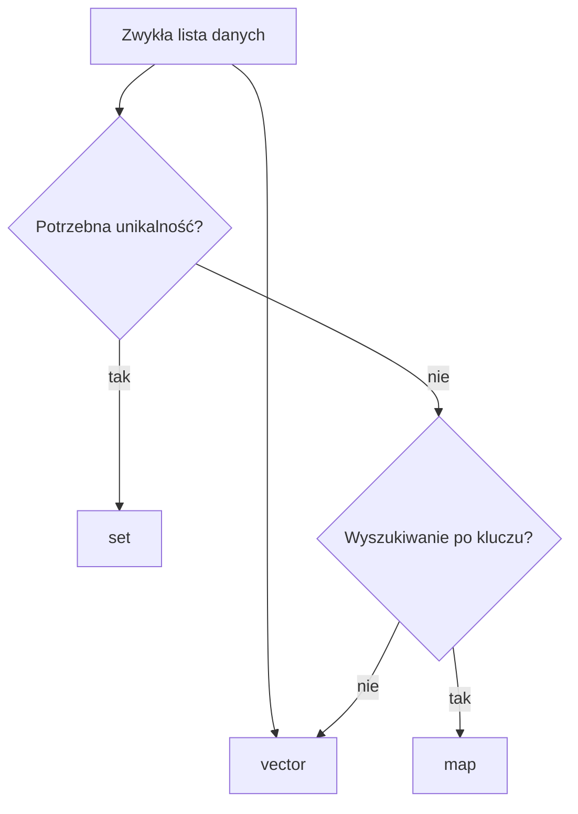

# 13 - Zbiory i kontenery asocjacyjne

W tym rozdziale poznasz kontenery, które pomagają wtedy, gdy zwykły `vector` przestaje być najwygodniejszy. Najważniejsza zasada: zaczynaj od `vector`. Wybierz inny kontener dopiero wtedy, gdy rozwiązuje konkretny problem prościej albo wyraźnie wydajniej.

Najważniejsze narzędzia to `vector`, `set` i `map`. `vector` jest podstawowym wyborem dla zwykłej sekwencji danych. `set` przydaje się do unikalnych i uporządkowanych wartości. `map` opisuje zależność klucz => wartość.

| Sytuacja                                              | Najprostszy wybór                                 |
| ----------------------------------------------------- | ------------------------------------------------- |
| Zwykła lista danych                                   | `vector`                                          |
| Mało danych i pojedyncze wyszukiwanie                 | `vector`                                          |
| Potrzebne są unikalne i uporządkowane wartości        | `set`                                             |
| Kluczowi odpowiada jedna wartość                      | `map`                                             |
| Trzeba zliczyć wystąpienia                            | `map<typ, int>`                                   |
| Jednemu kluczowi odpowiada wiele wartości             | `map<klucz, vector<wartosc>>`                     |
| Potrzebne są powtórzenia i stałe uporządkowanie       | `multiset` - opcjonalnie                          |
| Bardzo wiele wyszukiwań, a kolejność nie ma znaczenia | `unordered_set` lub `unordered_map` - opcjonalnie |

## Materiał podstawowy

1. [`set` - unikalne wartości](01-set-unikalne-wartosci.md)
2. [Operacje na zbiorach](02-operacje-na-zbiorach.md)
3. [`map` - klucz i wartość](03-map-klucz-i-wartosc.md)
4. [Zliczanie i grupowanie](04-zliczanie-i-grupowanie.md)
5. [Jak wybrać kontener?](05-jak-wybrac-kontener.md)

## Materiał nieobowiązkowy

6. [`multiset` - materiał nieobowiązkowy](06-multiset-material-nieobowiazkowy.md)
7. [`unordered_set` i `unordered_map` - materiał nieobowiązkowy](07-unordered-set-i-unordered-map-material-nieobowiazkowy.md)

`multimap`, `unordered_multiset` i `unordered_multimap` istnieją, ale nie są obecnie potrzebne. W szkolnych programach zapis `map<klucz, vector<wartosc>>` często jest czytelniejszy niż `multimap`.

## Po rozdziale

Po rozdziale potrafisz używać `set`, wykonywać proste operacje na zbiorach, stosować `map`, zliczać wystąpienia, grupować dane i uzasadniać, kiedy wystarczy `vector`.
