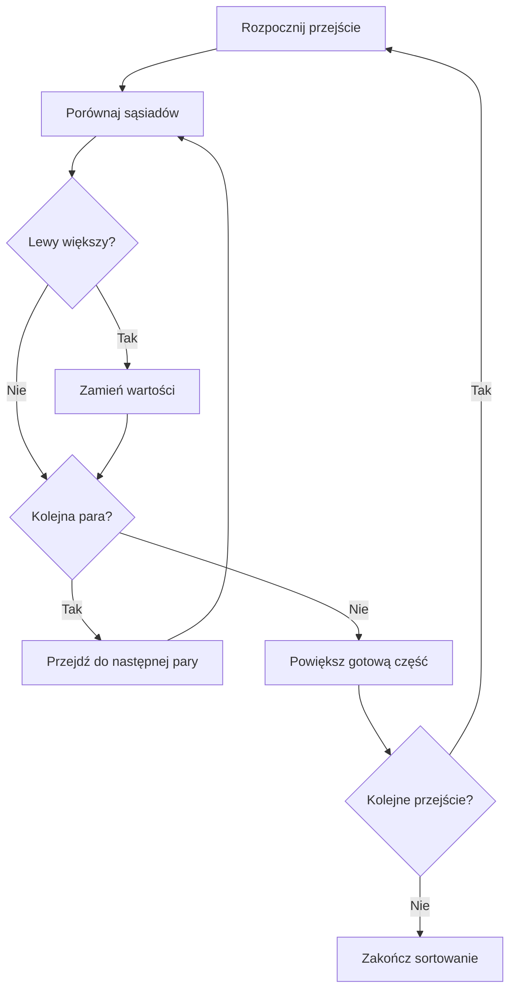

# Sortowanie bąbelkowe krok po kroku

## Cel lekcji

Nauczysz się porządkować liczby rosnąco przez porównywanie sąsiadów. Prześledzisz zmiany danych, napiszesz dwie zagnieżdżone pętle i wyjaśnisz ich granice. Używamy podstawowej wersji sortowania bąbelkowego. Wykonujemy wszystkie zaplanowane przejścia, także gdy dane są już uporządkowane.

## Prosta idea

Spójrz na dwie sąsiednie liczby. Jeśli lewa jest większa od prawej, zamień je miejscami. Następnie przesuń się o jedną pozycję w prawo i sprawdź następną parę.

Większa wartość przesuwa się w prawo. Po przejściu przez cały zbiór największa liczba jest na końcu. Następne przejście zaczynamy ponownie od lewej strony.

### Kiedy tego użyć?

Gdy uczysz się samodzielnie pisać algorytmy i chcesz prześledzić sortowanie małego zbioru. Ten algorytm pozwala ćwiczyć indeksy, zagnieżdżone pętle i zamianę wartości.

### Kiedy wybrać coś innego?

Gdy celem programu jest samo uporządkowanie dużej liczby danych, zwykle wybieramy gotowe narzędzie biblioteczne. Tutaj piszemy sortowanie samodzielnie, aby zrozumieć jego działanie.

## Przykład wykonany ręcznie

Zaczynamy od `7, 3, 5, 2, 6`. Indeksy to kolejno `0, 1, 2, 3, 4`.

<details markdown="1">
<summary>Pokaż pierwsze pełne przejście</summary>

| Porównanie | Indeksy | Wartości przed porównaniem | Decyzja | Zbiór po porównaniu |
| --- | --- | --- | --- | --- |
| 1 | 0 i 1 | 7 i 3 | 7 > 3 => zamiana | 3, 7, 5, 2, 6 |
| 2 | 1 i 2 | 7 i 5 | 7 > 5 => zamiana | 3, 5, 7, 2, 6 |
| 3 | 2 i 3 | 7 i 2 | 7 > 2 => zamiana | 3, 5, 2, 7, 6 |
| 4 | 3 i 4 | 7 i 6 | 7 > 6 => zamiana | 3, 5, 2, 6, 7 |

Po pierwszym przejściu `7` jest na właściwym miejscu: pod indeksem `4`. Reszta nie jest jeszcze uporządkowana, bo `5` stoi przed `2`.

</details>

### Porównanie, zamiana i przejście

- **Porównanie** sprawdza kolejność jednej pary sąsiadów.
- **Zamiana** przestawia dwie wartości. Nie każde porównanie kończy się zamianą. Równe wartości pozostają na miejscach.
- **Przejście** sprawdza kolejne pary od lewej strony do końca jeszcze niegotowej części.
- **Wszystkie przejścia** stopniowo powiększają gotową część po prawej. Dla pięciu elementów wykonujemy cztery przejścia.
- **Zakończenie sortowania** następuje po ostatnim zaplanowanym przejściu. Wtedy także pozostały element po lewej jest na właściwym miejscu.

<details markdown="1">
<summary>Pokaż stany po wszystkich przejściach</summary>

| Po przejściu | Zbiór | Część o potwierdzonym miejscu po prawej |
| --- | --- | --- |
| 1 | 3, 5, 2, 6, 7 | 7 |
| 2 | 3, 2, 5, 6, 7 | 6, 7 |
| 3 | 2, 3, 5, 6, 7 | 5, 6, 7 |
| 4 | 2, 3, 5, 6, 7 | 3, 5, 6, 7 |

W drugim przejściu pierwsze porównanie dotyczy `3` i `5`. Nie ma zamiany. Następnie zamieniamy `5` z `2`, a porównanie `5` i `6` nie zmienia danych.

Choć zbiór wygląda na uporządkowany już po trzecim przejściu, ta wersja wykonuje również czwarte. Po zakończeniu oznaczamy jako gotowy cały zbiór.

</details>

## Schemat działania

Diagram dotyczy zbioru mającego co najmniej dwa elementy. Granica danego przejścia pomija gotową część po prawej.



## Interaktywna wizualizacja

Naciśnij **Następny krok**, aby obejrzeć początek przejścia, jedno porównanie albo koniec przejścia. **Poprzedni krok** przywraca dokładnie wcześniejszy stan. Komórki po porównaniu pokazują wartości już po ewentualnej zamianie; opis pary podaje wartości sprzed niej.

Niebieska przerywana ramka oznacza porównanie bez zamiany, brązowa podwójna ramka oznacza zamianę, a zielona ramka oznacza gotową część. Każda komórka ma również etykietę tekstową. Numer porównania jest liczony łącznie dla wszystkich przejść.

<p id="alg-viz-fallback">Wizualizacja wymaga włączonego JavaScriptu. Możesz też prześledzić tabelę powyżej lub skorzystać z programu konsolowego poniżej.</p>
<div class="alg-viz" data-alg-viz-root hidden role="region" aria-label="Sortowanie bąbelkowe krok po kroku">
  <label for="alg-viz-input">Twoje liczby</label>
  <p id="alg-viz-help" class="alg-viz-help">Wpisz od 2 do 10 liczb całkowitych od -99 do 99, oddzielonych przecinkami.</p>
  <input id="alg-viz-input" data-alg-viz="input" type="text" value="7, 3, 5, 2, 6" autocomplete="off" spellcheck="false" aria-describedby="alg-viz-help alg-viz-error">
  <div class="alg-viz-controls"><button type="button" data-alg-viz="load">Wczytaj dane</button></div>
  <p id="alg-viz-error" class="alg-viz-error" data-alg-viz="error" role="alert"></p>
  <ol class="alg-viz-cells" data-alg-viz="cells" aria-label="Komórki zbioru"></ol>
  <p data-alg-viz="progress"></p>
  <p data-alg-viz="pair"></p>
  <p data-alg-viz="array"></p>
  <p data-alg-viz="sorted"></p>
  <p class="alg-viz-description" data-alg-viz="description" aria-live="polite" aria-atomic="true"></p>
  <div class="alg-viz-controls">
    <button type="button" data-alg-viz="previous">Poprzedni krok</button>
    <button type="button" data-alg-viz="next">Następny krok</button>
    <button type="button" data-alg-viz="play">Odtwórz</button>
    <button type="button" data-alg-viz="pause">Pauza</button>
    <button type="button" data-alg-viz="reset">Od początku</button>
  </div>
  <label for="alg-viz-speed">Szybkość odtwarzania</label>
  <select id="alg-viz-speed" data-alg-viz="speed">
    <option value="2000">Wolno — krok co 2 sekundy</option>
    <option value="1000" selected>Średnio — krok co sekundę</option>
    <option value="500">Szybko — krok co pół sekundy</option>
  </select>
  <p data-alg-viz="playback"></p>
</div>

Odtwarzanie zaczyna się dopiero po naciśnięciu **Odtwórz**. Ręczne przejście do innego kroku, reset i wczytanie danych zatrzymują odtwarzanie. Błędny wpis pozostawia ostatni poprawny zestaw i jego krok. **Od początku** wraca do pierwszego stanu ostatnio wczytanych danych.

## Podstawowy program w C++

Program używa `vector<int>` znanego z rozdziału 12. Zawiera cały algorytm; możesz wkleić go do `main.cpp` i skompilować w standardzie C++23.

```cpp
#include <iostream>
#include <vector>
using namespace std;

int main() {
    vector<int> liczby = {7, 3, 5, 2, 6};
    int rozmiar = liczby.size();

    for (int przejscie = 0; przejscie < rozmiar - 1; przejscie++) {
        for (int j = 0; j < rozmiar - 1 - przejscie; j++) {
            if (liczby[j] > liczby[j + 1]) {
                int pomocnicza = liczby[j];
                liczby[j] = liczby[j + 1];
                liczby[j + 1] = pomocnicza;
            }
        }
    }

    for (int liczba : liczby) {
        cout << liczba << ' ';
    }
    cout << '\n';
}
```

<details markdown="1">
<summary>Pokaż wynik programu</summary>

```text
2 3 5 6 7
```

</details>

## Omówienie kodu

### Liczba elementów

`liczby.size()` zwraca liczbę elementów. Dla małych zbiorów w tej lekcji zapisujemy ją w zmiennej `int rozmiar`. Dzięki temu wyrażenia takie jak `rozmiar - 1` są obliczeniami na liczbach ze znakiem. Zakładamy, że liczba elementów mieści się w typie `int`.

### Pętla zewnętrzna

`przejscie` liczy przejścia od zera. Warunek `przejscie < rozmiar - 1` daje dla pięciu elementów wartości `0`, `1`, `2`, `3`: cztery przejścia. W opisie dla człowieka nazywamy je przejściami od 1 do 4.

Po każdym przejściu jedna kolejna największa wartość z jeszcze niegotowej części trafia na jej prawy koniec. Po `rozmiar - 1` przejściach pozostaje tylko jeden element po lewej, więc cały zbiór jest uporządkowany.

### Pętla wewnętrzna

`j` jest indeksem lewego elementu pary. `j + 1` wskazuje jego bezpośredniego prawego sąsiada. Przy każdym nowym przejściu `j` zaczyna od zera. To inna rola niż liczenie przejść przez `przejscie`.

Warunek `j < rozmiar - 1 - przejscie` chroni prawy indeks i pomija gotową część:

- W pierwszym przejściu dla pięciu liczb `j < 4`. Ostatnia para ma indeksy `3` i `4`. Indeks `5` byłby poza zakresem.
- W drugim przejściu `j < 3`. Ostatnia para ma indeksy `2` i `3`. Element pod indeksem `4` ma już właściwe miejsce.
- W kolejnych przejściach granica przesuwa się w lewo, ponieważ gotowa część rośnie.

Nie sprawdzamy, czy całe dane są już uporządkowane. Wykonujemy ustaloną liczbę przejść, także dla danych rosnących.

### Warunek zamiany

`liczby[j] > liczby[j + 1]` oznacza, że większa liczba stoi przed mniejszą. W porządku rosnącym trzeba zamienić tę parę. Gdy wartości są równe, warunek jest fałszywy.

### Trzy przypisania

`pomocnicza` przechowuje dawną lewą wartość. Następnie prawa wartość trafia na lewo, a zapamiętana lewa na prawo. Bez zmiennej pomocniczej pierwsze przypisanie nadpisałoby wartość, której jeszcze potrzebujemy.

## Typowe błędy

- Warunek `j < rozmiar` dopuszcza odczyt `liczby[rozmiar]` przez `j + 1`. To dostęp poza zakresem.
- Znak `<=` zamiast `<` w granicy pętli wewnętrznej dodaje jedną niedozwoloną parę.
- Użycie `przejscie` jako indeksu obu porównywanych elementów powoduje sprawdzanie niewłaściwych par. Sąsiadami steruje `j`.
- Dwa przypisania bez zapamiętania starej wartości mogą utworzyć dwie kopie tej samej liczby.
- Jedno przejście ustawia największą liczbę na końcu, ale nie musi porządkować pozostałych.
- Zamiana znaku `>` na `<` zmienia kierunek sortowania na malejący.
- Równe liczby nie wymagają zamiany. Należy zachować wszystkie ich wystąpienia.

## Ćwiczenia

### Ćwiczenie 1. Wynik pierwszego przejścia

Dla danych `4, 1, 6, 2, 5` zapisz zbiór po pierwszym pełnym przejściu. Wskaż element o potwierdzonym końcowym miejscu. Wyjaśnij, czy całe sortowanie już się zakończyło. Przygotuj odpowiedź na kartce, zanim użyjesz wizualizacji.

<details markdown="1">
<summary>Pokaż wskazówkę do ćwiczenia 1</summary>

Po każdym porównaniu korzystaj z nowego stanu danych. Przejdź od pary o indeksach `0, 1` do pary `3, 4`.

</details>

<details markdown="1">
<summary>Pokaż rozwiązanie ćwiczenia 1</summary>

Kolejne stany to `1, 4, 6, 2, 5`, następnie bez zmiany, potem `1, 4, 2, 6, 5` i na końcu `1, 4, 2, 5, 6`. Liczba `6` ma końcowe miejsce pod indeksem `4`. Sortowanie nie jest zakończone: `4` stoi przed `2` i trzeba wykonać następne przejścia.

</details>

### Ćwiczenie 2. Porównanie nie zawsze oznacza zamianę

Dla danych `2, 2, -1, 3` przygotuj tabelę wszystkich porównań z pierwszego i drugiego przejścia. W każdym wierszu podaj indeksy, wartości przed porównaniem oraz decyzję o zamianie. Wyjaśnij, dlaczego w drugim przejściu tabela jest krótsza.

<details markdown="1">
<summary>Pokaż wskazówkę do ćwiczenia 2</summary>

Równe wartości pozostają na miejscach. Drugie przejście nie dotyka ostatniego elementu.

</details>

<details markdown="1">
<summary>Pokaż rozwiązanie ćwiczenia 2</summary>

| Przejście | Indeksy | Wartości | Zamiana |
| --- | --- | --- | --- |
| 1 | 0 i 1 | 2 i 2 | nie |
| 1 | 1 i 2 | 2 i -1 | tak |
| 1 | 2 i 3 | 2 i 3 | nie |
| 2 | 0 i 1 | 2 i -1 | tak |
| 2 | 1 i 2 | 2 i 2 | nie |

Po pierwszym przejściu mamy `2, -1, 2, 3`, a po drugim `-1, 2, 2, 3`. W drugim przejściu nie porównujemy pary `2, 3`, bo ostatni element jest już na właściwym miejscu. Podstawowy algorytm wykona jeszcze trzecie przejście.

</details>

### Ćwiczenie 3. Błędna granica

Ktoś zmienił w programie z lekcji warunek wewnętrznej pętli na `j <= rozmiar - 1 - przejscie`. Dla `9, 4, 1` wskaż pierwszą parę wychodzącą poza zakres. Zapisz poprawny warunek i przygotuj pełny poprawiony program. W debuggerze zatrzymaj poprawiony program na warunku zamiany i sprawdź kolejne wartości `j` oraz `j + 1`.

<details markdown="1">
<summary>Pokaż wskazówkę do ćwiczenia 3</summary>

Największy dozwolony indeks to `rozmiar - 1`. Pamiętaj, że odczytujesz również prawą komórkę.

</details>

<details markdown="1">
<summary>Pokaż rozwiązanie ćwiczenia 3</summary>

W pierwszym przejściu błędna pętla dopuszcza `j = 2`, czyli indeksy `2` i `3`. Drugi z nich nie istnieje. Poprawny warunek to `j < rozmiar - 1 - przejscie`. W poprawionym pierwszym przejściu debugger pokaże pary `0, 1` oraz `1, 2`.

```cpp
#include <iostream>
#include <vector>
using namespace std;

int main() {
    vector<int> liczby = {9, 4, 1};
    int rozmiar = liczby.size();
    for (int przejscie = 0; przejscie < rozmiar - 1; przejscie++) {
        for (int j = 0; j < rozmiar - 1 - przejscie; j++) {
            if (liczby[j] > liczby[j + 1]) {
                int pomocnicza = liczby[j];
                liczby[j] = liczby[j + 1];
                liczby[j + 1] = pomocnicza;
            }
        }
    }
    for (int liczba : liczby) {
        cout << liczba << ' ';
    }
    cout << '\n';
}
```

Wynik: `1 4 9`.

</details>

### Ćwiczenie 4. Uzupełnij zamianę

Przepisz podstawowy program dla danych `8, 3, 8, 1`. W miejscu trzech przypisań masz tylko zdanie „przenieś mniejszą liczbę na lewo, zachowując obie wartości”. Uzupełnij to miejsce kodem wykorzystującym zmienną pomocniczą. Oddaj pełny program oraz zapis wartości obu komórek i zmiennej pomocniczej po każdym przypisaniu podczas pierwszej zamiany. Nie używaj funkcji bibliotecznej do zamiany.

<details markdown="1">
<summary>Pokaż wskazówkę do ćwiczenia 4</summary>

Zanim nadpiszesz lewą komórkę, zachowaj jej wartość. Oba wystąpienia liczby `8` muszą pozostać w zbiorze.

</details>

<details markdown="1">
<summary>Pokaż rozwiązanie ćwiczenia 4</summary>

```cpp
#include <iostream>
#include <vector>
using namespace std;

int main() {
    vector<int> liczby = {8, 3, 8, 1};
    int rozmiar = liczby.size();
    for (int przejscie = 0; przejscie < rozmiar - 1; przejscie++) {
        for (int j = 0; j < rozmiar - 1 - przejscie; j++) {
            if (liczby[j] > liczby[j + 1]) {
                int pomocnicza = liczby[j];
                liczby[j] = liczby[j + 1];
                liczby[j + 1] = pomocnicza;
            }
        }
    }
    for (int liczba : liczby) {
        cout << liczba << ' ';
    }
    cout << '\n';
}
```

Pierwsza zamiana dotyczy `8` i `3`:

| Po przypisaniu | Lewa komórka | Prawa komórka | pomocnicza |
| --- | --- | --- | --- |
| pierwszym | 8 | 3 | 8 |
| drugim | 3 | 3 | 8 |
| trzecim | 3 | 8 | 8 |

Wynik całego programu: `1 3 8 8`.

</details>

### Ćwiczenie 5. Porządek malejący

Napisz pełny program sortujący `3, -2, 3, 7, 0` malejąco. Zmień warunek decydujący o zamianie, zachowując obie pętle. Wyjaśnij, czy po pierwszym przejściu po prawej znajdzie się najmniejsza, czy największa wartość. Podaj wynik całego sortowania.

<details markdown="1">
<summary>Pokaż wskazówkę do ćwiczenia 5</summary>

W porządku malejącym większa wartość powinna stać po lewej. Sprawdź, kiedy para narusza tę zasadę.

</details>

<details markdown="1">
<summary>Pokaż rozwiązanie ćwiczenia 5</summary>

```cpp
#include <iostream>
#include <vector>
using namespace std;

int main() {
    vector<int> liczby = {3, -2, 3, 7, 0};
    int rozmiar = liczby.size();
    for (int przejscie = 0; przejscie < rozmiar - 1; przejscie++) {
        for (int j = 0; j < rozmiar - 1 - przejscie; j++) {
            if (liczby[j] < liczby[j + 1]) {
                int pomocnicza = liczby[j];
                liczby[j] = liczby[j + 1];
                liczby[j + 1] = pomocnicza;
            }
        }
    }
    for (int liczba : liczby) {
        cout << liczba << ' ';
    }
    cout << '\n';
}
```

Po pierwszym przejściu na końcu jest najmniejsza wartość, czyli `-2`. Wynik całego sortowania: `7 3 3 0 -2`.

</details>

### Ćwiczenie 6. Funkcja zmieniająca vector

Napisz funkcję `void sortujBabelkowo(vector<int>& liczby)`. Ma uporządkować rosnąco przekazany wektor, bez wypisywania i bez tworzenia drugiego wektora. Wywołaj ją w pełnym programie dla `6, -3, 6, 0` i wypisz wynik w `main`. Sprawdź też pusty wektor i wektor z jednym elementem. Wyjaśnij, po co w parametrze jest `&`. Przyjmij, że liczba elementów mieści się w typie `int`.

<details markdown="1">
<summary>Pokaż wskazówkę do ćwiczenia 6</summary>

Przenieś obie pętle do funkcji. Referencja pozwala zmieniać oryginalny wektor. Zapisz rozmiar w zmiennej typu `int`, zanim odejmiesz od niego `1`.

</details>

<details markdown="1">
<summary>Pokaż rozwiązanie ćwiczenia 6</summary>

```cpp
#include <iostream>
#include <vector>
using namespace std;

void sortujBabelkowo(vector<int>& liczby) {
    int rozmiar = liczby.size();
    for (int przejscie = 0; przejscie < rozmiar - 1; przejscie++) {
        for (int j = 0; j < rozmiar - 1 - przejscie; j++) {
            if (liczby[j] > liczby[j + 1]) {
                int pomocnicza = liczby[j];
                liczby[j] = liczby[j + 1];
                liczby[j + 1] = pomocnicza;
            }
        }
    }
}

int main() {
    vector<int> liczby = {6, -3, 6, 0};
    sortujBabelkowo(liczby);
    for (int liczba : liczby) {
        cout << liczba << ' ';
    }
    cout << '\n';

    vector<int> puste;
    vector<int> jednaLiczba = {4};
    sortujBabelkowo(puste);
    sortujBabelkowo(jednaLiczba);
    cout << "Rozmiar pustego: " << puste.size() << '\n';
    cout << "Jedyny element: " << jednaLiczba[0] << '\n';
}
```

Wynik pierwszego sortowania: `-3 0 6 6`. Pusty wektor ma nadal rozmiar `0`, a jedyny element drugiego wektora to nadal `4`. Dla tych dwóch przypadków pętla zewnętrzna nie wykona się ani razu. Parametr z `&` odnosi się do oryginalnego wektora, więc zmiany pozostają widoczne w `main`.

</details>

## Program do pobrania: kolejne kroki w konsoli

[Pobierz program C++: sortowanie bąbelkowe krok po kroku]({{ '/assets/downloads/algorytmy/sortowanie-babelkowe-krok-po-kroku.cpp' | relative_url }})

- W Code::Blocks wybierz **File → New → Project → Console application**, a następnie język **C++**.
- Otwórz pobrany plik i wklej całą jego zawartość do pliku `main.cpp` w projekcie.
- W opcjach kompilatora projektu ustaw standard **C++23**. Jeśli nie ma go na liście, przy kompilatorze obsługującym ten standard możesz dodać opcję `-std=c++23`.
- Zbuduj i uruchom projekt przez **Build and run**.
- Podaj liczbę elementów od 2 do 10, a potem liczby całkowite oddzielone spacjami. Zatwierdź wiersz danych Enterem.
- Każde kolejne naciśnięcie Enter pokazuje jedno porównanie: numer przejścia, indeksy, wartości, decyzję o zamianie i aktualny zbiór. Program zatrzymuje się przed następnym porównaniem.

W konsoli komunikaty są zapisane bez polskich znaków, aby były czytelne również przy różnych ustawieniach kodowania terminala. Program przyjmuje wartości mieszczące się w typie `int`; ograniczenie od `-99` do `99` dotyczy wizualizacji na stronie. Niepoprawne dane kończą program komunikatem o błędzie. Koniec wejścia podczas prezentacji przerywa ją bez udawania, że sortowanie zostało ukończone.

## Podsumowanie

- Porównujemy sąsiednie elementy i zamieniamy je, gdy lewy jest większy.
- Jedno przejście ustawia największy element niegotowej części na jej prawym końcu.
- Pętla zewnętrzna liczy przejścia, a wewnętrzna wybiera pary.
- Granica pętli musi uwzględniać odczyt pod indeksem `j + 1`.
- W tej wersji wykonujemy wszystkie zaplanowane przejścia.
- Zmienna pomocnicza pozwala zamienić wartości bez utraty jednej z nich.
