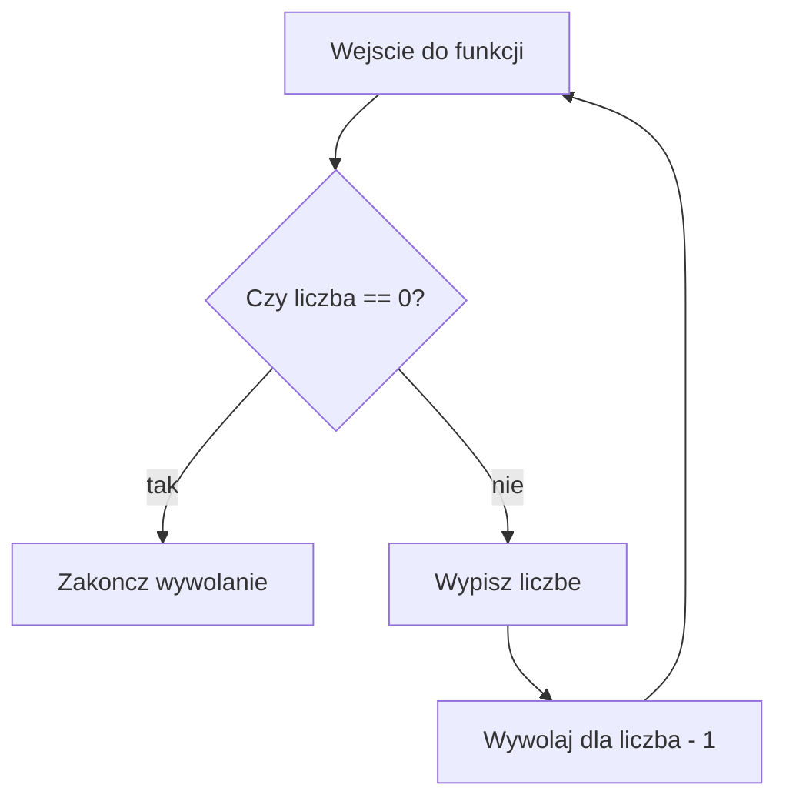

# Pierwsza funkcja rekurencyjna

## Krotkie przedstawienie problemu

Chcemy zobaczyc najprostszy mechanizm: funkcja wywoluje sama siebie.

## Proste wyjasnienie idei

Funkcja wykonuje jeden krok i przekazuje mniejszy problem kolejnemu wywolaniu.

## Dokladne wyjasnienie techniczne

Rekurencja wymaga warunku zatrzymania oraz wywolania z argumentem blizszym temu warunkowi.

## Przypadek podstawowy

Dla `liczba == 0` funkcja konczy biezace wywolanie przez `return`.

## Krok rekurencyjny

Funkcja wypisuje aktualna liczbe i wywoluje `odliczaj(liczba - 1)`.

## W jaki sposob problem sie zmniejsza?

W kazdym poprawnym przykladzie zmienia sie argument funkcji albo zakres danych. Nowe wywolanie dostaje mniejszy problem, wiec moze dojsc do przypadku podstawowego.

## Reczne przesledzenie niewielkiego przykladu

Dla `odliczaj(4)` kolejne argumenty to `4`, `3`, `2`, `1`, `0`.

## Diagram dzialania




## Pelny program C++

```cpp
#include <iostream>

using namespace std;

void odliczaj(int liczba)
{
    if (liczba == 0)
    {
        return;
    }

    cout << liczba << " ";
    odliczaj(liczba - 1);
}

int main()
{
    odliczaj(4);
    cout << "\n";
    return 0;
}
```

<details markdown="1">
<summary>Pokaz przykladowe dane i wynik</summary>

Dane wejsciowe:

```text
brak
```

Wynik:

```text
4 3 2 1
```

</details>

## Omowienie programu krok po kroku

Program pokazuje roznice miedzy zwyklym wywolaniem funkcji a rekurencja. Ostatnie wywolanie dla zera niczego nie wypisuje.

## Kiedy rekurencja sie zakonczy?

Rekurencja zakonczy sie wtedy, gdy kolejne wywolania doprowadza do przypadku podstawowego. Jezeli argument nie zbliza sie do konca, funkcja moze wywolywac sie bez konca.

## Kiedy lepsza bedzie petla?

Petla bedzie lepsza, gdy zadanie polega na prostym przejsciu po kolejnych wartosciach i rekurencja nie ulatwia myslenia. Petla zwykle zuzywa mniej pamieci i jest bezpieczniejsza dla bardzo duzych danych.

## Typowe bledy

- Brak przypadku podstawowego.
- Przypadek podstawowy, ktorego nie da sie osiagnac.
- Argument rosnacy zamiast zblizajacego sie do konca.
- Pominiecie `return` w funkcji zwracajacej wartosc.
- Pomylenie instrukcji wykonywanych podczas schodzenia z instrukcjami wykonywanymi podczas powrotu.
- Uzycie rekurencji tam, gdzie zwykla petla jest prostsza.

## Cwiczenia

### Cwiczenie 1 - Przewidzenie wyniku

Przewidz wynik malego wywolania z lekcji.

<details markdown="1">
<summary>Pokaz wskazowke do cwiczenia 1</summary>

Rozpisz kolejne argumenty i zaznacz przypadek podstawowy.

</details>

<details markdown="1">
<summary>Pokaz rozwiazanie cwiczenia 1</summary>

Rozwiazanie polega na rozpisaniu kolejnych wywolan i powrotow. Dla malego przykladu widac, kiedy funkcja przestaje wywolywac sama siebie.

</details>

### Cwiczenie 2 - Reczne rozpisanie wywolan

Utworz tabele wywolan dla wartosci poczatkowej podanej w przykladzie.

<details markdown="1">
<summary>Pokaz wskazowke do cwiczenia 2</summary>

W pierwszej kolumnie wpisz numer wywolania, w drugiej argument, w trzeciej decyzje.

</details>

<details markdown="1">
<summary>Pokaz rozwiazanie cwiczenia 2</summary>

Tabela powinna pokazac schodzenie do przypadku podstawowego oraz powroty do poprzednich wywolan.

</details>

### Cwiczenie 3 - Przypadek podstawowy

Wskaz przypadek podstawowy i wyjasnij, dlaczego konczy rekurencje.

<details markdown="1">
<summary>Pokaz wskazowke do cwiczenia 3</summary>

Szukaj warunku, po ktorym funkcja nie wywoluje samej siebie.

</details>

<details markdown="1">
<summary>Pokaz rozwiazanie cwiczenia 3</summary>

Przypadek podstawowy jest tym fragmentem funkcji, ktory zwraca wynik albo wykonuje `return` bez kolejnego wywolania rekurencyjnego.

</details>

### Cwiczenie 4 - Poprawienie bledu

Wyjasnij, co stanie sie, gdy argument nie bedzie sie zmniejszal.

<details markdown="1">
<summary>Pokaz wskazowke do cwiczenia 4</summary>

Sprawdz, czy kolejne wywolanie zbliza sie do konca.

</details>

<details markdown="1">
<summary>Pokaz rozwiazanie cwiczenia 4</summary>

Jezeli argument nie zbliza sie do przypadku podstawowego, rekurencja moze dzialac bez konca albo zakonczyc sie bledem wykonania.

</details>

### Cwiczenie 5 - Program

Napisz lub uruchom kompletny program oparty na schemacie z lekcji.

<details markdown="1">
<summary>Pokaz wskazowke do cwiczenia 5</summary>

Zachowaj przypadek podstawowy i krok rekurencyjny.

</details>

<details markdown="1">
<summary>Pokaz rozwiazanie cwiczenia 5</summary>

```cpp
#include <iostream>

using namespace std;

void odliczaj(int liczba)
{
    if (liczba == 0)
    {
        return;
    }

    cout << liczba << " ";
    odliczaj(liczba - 1);
}

int main()
{
    odliczaj(4);
    cout << "\n";
    return 0;
}
```

</details>


## Podsumowanie

Najwazniejsze jest rozumienie przypadku podstawowego, zmniejszania problemu i kolejności powrotow.
