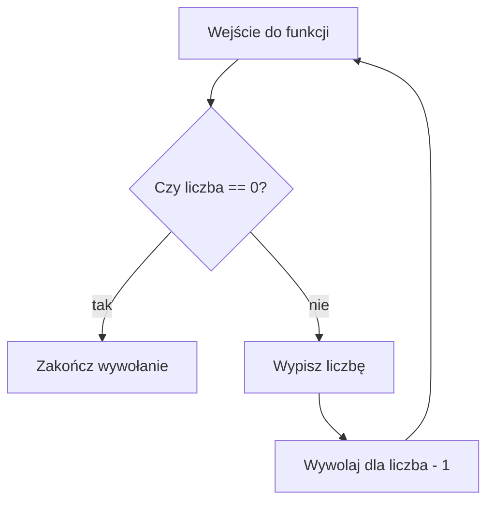

# Pierwsza funkcja rekurencyjna

## Krótkie przedstawienie problemu

Chcemy zobaczyć najprostszy mechanizm: funkcja wywołuje sama siebie.

## Proste wyjaśnienie idei

Funkcja wykonuje jeden krok i przekazuje mniejszy problem kolejnemu wywołaniu.

## Dokładne wyjaśnienie techniczne

Rekurencja wymaga warunku zatrzymania oraz wywołania z argumentem blizszym temu warunkowi.

## Przypadek podstawowy

Dla `liczba == 0` funkcja konczy bieżące wywołanie przez `return`.

## Krok rekurencyjny

Funkcja wypisuje aktualną liczbę i wywołuje `odliczaj(liczba - 1)`.

## W jaki sposób problem się zmniejsza?

W każdym poprawnym przykładzie zmienia się argument funkcji albo zakres danych. Nowe wywołanie dostaje mniejszy problem, więc może dojść do przypadku podstawowego.

## Ręczne prześledzenie niewielkiego przykładu

Dla `odliczaj(4)` kolejne argumenty to `4`, `3`, `2`, `1`, `0`.

## Diagram działania


```mermaid
flowchart TD
    A["Wejście do funkcji"] --> B{"Czy liczba == 0?"}
    B -->|tak| C["Zakończ wywołanie"]
    B -->|nie| D["Wypisz liczbę"]
    D --> E["Wywolaj dla liczba - 1"]
    E --> A
```


## Pełny program C++

```cpp
#include <iostream>

using namespace std;

void odliczaj(int liczba)
{
    if (liczba == 0)
    {
        return;
    }

    cout << liczba << " ";
    odliczaj(liczba - 1);
}

int main()
{
    odliczaj(4);
    cout << "\n";
    return 0;
}
```

<details markdown="1">
<summary>Pokaż przykładowe dane i wynik</summary>

Dane wejściowe:

```text
brak
```

Wynik:

```text
4 3 2 1
```

</details>

## Omówienie programu krok po kroku

Program pokazuje różnicę między zwyklym wywołaniem funkcji a rekurencja. Ostatnie wywołanie dla zera niczego nie wypisuje.

## Kiedy rekurencja się zakończy?

Rekurencja zakończy się wtedy, gdy kolejne wywołania doprowadzą do przypadku podstawowego. Jeżeli argument nie zbliża się do końca, funkcja może wywoływać się bez końca.

## Kiedy lepsza będzie pętla?

Pętla będzie lepsza, gdy zadanie polega na prostym przejściu po kolejnych wartościach i rekurencja nie ułatwia myślenia. Pętla zwykle zużywa mniej pamięci i jest bezpieczniejsza dla bardzo dużych danych.

## Typowe błędy

- Brak przypadku podstawowego.
- Przypadek podstawowy, którego nie da się osiągnąć.
- Argument rosnący zamiast zbliżającego się do końca.
- Pominięcie `return` w funkcji zwracającej wartość.
- Pomylenie instrukcji wykonywanych podczas schodzenia z instrukcjami wykonywanymi podczas powrotu.
- Użycie rekurencji tam, gdzie zwykła pętla jest prostsza.

## Ćwiczenia

### Ćwiczenie 1 - przewidzenie wyniku

Dla funkcji `odliczaj` pokazanej w tej lekcji ustal wynik wywołania `odliczaj(4)`. Zapisz odpowiedź jako wartość zwracaną albo dokładny tekst wypisany przez program.

<details markdown="1">
<summary>Wskazówka</summary>

Najpierw znajdź przypadek podstawowy `liczba <= 0`, a potem rozpisz kolejne wartości argumentu `liczba`.

</details>

<details markdown="1">
<summary>Przykładowe rozwiązanie</summary>

Wywołanie `odliczaj(4)` daje wynik:

```text
4 3 2 1
```

</details>

### Ćwiczenie 2 - rozpisanie wywołań

Zapisz kolejno argumenty wszystkich wywołań rekurencyjnych funkcji `odliczaj` dla wywołania `odliczaj(4)`. Przy każdym wywołaniu dopisz, czy funkcja schodzi głębiej, czy osiąga przypadek podstawowy.

<details markdown="1">
<summary>Wskazówka</summary>

Zacznij od pierwszego wywołania. Potem zapisuj tylko te argumenty, które pojawiają się w kolejnych wywołaniach tej samej funkcji.

</details>

<details markdown="1">
<summary>Przykładowe rozwiązanie</summary>

Poprawna odpowiedź powinna pokazywać, że każde kolejne wywołanie zbliża funkcję do przypadku podstawowego `liczba <= 0`. Ostatni wiersz opisu to wywołanie, które już nie uruchamia kolejnej rekurencji.

</details>

### Ćwiczenie 3 - przypadek podstawowy

Wskaż w funkcji `odliczaj` przypadek podstawowy. Napisz jednym zdaniem, dlaczego bez tego warunku rekurencja nie mogłaby się poprawnie zakończyć.

<details markdown="1">
<summary>Wskazówka</summary>

Szukaj instrukcji `if`, po której funkcja kończy pracę bez kolejnego wywołania samej siebie.

</details>

<details markdown="1">
<summary>Przykładowe rozwiązanie</summary>

Przypadek podstawowy to warunek `liczba <= 0`. Po jego spełnieniu funkcja nie wywołuje już samej siebie, więc rekurencja zaczyna się kończyć.

</details>

### Ćwiczenie 4 - błąd w kroku rekurencyjnym

Wyjaśnij, co mogłoby się stać, gdyby w funkcji `odliczaj` krok rekurencyjny nie zmieniał argumentu `liczba` w stronę przypadku podstawowego.

<details markdown="1">
<summary>Wskazówka</summary>

Porównaj pierwsze wywołanie z następnym. Sprawdź, czy problem staje się mniejszy albo prostszy.

</details>

<details markdown="1">
<summary>Przykładowe rozwiązanie</summary>

Jeżeli argument nie zbliża się do przypadku podstawowego, funkcja może wywoływać samą siebie bez końca. Program zużywa wtedy coraz więcej pamięci stosu i może zakończyć się błędem.

</details>

### Ćwiczenie 5 - krótki program

Napisz krótki program testujący funkcję `odliczaj` dla wywołania `odliczaj(4)`. Program ma wypisać wynik i działać w standardzie C++23.

<details markdown="1">
<summary>Wskazówka</summary>

Zostaw przypadek podstawowy i krok rekurencyjny. W funkcji `main` wywołaj funkcję z podanymi argumentami.

</details>

<details markdown="1">
<summary>Przykładowe rozwiązanie</summary>

```cpp
#include <iostream>

using namespace std;

void odliczaj(int liczba)
{
    if (liczba <= 0)
    {
        return;
    }

    cout << liczba << " ";
    odliczaj(liczba - 1);
}

int main()
{
    odliczaj(4);
    cout << "\n";
    return 0;
}
```

</details>
