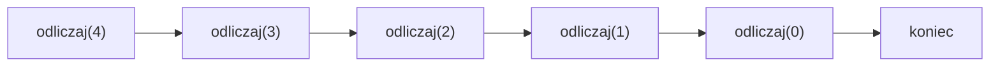

# Pierwsza funkcja rekurencyjna

## Problem

Chcemy napisać funkcję, która wypisze liczby od podanej wartości do `1`. Dla wywołania `odliczaj(4)` oczekujemy wyniku:

```text
4 3 2 1
```

Można to zrobić pętlą, ale tutaj użyjemy rekurencji, żeby zobaczyć najprostszy mechanizm: funkcja tworzy nowe wywołanie samej siebie.

## Idea

Funkcja `odliczaj` wykonuje jedno zadanie: wypisuje aktualną liczbę. Potem prosi kolejne wywołanie tej samej funkcji o obsłużenie liczby o `1` mniejszej.

Przypadek podstawowy to `liczba <= 0`. Gdy liczba jest równa `0` albo ujemna, funkcja kończy pracę i niczego nie wypisuje. Dzięki temu program jest bezpieczny także dla argumentu ujemnego.

## Łańcuch wywołań

```text
odliczaj(4)
=> odliczaj(3)
=> odliczaj(2)
=> odliczaj(1)
=> odliczaj(0)
=> koniec
```


```mermaid
flowchart LR
    A["odliczaj(4)"] --> B["odliczaj(3)"]
    B --> C["odliczaj(2)"]
    C --> D["odliczaj(1)"]
    D --> E["odliczaj(0)"]
    E --> F["koniec"]
```

To nie jest powrót do tego samego miejsca jak w pętli. Powstaje nowe wywołanie funkcji z własną wartością parametru `liczba`.

## Kod

```cpp
#include <iostream>

using namespace std;

void odliczaj(int liczba)
{
    if (liczba <= 0)
    {
        return;
    }

    cout << liczba << " ";
    odliczaj(liczba - 1);
}

int main()
{
    odliczaj(4);
    cout << "\n";
    return 0;
}
```

<details markdown="1">
<summary>Pokaż wynik</summary>

```text
4 3 2 1
```

</details>

## Omówienie kodu

- `odliczaj(4)` jest pierwszym wywołaniem funkcji.
- Warunek `liczba <= 0` zatrzymuje rekurencję.
- Dla `4`, `3`, `2` i `1` warunek jest fałszywy, więc funkcja wypisuje liczbę.
- Instrukcja `odliczaj(liczba - 1)` tworzy nowe wywołanie z mniejszym argumentem.
- `odliczaj(0)` trafia w przypadek podstawowy i kończy pracę bez wypisywania.

Każde wywołanie ma własną wartość parametru. Gdy działa `odliczaj(2)`, nie zmienia ono parametru wcześniejszego wywołania `odliczaj(3)`.

## Zachowanie dla argumentów brzegowych

| Wywołanie       | Wynik działania                 |
| --------------- | ------------------------------- |
| `odliczaj(3)`   | wypisuje `3 2 1`                |
| `odliczaj(1)`   | wypisuje `1`                    |
| `odliczaj(0)`   | niczego nie wypisuje            |
| `odliczaj(-5)`  | niczego nie wypisuje            |

Warunek `liczba <= 0` jest bezpieczniejszy niż `liczba == 0`, bo zatrzymuje także wartości ujemne.

## Typowe błędy

- Brak przypadku podstawowego.
- Wywołanie funkcji z tym samym argumentem, np. `odliczaj(liczba)`.
- Mylenie nowego wywołania funkcji z kolejnym obiegiem pętli.
- Warunek zatrzymania obsługujący tylko `0`, gdy do funkcji może trafić liczba ujemna.
- Umieszczenie wywołania rekurencyjnego przed wypisywaniem bez zrozumienia zmiany kolejności wyniku.

## Ćwiczenia

### Ćwiczenie 1 - wynik dla innego argumentu

Podaj dokładny tekst wypisany przez program po wywołaniu `odliczaj(6)`.

<details markdown="1">
<summary>Pokaż wskazówkę do ćwiczenia 1</summary>

Funkcja wypisuje liczbę przed wywołaniem rekurencyjnym.

</details>

<details markdown="1">
<summary>Pokaż rozwiązanie ćwiczenia 1</summary>

```text
6 5 4 3 2 1
```

Wywołanie `odliczaj(0)` już niczego nie wypisuje.

</details>

### Ćwiczenie 2 - rozpisanie wywołań

Rozpisz wszystkie wywołania powstałe po uruchomieniu `odliczaj(3)` aż do zatrzymania rekurencji.

<details markdown="1">
<summary>Pokaż wskazówkę do ćwiczenia 2</summary>

W każdym kroku argument zmniejsza się o `1`.

</details>

<details markdown="1">
<summary>Pokaż rozwiązanie ćwiczenia 2</summary>

```text
odliczaj(3)
=> odliczaj(2)
=> odliczaj(1)
=> odliczaj(0)
=> koniec
```

Przypadek podstawowy występuje przy `liczba <= 0`.

</details>

### Ćwiczenie 3 - zero i liczba ujemna

Wyjaśnij, co wypiszą wywołania `odliczaj(0)` oraz `odliczaj(-2)`.

<details markdown="1">
<summary>Pokaż wskazówkę do ćwiczenia 3</summary>

Sprawdź pierwszy warunek w funkcji.

</details>

<details markdown="1">
<summary>Pokaż rozwiązanie ćwiczenia 3</summary>

Oba wywołania niczego nie wypiszą. Dla `0` i `-2` warunek `liczba <= 0` jest prawdziwy, więc funkcja wykonuje `return` przed instrukcją `cout`.

</details>

### Ćwiczenie 4 - naprawienie błędu

Dana jest błędna funkcja:

```cpp
void odliczaj(int liczba)
{
    if (liczba <= 0)
    {
        return;
    }

    cout << liczba << " ";
    odliczaj(liczba);
}
```

Wyjaśnij błąd i zapisz poprawioną linię wywołania rekurencyjnego.

<details markdown="1">
<summary>Pokaż wskazówkę do ćwiczenia 4</summary>

Argument musi zbliżać się do przypadku podstawowego.

</details>

<details markdown="1">
<summary>Pokaż rozwiązanie ćwiczenia 4</summary>

Błąd polega na tym, że funkcja wywołuje się z tym samym argumentem. Dla dodatniej liczby nigdy nie dojdzie do `liczba <= 0`.

Poprawiona linia:

```cpp
odliczaj(liczba - 1);
```

</details>

### Ćwiczenie 5 - liczby parzyste malejąco

Napisz funkcję `wypiszParzyste(int liczba)`, która dla dodatniego argumentu wypisuje dodatnie liczby parzyste nie większe od `liczba`, w kolejności malejącej. Dla `wypiszParzyste(7)` wynik ma być:

```text
6 4 2
```

<details markdown="1">
<summary>Pokaż wskazówkę do ćwiczenia 5</summary>

Jeżeli liczba jest nieparzysta, możesz najpierw zmniejszyć ją o `1`. Potem w każdym kroku odejmuj `2`.

</details>

<details markdown="1">
<summary>Pokaż rozwiązanie ćwiczenia 5</summary>

```cpp
#include <iostream>

using namespace std;

void wypiszParzyste(int liczba)
{
    if (liczba <= 0)
    {
        return;
    }

    if (liczba % 2 != 0)
    {
        wypiszParzyste(liczba - 1);
        return;
    }

    cout << liczba << " ";
    wypiszParzyste(liczba - 2);
}

int main()
{
    wypiszParzyste(7);
    cout << "\n";
    return 0;
}
```

</details>
