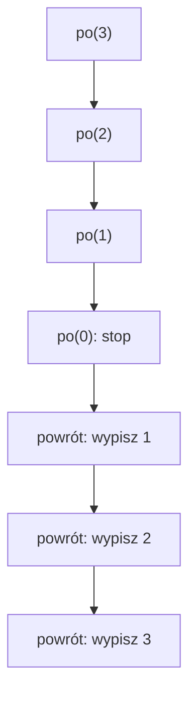

# Stos wywołań i kolejność działania

## Problem

W rekurencji ważne jest nie tylko to, jakie wywołania powstają, ale też kiedy wykonywane są instrukcje. Ten sam warunek i ten sam argument mogą dać inny wynik, jeśli `cout` znajduje się przed wywołaniem rekurencyjnym albo po nim.

## Dwie wersje funkcji

Pierwsza wersja wypisuje podczas schodzenia:

```cpp
void przed(int liczba)
{
    if (liczba <= 0)
    {
        return;
    }

    cout << liczba << " ";
    przed(liczba - 1);
}
```

Druga wersja wypisuje podczas powrotów:

```cpp
void po(int liczba)
{
    if (liczba <= 0)
    {
        return;
    }

    po(liczba - 1);
    cout << liczba << " ";
}
```

Różnica jest w położeniu instrukcji `cout`.

## Schodzenie i powroty

Dla `po(3)` wywołania schodzą w dół tak:

```text
po(3) => po(2) => po(1) => po(0)
```

`po(0)` trafia w przypadek podstawowy. Dopiero potem wcześniejsze wywołania kończą swoją pracę:

```text
powrót do po(1) => wypisz 1
powrót do po(2) => wypisz 2
powrót do po(3) => wypisz 3
```



## Stos wywołań

Stos wywołań przechowuje aktywne wywołania funkcji. Dla każdego wywołania pamiętane są między innymi argumenty, zmienne lokalne i miejsce, do którego program ma wrócić.

To nie jest osobna funkcja w kodzie. To mechanizm działania programu. Uczeń powinien wiedzieć, że wcześniejsze wywołanie może czekać, aż zakończy się głębsze wywołanie.

| Numer wywołania | Wartość `liczba` | Przed zejściem | Moment oczekiwania | Po powrocie |
| ---------------- | ---------------- | -------------- | ------------------ | ----------- |
| 1                | 3                | brak wypisu    | czeka na `po(2)`   | wypisuje 3  |
| 2                | 2                | brak wypisu    | czeka na `po(1)`   | wypisuje 2  |
| 3                | 1                | brak wypisu    | czeka na `po(0)`   | wypisuje 1  |
| 4                | 0                | stop           | nie czeka          | brak        |

## Pełny program

```cpp
#include <iostream>

using namespace std;

void przed(int liczba)
{
    if (liczba <= 0)
    {
        return;
    }

    cout << liczba << " ";
    przed(liczba - 1);
}

void po(int liczba)
{
    if (liczba <= 0)
    {
        return;
    }

    po(liczba - 1);
    cout << liczba << " ";
}

int main()
{
    przed(3);
    cout << "\n";

    po(3);
    cout << "\n";

    return 0;
}
```

<details markdown="1">
<summary>Pokaż wynik</summary>

```text
3 2 1
1 2 3
```

</details>

## Typowe błędy

- Zakładanie, że instrukcje po wywołaniu rekurencyjnym wykonują się od razu.
- Brak rozróżnienia między schodzeniem i powrotami.
- Mylenie kolejności wywołań z kolejnością wypisywania.
- Rysowanie rekurencji jako zwykłej pętli.
- Pomijanie aktywnych wywołań, które czekają na zakończenie głębszych wywołań.

## Ćwiczenia

### Ćwiczenie 1 - kolejność wypisywania

Jaki tekst wypisze wywołanie `po(4)`?

<details markdown="1">
<summary>Pokaż wskazówkę do ćwiczenia 1</summary>

W funkcji `po` wypisywanie jest po wywołaniu rekurencyjnym.

</details>

<details markdown="1">
<summary>Pokaż rozwiązanie ćwiczenia 1</summary>

```text
1 2 3 4
```

Najpierw funkcja schodzi do `po(0)`, a dopiero podczas powrotów wypisuje `1`, `2`, `3`, `4`.

</details>

### Ćwiczenie 2 - tabela wywołań

Uzupełnij tabelę dla wywołania `przed(3)`: wartość parametru, tekst wypisany przed zejściem i następne wywołanie.

<details markdown="1">
<summary>Pokaż wskazówkę do ćwiczenia 2</summary>

W funkcji `przed` instrukcja `cout` jest przed wywołaniem rekurencyjnym.

</details>

<details markdown="1">
<summary>Pokaż rozwiązanie ćwiczenia 2</summary>

| Wywołanie    | Wypisuje przed zejściem | Następne wywołanie |
| ------------ | ----------------------- | ------------------ |
| `przed(3)`   | `3`                     | `przed(2)`         |
| `przed(2)`   | `2`                     | `przed(1)`         |
| `przed(1)`   | `1`                     | `przed(0)`         |
| `przed(0)`   | nic                     | brak               |

</details>

### Ćwiczenie 3 - przeniesienie instrukcji

Funkcja wypisuje liczby malejąco. Jak zmieni się wynik, jeśli instrukcję `cout << liczba << " ";` przeniesiesz za wywołanie rekurencyjne?

<details markdown="1">
<summary>Pokaż wskazówkę do ćwiczenia 3</summary>

Instrukcja po wywołaniu rekurencyjnym wykona się dopiero podczas powrotów.

</details>

<details markdown="1">
<summary>Pokaż rozwiązanie ćwiczenia 3</summary>

Wynik zmieni się z malejącego na rosnący. Dla argumentu `3` zamiast:

```text
3 2 1
```

otrzymamy:

```text
1 2 3
```

</details>

### Ćwiczenie 4 - schodzenie i powroty jednocześnie

Przewidź wynik programu:

```cpp
void pokaz(int liczba)
{
    if (liczba <= 0)
    {
        return;
    }

    cout << "A" << liczba << " ";
    pokaz(liczba - 1);
    cout << "B" << liczba << " ";
}
```

Dla wywołania `pokaz(2)` podaj dokładny tekst wypisany przez funkcję.

<details markdown="1">
<summary>Pokaż wskazówkę do ćwiczenia 4</summary>

`A` wypisuje się podczas schodzenia, a `B` podczas powrotów.

</details>

<details markdown="1">
<summary>Pokaż rozwiązanie ćwiczenia 4</summary>

```text
A2 A1 B1 B2
```

Najpierw działa `pokaz(2)`, potem `pokaz(1)`, potem `pokaz(0)` kończy rekurencję. Po powrocie wypisują się części `B1` i `B2`.

</details>

### Ćwiczenie 5 - kompletny program

Napisz program z funkcją `ramka(int liczba)`, która dla `ramka(3)` wypisze:

```text
[3 [2 [1 ]1 ]2 ]3
```

<details markdown="1">
<summary>Pokaż wskazówkę do ćwiczenia 5</summary>

Przed wywołaniem wypisz `[` i liczbę. Po powrocie wypisz `]` i tę samą liczbę.

</details>

<details markdown="1">
<summary>Pokaż rozwiązanie ćwiczenia 5</summary>

```cpp
#include <iostream>

using namespace std;

void ramka(int liczba)
{
    if (liczba <= 0)
    {
        return;
    }

    cout << "[" << liczba << " ";
    ramka(liczba - 1);
    cout << "]" << liczba << " ";
}

int main()
{
    ramka(3);
    cout << "\n";
    return 0;
}
```

</details>
