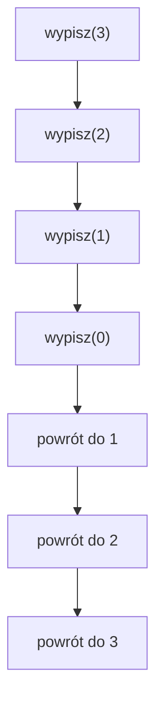

# Stos wywołań i kolejność działania

## Krótkie przedstawienie problemu

Chcemy zrozumiec, dlaczego polozenie instrukcji przed albo po wywołaniu rekurencyjnym zmienia wynik.

## Proste wyjaśnienie idei

Każde wywołanie ma własny argument i może czekac na zakonczenie głębszego wywołania.

## Dokładne wyjaśnienie techniczne

Stos wywołań przechowuje aktywne wywołania. Najnowsze wywołanie konczy się jako pierwsze.

## Przypadek podstawowy

Dla `liczba == 0` funkcja wraca.

## Krok rekurencyjny

Argument maleje przez wywołanie z `liczba - 1`.

## W jaki sposób problem się zmniejsza?

W każdym poprawnym przykładzie zmienia się argument funkcji albo zakres danych. Nowe wywołanie dostaje mniejszy problem, więc może dojść do przypadku podstawowego.

## Ręczne prześledzenie niewielkiego przykładu

Dla `rosnaco(3)` funkcja najpierw schodzi do zera, a potem wypisuje `1`, `2`, `3`.

## Tabela wywołań

| Wywołanie | Argument | Co robi? |
| --- | ---: | --- |
| `wypisz(3)` | 3 | czeka na `wypisz(2)` |
| `wypisz(2)` | 2 | czeka na `wypisz(1)` |
| `wypisz(1)` | 1 | czeka na `wypisz(0)` |
| `wypisz(0)` | 0 | konczy schodzenie |
| powrót do `wypisz(1)` | 1 | wykonuje dalszą część |
| powrót do `wypisz(2)` | 2 | wykonuje dalszą część |
| powrót do `wypisz(3)` | 3 | wykonuje dalszą część |




## Pełny program C++

```cpp
#include <iostream>

using namespace std;

void malejaco(int liczba)
{
    if (liczba == 0)
    {
        return;
    }

    cout << liczba << " ";
    malejaco(liczba - 1);
}

void rosnaco(int liczba)
{
    if (liczba == 0)
    {
        return;
    }

    rosnaco(liczba - 1);
    cout << liczba << " ";
}

int main()
{
    malejaco(3);
    cout << "\n";
    rosnaco(3);
    cout << "\n";
    return 0;
}
```

<details markdown="1">
<summary>Pokaż przykładowe dane i wynik</summary>

Dane wejściowe:

```text
brak
```

Wynik:

```text
3 2 1
1 2 3
```

</details>

## Omówienie programu krok po kroku

Pierwsza funkcja wypisuje podczas schodzenia, a druga podczas powrotów.

## Kiedy rekurencja się zakończy?

Rekurencja zakończy się wtedy, gdy kolejne wywołania doprowadzą do przypadku podstawowego. Jeżeli argument nie zbliża się do końca, funkcja może wywoływać się bez końca.

## Kiedy lepsza będzie pętla?

Pętla będzie lepsza, gdy zadanie polega na prostym przejściu po kolejnych wartościach i rekurencja nie ułatwia myślenia. Pętla zwykle zużywa mniej pamięci i jest bezpieczniejsza dla bardzo dużych danych.

## Typowe błędy

- Brak przypadku podstawowego.
- Przypadek podstawowy, którego nie da się osiągnąć.
- Argument rosnący zamiast zbliżającego się do końca.
- Pominięcie `return` w funkcji zwracającej wartość.
- Pomylenie instrukcji wykonywanych podczas schodzenia z instrukcjami wykonywanymi podczas powrotu.
- Użycie rekurencji tam, gdzie zwykła pętla jest prostsza.

## Ćwiczenia

### Ćwiczenie 1 - przewidzenie wyniku

Dla funkcji `rosnaco` pokazanej w tej lekcji ustal wynik wywołania `rosnaco(3)`. Zapisz odpowiedź jako wartość zwracaną albo dokładny tekst wypisany przez program.

<details markdown="1">
<summary>Wskazówka</summary>

Najpierw znajdź przypadek podstawowy `liczba == 0`, a potem rozpisz kolejne wartości argumentu `liczba`.

</details>

<details markdown="1">
<summary>Przykładowe rozwiązanie</summary>

Wywołanie `rosnaco(3)` daje wynik:

```text
1 2 3
```

</details>

### Ćwiczenie 2 - rozpisanie wywołań

Zapisz kolejno argumenty wszystkich wywołań rekurencyjnych funkcji `rosnaco` dla wywołania `rosnaco(3)`. Przy każdym wywołaniu dopisz, czy funkcja schodzi głębiej, czy osiąga przypadek podstawowy.

<details markdown="1">
<summary>Wskazówka</summary>

Zacznij od pierwszego wywołania. Potem zapisuj tylko te argumenty, które pojawiają się w kolejnych wywołaniach tej samej funkcji.

</details>

<details markdown="1">
<summary>Przykładowe rozwiązanie</summary>

Poprawna odpowiedź powinna pokazywać, że każde kolejne wywołanie zbliża funkcję do przypadku podstawowego `liczba == 0`. Ostatni wiersz opisu to wywołanie, które już nie uruchamia kolejnej rekurencji.

</details>

### Ćwiczenie 3 - przypadek podstawowy

Wskaż w funkcji `rosnaco` przypadek podstawowy. Napisz jednym zdaniem, dlaczego bez tego warunku rekurencja nie mogłaby się poprawnie zakończyć.

<details markdown="1">
<summary>Wskazówka</summary>

Szukaj instrukcji `if`, po której funkcja kończy pracę bez kolejnego wywołania samej siebie.

</details>

<details markdown="1">
<summary>Przykładowe rozwiązanie</summary>

Przypadek podstawowy to warunek `liczba == 0`. Po jego spełnieniu funkcja nie wywołuje już samej siebie, więc rekurencja zaczyna się kończyć.

</details>

### Ćwiczenie 4 - błąd w kroku rekurencyjnym

Wyjaśnij, co mogłoby się stać, gdyby w funkcji `rosnaco` krok rekurencyjny nie zmieniał argumentu `liczba` w stronę przypadku podstawowego.

<details markdown="1">
<summary>Wskazówka</summary>

Porównaj pierwsze wywołanie z następnym. Sprawdź, czy problem staje się mniejszy albo prostszy.

</details>

<details markdown="1">
<summary>Przykładowe rozwiązanie</summary>

Jeżeli argument nie zbliża się do przypadku podstawowego, funkcja może wywoływać samą siebie bez końca. Program zużywa wtedy coraz więcej pamięci stosu i może zakończyć się błędem.

</details>

### Ćwiczenie 5 - krótki program

Napisz krótki program testujący funkcję `rosnaco` dla wywołania `rosnaco(3)`. Program ma wypisać wynik i działać w standardzie C++23.

<details markdown="1">
<summary>Wskazówka</summary>

Zostaw przypadek podstawowy i krok rekurencyjny. W funkcji `main` wywołaj funkcję z podanymi argumentami.

</details>

<details markdown="1">
<summary>Przykładowe rozwiązanie</summary>

```cpp
#include <iostream>

using namespace std;

void rosnaco(int liczba)
{
    if (liczba == 0)
    {
        return;
    }

    rosnaco(liczba - 1);
    cout << liczba << " ";
}

int main()
{
    rosnaco(3);
    cout << "\n";
    return 0;
}
```

</details>
