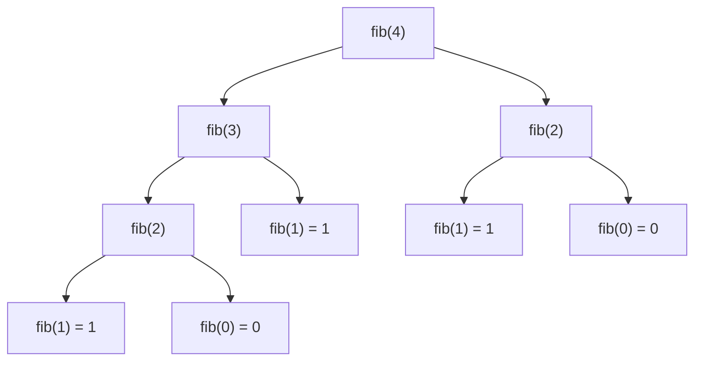

# Wiele wywołań i ciąg Fibonacciego

## Problem

Do tej pory jedno wywołanie rekurencyjne tworzyło zwykle jedno kolejne wywołanie. W ciągu Fibonacciego jedno wywołanie może utworzyć dwie gałęzie.

Przyjmujemy definicję dla `n >= 0`:

```text
fib(0) = 0
fib(1) = 1
fib(n) = fib(n - 1) + fib(n - 2), gdy n >= 2
```

## Drzewo wywołań

Dla `fib(4)` nie powstaje jedna prosta lista argumentów. Powstaje drzewo:



W kodzie w tej lekcji gałęzie są zapisane w osobnych instrukcjach. To ważne, bo w wyrażeniu `fib(n - 1) + fib(n - 2)` kompilator nie musi zaczynać od lewego składnika dodawania. Osobne instrukcje wymuszają kolejność: najpierw rozwijana jest gałąź `fib(n - 1)`, a dopiero później gałąź `fib(n - 2)`. Dzięki temu pokazany ślad wywołań jest zgodny z programem.

Dla tak zapisanego programu kolejność wykonywania wywołań można zapisać tak:

```text
fib(4)
  fib(3)
    fib(2)
      fib(1) => 1
      fib(0) => 0
    fib(2) => 1
    fib(1) => 1
  fib(3) => 2
  fib(2)
    fib(1) => 1
    fib(0) => 0
  fib(2) => 1
fib(4) => 3
```

Wartości zwracane:

```text
fib(2) = fib(1) + fib(0) = 1
fib(3) = fib(2) + fib(1) = 2
fib(4) = fib(3) + fib(2) = 3
```

Wartość `fib(2)` jest liczona dwa razy: raz wewnątrz `fib(3)` i drugi raz jako prawa gałąź `fib(4)`. Problem tej wersji nie wynika z samego użycia rekurencji, tylko z wielokrotnego rozwiązywania tych samych podproblemów.

Warto też pamiętać, że wartości ciągu Fibonacciego szybko rosną i mogą przekroczyć zakres typów całkowitych. Ta lekcja pokazuje mechanizm wywołań, a nie sposób liczenia bardzo dużych wyrazów ciągu.

## Kod

```cpp
#include <iostream>

using namespace std;

int fib(int n)
{
    if (n < 0)
    {
        return -1;
    }

    if (n == 0)
    {
        return 0;
    }

    if (n == 1)
    {
        return 1;
    }

    int wynikPierwszejGalezi = fib(n - 1);
    int wynikDrugiejGalezi = fib(n - 2);

    return wynikPierwszejGalezi + wynikDrugiejGalezi;
}

int main()
{
    cout << fib(4) << "\n";
    return 0;
}
```

<details markdown="1">
<summary>Pokaż wynik</summary>

```text
3
```

</details>

## Omówienie kodu

- Dla `n < 0` funkcja zwraca `-1`, ponieważ ujemny indeks nie należy do dziedziny ciągu w tej lekcji.
- Dla `0` i `1` funkcja zna wynik od razu.
- Dla większego `n` funkcja tworzy dwa wywołania.
- Wyniki tych dwóch wywołań są dodawane.

## Wersja iteracyjna jako porównanie idei

Do samego obliczenia kolejnego wyrazu ciągu często lepsza jest pętla. Rekurencja dobrze pokazuje definicję, ale prosta wersja liczy wiele wartości ponownie.

Nie oznacza to, że rekurencja jest zła. Oznacza to, że trzeba rozumieć koszt rozgałęzień.

## Typowe błędy

- Traktowanie argumentów `fib` jak jednej liniowej listy.
- Brak przypadku `n == 0` albo `n == 1`.
- Brak zabezpieczenia dla wartości ujemnych.
- Nieświadomość, że te same wartości są obliczane wielokrotnie.
- Mylenie drzewa wywołań z kolejnością wypisywania.

## Ćwiczenia

### Ćwiczenie 1 - mała wartość

Oblicz ręcznie `fib(5)` na podstawie definicji i podaj wartość zwracaną.

<details markdown="1">
<summary>Pokaż wskazówkę do ćwiczenia 1</summary>

Najpierw ustal `fib(2)`, `fib(3)` i `fib(4)`.

</details>

<details markdown="1">
<summary>Pokaż rozwiązanie ćwiczenia 1</summary>

```text
fib(2) = 1
fib(3) = 2
fib(4) = 3
fib(5) = fib(4) + fib(3) = 3 + 2 = 5
```

Wartość zwracana przez `fib(5)` to `5`.

</details>

### Ćwiczenie 2 - pełne drzewo dla fib(4)

Narysuj albo zapisz tekstowo wszystkie wywołania powstałe dla `fib(4)`.

<details markdown="1">
<summary>Pokaż wskazówkę do ćwiczenia 2</summary>

Każde wywołanie dla `n >= 2` tworzy dwie gałęzie: `n - 1` i `n - 2`.

</details>

<details markdown="1">
<summary>Pokaż rozwiązanie ćwiczenia 2</summary>

```text
fib(4)
├─ fib(3)
│  ├─ fib(2)
│  │  ├─ fib(1)
│  │  └─ fib(0)
│  └─ fib(1)
└─ fib(2)
   ├─ fib(1)
   └─ fib(0)
```

To drzewo ma `9` wywołań.

</details>

### Ćwiczenie 3 - powtarzające się obliczenia

W drzewie dla `fib(5)` wskaż co najmniej dwie wartości, które są obliczane więcej niż raz.

<details markdown="1">
<summary>Pokaż wskazówkę do ćwiczenia 3</summary>

Rozwiń `fib(5)` na `fib(4)` i `fib(3)`, a potem porównaj poddrzewa.

</details>

<details markdown="1">
<summary>Pokaż rozwiązanie ćwiczenia 3</summary>

W drzewie dla `fib(5)` wielokrotnie pojawiają się między innymi `fib(3)`, `fib(2)`, `fib(1)` i `fib(0)`. To oznacza, że prosta rekurencja powtarza te same obliczenia.

</details>

### Ćwiczenie 4 - poprawienie przypadku podstawowego

Funkcja ma błąd:

```cpp
int fib(int n)
{
    if (n == 0)
    {
        return 0;
    }

    int wynikPierwszejGalezi = fib(n - 1);
    int wynikDrugiejGalezi = fib(n - 2);

    return wynikPierwszejGalezi + wynikDrugiejGalezi;
}
```

Wyjaśnij, dlaczego `fib(1)` jest problemem, i dopisz brakujący przypadek podstawowy.

<details markdown="1">
<summary>Pokaż wskazówkę do ćwiczenia 4</summary>

Sprawdź, jakie wywołania powstaną z `fib(1)`.

</details>

<details markdown="1">
<summary>Pokaż rozwiązanie ćwiczenia 4</summary>

Dla `fib(1)` funkcja wywoła `fib(0)` oraz `fib(-1)`, a potem może schodzić dalej w wartości ujemne. Trzeba dodać:

```cpp
if (n == 1)
{
    return 1;
}
```

</details>

### Ćwiczenie 5 - wersja iteracyjna

Napisz program obliczający `fib(7)` za pomocą pętli. Wynik ma być `13`.

<details markdown="1">
<summary>Pokaż wskazówkę do ćwiczenia 5</summary>

Przechowuj dwie ostatnie wartości ciągu.

</details>

<details markdown="1">
<summary>Pokaż rozwiązanie ćwiczenia 5</summary>

```cpp
#include <iostream>

using namespace std;

int main()
{
    int n = 7;
    int a = 0;
    int b = 1;

    for (int i = 2; i <= n; i++)
    {
        int kolejny = a + b;
        a = b;
        b = kolejny;
    }

    cout << b << "\n";
    return 0;
}
```

</details>
