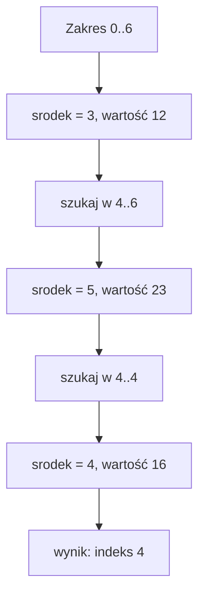

# Rekurencyjne wyszukiwanie binarne

## Problem

Chcemy szybko znaleźć wartość w posortowanym `vector<int>`. Wyszukiwanie binarne działa poprawnie tylko dla danych posortowanych zgodnie z przyjętym porządkiem.

Pracujemy na zakresie domkniętym `[lewy, prawy]`, czyli sprawdzamy elementy od indeksu `lewy` do indeksu `prawy` włącznie.

## Idea

W każdym kroku sprawdzamy środkowy element:

```cpp
int srodek = lewy + (prawy - lewy) / 2;
```

- jeśli środkowy element jest szukany, zwracamy jego indeks,
- jeśli szukana wartość jest mniejsza, szukamy w lewej połowie,
- jeśli jest większa, szukamy w prawej połowie,
- jeśli `lewy > prawy`, zakres jest pusty i zwracamy `-1`.

Środka nie wolno ponownie włączać do zakresu, bo został już sprawdzony.

## Tabela śledzenia

Dla `liczby = {2, 5, 8, 12, 16, 23, 38}` i szukanej wartości `16`:

| `lewy` | `prawy` | `srodek` | `liczby[srodek]` | Porównanie      | Następny zakres |
| ------ | ------- | -------- | ---------------- | --------------- | --------------- |
| 0      | 6       | 3        | 12               | 16 > 12         | `[4, 6]`        |
| 4      | 6       | 5        | 23               | 16 < 23         | `[4, 4]`        |
| 4      | 4       | 4        | 16               | znaleziono      | koniec          |



## Kod

```cpp
#include <iostream>
#include <vector>

using namespace std;

int wyszukajBinarnie(const vector<int> &liczby, int lewy, int prawy, int szukana)
{
    if (lewy > prawy)
    {
        return -1;
    }

    int srodek = lewy + (prawy - lewy) / 2;

    if (liczby[srodek] == szukana)
    {
        return srodek;
    }

    if (szukana < liczby[srodek])
    {
        return wyszukajBinarnie(liczby, lewy, srodek - 1, szukana);
    }

    return wyszukajBinarnie(liczby, srodek + 1, prawy, szukana);
}

int main()
{
    vector<int> liczby = {2, 5, 8, 12, 16, 23, 38};
    int wynik = wyszukajBinarnie(liczby, 0, (int)liczby.size() - 1, 16);

    cout << wynik << "\n";
    return 0;
}
```

<details markdown="1">
<summary>Pokaż wynik</summary>

```text
4
```

</details>

## Dlaczego wyszukiwanie binarne jest szybkie

W każdym kroku odrzucamy mniej więcej połowę pozostałych elementów. Dlatego liczba sprawdzeń rośnie bardzo wolno w porównaniu z liczbą danych.

| Liczba elementów | Przybliżona maksymalna liczba sprawdzeń |
| ---------------: | --------------------------------------: |
|                8 |                                       4 |
|            1 000 |                                      10 |
|        1 000 000 |                                      20 |

Ta szybkość działa tylko wtedy, gdy dane są uporządkowane.

## Powtarzające się wartości

Jeżeli w posortowanych danych ta sama wartość występuje kilka razy, algorytm może zwrócić indeks jednego z wystąpień. Nie musi to być pierwsze ani ostatnie wystąpienie.

Przykład: dla danych `{2, 4, 4, 4, 9}` i szukanej wartości `4` funkcja może zwrócić indeks `2`, bo środkowy element jest równy szukanej wartości. Jeśli potrzebujemy pierwszego albo ostatniego wystąpienia, trzeba zmodyfikować algorytm i po znalezieniu wartości dalej zawężać zakres.

## Znaczenie wyniku

Wartość `-1` oznacza, że szukanej liczby nie ma w przeszukiwanym zakresie. Nie jest to indeks. To umowna informacja o braku wyniku.

Dla pustego `vector` pierwsze wywołanie może wyglądać tak:

```cpp
wyszukajBinarnie(liczby, 0, (int)liczby.size() - 1, szukana)
```

Gdy `liczby.size()` wynosi `0`, prawy indeks będzie równy `-1`, więc warunek `lewy > prawy` od razu zwróci `-1`.

## Typowe błędy

- Użycie wyszukiwania binarnego dla danych nieposortowanych.
- Ponowne uwzględnienie środka w kolejnym zakresie.
- Zły warunek pustego zakresu.
- Mylenie zakresu `[lewy, prawy]` z zakresem bez prawego końca.
- Użycie identyfikatora z polskim znakiem w kodzie, np. `środek`.

## Ćwiczenia

### Ćwiczenie 1 - element istnieje

Dla `liczby = {1, 4, 6, 9, 13, 20}` prześledź wyszukiwanie wartości `13`. Podaj kolejne zakresy i wynik.

<details markdown="1">
<summary>Pokaż wskazówkę do ćwiczenia 1</summary>

Zaczynasz od zakresu `[0, 5]`.

</details>

<details markdown="1">
<summary>Pokaż rozwiązanie ćwiczenia 1</summary>

| `lewy` | `prawy` | `srodek` | Wartość | Decyzja       |
| ------ | ------- | -------- | ------- | ------------- |
| 0      | 5       | 2        | 6       | szukaj w 3..5 |
| 3      | 5       | 4        | 13      | znaleziono    |

Wynik to indeks `4`.

</details>

### Ćwiczenie 2 - brak elementu

Dla tego samego `vector` prześledź wyszukiwanie wartości `7`. Podaj, kiedy pojawia się pusty zakres.

<details markdown="1">
<summary>Pokaż wskazówkę do ćwiczenia 2</summary>

Po sprawdzeniu wartości `6` przejdziesz w prawo, a po sprawdzeniu `9` w lewo.

</details>

<details markdown="1">
<summary>Pokaż rozwiązanie ćwiczenia 2</summary>

```text
[0, 5] => srodek 2, wartość 6, szukaj w [3, 5]
[3, 5] => srodek 4, wartość 13, szukaj w [3, 3]
[3, 3] => srodek 3, wartość 9, szukaj w [3, 2]
```

Zakres `[3, 2]` jest pusty, bo `lewy > prawy`. Wynik to `-1`.

</details>

### Ćwiczenie 3 - jednoelementowy zakres

Co zwróci wywołanie dla `liczby = {8}`, zakresu `[0, 0]` i szukanej wartości `8`?

<details markdown="1">
<summary>Pokaż wskazówkę do ćwiczenia 3</summary>

Dla zakresu `[0, 0]` środek też wynosi `0`.

</details>

<details markdown="1">
<summary>Pokaż rozwiązanie ćwiczenia 3</summary>

Funkcja sprawdzi `liczby[0]`, znajdzie wartość `8` i zwróci indeks `0`.

</details>

### Ćwiczenie 4 - pusty vector

Jaki wynik powinno dać wyszukiwanie w pustym `vector<int>`?

<details markdown="1">
<summary>Pokaż wskazówkę do ćwiczenia 4</summary>

Pierwszy zakres jest od razu pusty.

</details>

<details markdown="1">
<summary>Pokaż rozwiązanie ćwiczenia 4</summary>

Wynik powinien wynosić `-1`. Dla pustego `vector` mamy wywołanie z zakresem `[0, -1]`, więc `lewy > prawy` jest prawdziwe.

</details>

### Ćwiczenie 5 - błąd ze środkiem

Wyjaśnij błąd w wywołaniu:

```cpp
return wyszukajBinarnie(liczby, lewy, srodek, szukana);
```

użytym wtedy, gdy `szukana < liczby[srodek]`.

<details markdown="1">
<summary>Pokaż wskazówkę do ćwiczenia 5</summary>

Element pod indeksem `srodek` został już porównany.

</details>

<details markdown="1">
<summary>Pokaż rozwiązanie ćwiczenia 5</summary>

Błąd polega na ponownym włączeniu środka do zakresu. Poprawnie trzeba użyć:

```cpp
return wyszukajBinarnie(liczby, lewy, srodek - 1, szukana);
```

W przeciwnym razie przy niektórych zakresach funkcja może nie zmniejszać problemu.

</details>

### Ćwiczenie 6 - duplikaty

Dla `liczby = {2, 4, 4, 4, 9}` oraz szukanej wartości `4` podaj indeks, który zwróci funkcja przy pierwszym sprawdzeniu środka. Czy musi to być pierwsze wystąpienie wartości `4`?

<details markdown="1">
<summary>Pokaż wskazówkę do ćwiczenia 6</summary>

Dla zakresu `[0, 4]` środek ma indeks `2`.

</details>

<details markdown="1">
<summary>Pokaż rozwiązanie ćwiczenia 6</summary>

Środek zakresu `[0, 4]` to `2`, a `liczby[2]` ma wartość `4`. Funkcja zwróci więc indeks `2`.

Nie jest to pierwsze wystąpienie, bo wartość `4` znajduje się także pod indeksem `1`. Klasyczna wersja wyszukiwania binarnego zwraca jedno znalezione wystąpienie, niekoniecznie pierwsze lub ostatnie.

</details>

### Ćwiczenie 7 - dane nieposortowane

Dlaczego wyszukiwanie binarne nie jest poprawnym wyborem dla danych `{8, 2, 16, 4, 10}`?

<details markdown="1">
<summary>Pokaż wskazówkę do ćwiczenia 7</summary>

Decyzja o odrzuceniu połowy danych ma sens tylko wtedy, gdy dane są uporządkowane.

</details>

<details markdown="1">
<summary>Pokaż rozwiązanie ćwiczenia 7</summary>

Dane nie są posortowane. Po sprawdzeniu środka nie wiemy, czy szukana wartość powinna znajdować się po lewej, czy po prawej stronie. Odrzucenie połowy danych może usunąć część, w której naprawdę znajduje się szukana wartość.

</details>
