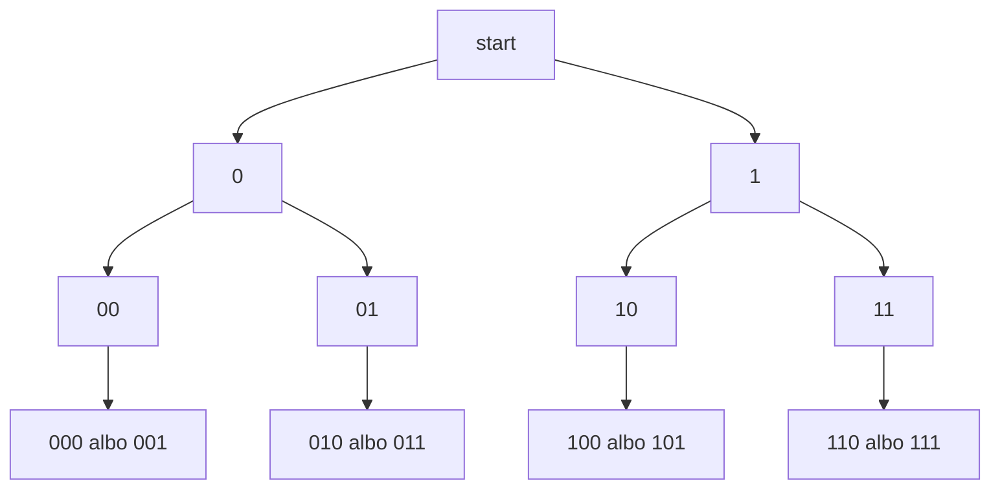

# Nawracanie i generowanie

## Krótkie przedstawienie problemu

Chcemy generowac wiele możliwych rozwiązań.

## Proste wyjaśnienie idei

Wybieramy możliwość, przechodzimy głębiej, po powrocie cofamy zmianę, jeśli była potrzebna, i sprawdzamy następną możliwość.

## Dokładne wyjaśnienie techniczne

To rekurencja rozgaleziajaca się. Czasem wystarczy przekazywac nowy napis, a czasem trzeba zmieniac wspólny stan i go cofac.

## Przypadek podstawowy

Gdy napis ma wymagana długość, wypisujemy go i konczymy wywołanie.

## Krok rekurencyjny

Funkcja tworzy dwa wywołania: z dopisanym `0` i z dopisanym `1`.

## W jaki sposób problem się zmniejsza?

W każdym poprawnym przykładzie zmienia się argument funkcji albo zakres danych. Nowe wywołanie dostaje mniejszy problem, więc może dojść do przypadku podstawowego.

## Ręczne prześledzenie niewielkiego przykładu

Dla długości `3` powstaja galezie od pustego napisu do pełnych napisow binarnych.

## Drzewo decyzji




## Pełny program C++

```cpp
#include <iostream>
#include <string>

using namespace std;

void generujBinarne(int długość, string wynik)
{
    if ((int)wynik.size() == długość)
    {
        cout << wynik << "\n";
        return;
    }

    generujBinarne(długość, wynik + "0");
    generujBinarne(długość, wynik + "1");
}

int main()
{
    generujBinarne(3, "");
    return 0;
}
```

<details markdown="1">
<summary>Pokaż przykładowe dane i wynik</summary>

Dane wejściowe:

```text
brak
```

Wynik:

```text
000
001
010
011
100
101
110
111
```

</details>

## Omówienie programu krok po kroku

Program najpierw generuje warianty zaczynające się od `0`, a potem warianty zaczynające się od `1`. Permutacje są trudniejsze, bo trzeba pilnowac użytych elementow.

## Kiedy rekurencja się zakończy?

Rekurencja zakończy się wtedy, gdy kolejne wywołania doprowadzą do przypadku podstawowego. Jeżeli argument nie zbliża się do końca, funkcja może wywoływać się bez końca.

## Kiedy lepsza będzie pętla?

Pętla będzie lepsza, gdy zadanie polega na prostym przejściu po kolejnych wartościach i rekurencja nie ułatwia myślenia. Pętla zwykle zużywa mniej pamięci i jest bezpieczniejsza dla bardzo dużych danych.

## Typowe błędy

- Brak przypadku podstawowego.
- Przypadek podstawowy, którego nie da się osiągnąć.
- Argument rosnący zamiast zbliżającego się do końca.
- Pominięcie `return` w funkcji zwracającej wartość.
- Pomylenie instrukcji wykonywanych podczas schodzenia z instrukcjami wykonywanymi podczas powrotu.
- Użycie rekurencji tam, gdzie zwykła pętla jest prostsza.

## Ćwiczenia

### Ćwiczenie 1 - przewidzenie wyniku

Dla funkcji `generujBinarne` pokazanej w tej lekcji ustal wynik wywołania `generujBinarne(3, "")`. Zapisz odpowiedź jako wartość zwracaną albo dokładny tekst wypisany przez program.

<details markdown="1">
<summary>Wskazówka</summary>

Najpierw znajdź przypadek podstawowy `wynik.size() == długość`, a potem rozpisz kolejne wartości argumentu `wynik`.

</details>

<details markdown="1">
<summary>Przykładowe rozwiązanie</summary>

Wywołanie `generujBinarne(3, "")` daje wynik:

```text
000, 001, 010, 011, 100, 101, 110, 111
```

</details>

### Ćwiczenie 2 - rozpisanie wywołań

Zapisz kolejno argumenty wszystkich wywołań rekurencyjnych funkcji `generujBinarne` dla wywołania `generujBinarne(3, "")`. Przy każdym wywołaniu dopisz, czy funkcja schodzi głębiej, czy osiąga przypadek podstawowy.

<details markdown="1">
<summary>Wskazówka</summary>

Zacznij od pierwszego wywołania. Potem zapisuj tylko te argumenty, które pojawiają się w kolejnych wywołaniach tej samej funkcji.

</details>

<details markdown="1">
<summary>Przykładowe rozwiązanie</summary>

Poprawna odpowiedź powinna pokazywać, że każde kolejne wywołanie zbliża funkcję do przypadku podstawowego `wynik.size() == długość`. Ostatni wiersz opisu to wywołanie, które już nie uruchamia kolejnej rekurencji.

</details>

### Ćwiczenie 3 - przypadek podstawowy

Wskaż w funkcji `generujBinarne` przypadek podstawowy. Napisz jednym zdaniem, dlaczego bez tego warunku rekurencja nie mogłaby się poprawnie zakończyć.

<details markdown="1">
<summary>Wskazówka</summary>

Szukaj instrukcji `if`, po której funkcja kończy pracę bez kolejnego wywołania samej siebie.

</details>

<details markdown="1">
<summary>Przykładowe rozwiązanie</summary>

Przypadek podstawowy to warunek `wynik.size() == długość`. Po jego spełnieniu funkcja nie wywołuje już samej siebie, więc rekurencja zaczyna się kończyć.

</details>

### Ćwiczenie 4 - błąd w kroku rekurencyjnym

Wyjaśnij, co mogłoby się stać, gdyby w funkcji `generujBinarne` krok rekurencyjny nie zmieniał argumentu `wynik` w stronę przypadku podstawowego.

<details markdown="1">
<summary>Wskazówka</summary>

Porównaj pierwsze wywołanie z następnym. Sprawdź, czy problem staje się mniejszy albo prostszy.

</details>

<details markdown="1">
<summary>Przykładowe rozwiązanie</summary>

Jeżeli argument nie zbliża się do przypadku podstawowego, funkcja może wywoływać samą siebie bez końca. Program zużywa wtedy coraz więcej pamięci stosu i może zakończyć się błędem.

</details>

### Ćwiczenie 5 - krótki program

Napisz krótki program testujący funkcję `generujBinarne` dla wywołania `generujBinarne(3, "")`. Program ma wypisać wynik i działać w standardzie C++23.

<details markdown="1">
<summary>Wskazówka</summary>

Zostaw przypadek podstawowy i krok rekurencyjny. W funkcji `main` wywołaj funkcję z podanymi argumentami.

</details>

<details markdown="1">
<summary>Przykładowe rozwiązanie</summary>

```cpp
#include <iostream>
#include <string>

using namespace std;

void generujBinarne(int dlugosc, string wynik)
{
    if ((int)wynik.size() == dlugosc)
    {
        cout << wynik << "\n";
        return;
    }

    generujBinarne(dlugosc, wynik + "0");
    generujBinarne(dlugosc, wynik + "1");
}

int main()
{
    generujBinarne(3, "");
    return 0;
}
```

</details>
