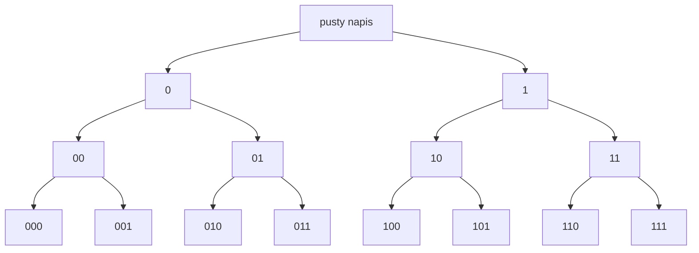

# Nawracanie i generowanie

## Problem

Nawracanie polega na budowaniu rozwiązania krok po kroku. Wybieramy możliwość, zapisujemy ją, schodzimy głębiej, a po powrocie cofamy wybór. Dzięki temu możemy sprawdzić kolejną możliwość.

To nie jest tylko rozgałęzianie. Ważny jest moment cofnięcia decyzji.

## Cztery etapy

1. Wybierz możliwość.
2. Zapisz wybór.
3. Wywołaj funkcję dla kolejnego etapu.
4. Cofnij wybór po powrocie.

Będziemy generować napisy binarne określonej długości. Długość musi być nieujemna.

## Kod z rzeczywistym cofaniem wyboru

```cpp
#include <iostream>
#include <string>

using namespace std;

void generujBinarne(int dlugosc, string &wynik)
{
    if ((int)wynik.size() == dlugosc)
    {
        cout << wynik << '\n';
        return;
    }

    wynik.push_back('0');
    generujBinarne(dlugosc, wynik);
    wynik.pop_back();

    wynik.push_back('1');
    generujBinarne(dlugosc, wynik);
    wynik.pop_back();
}

int main()
{
    int dlugosc = 3;
    string wynik = "";

    if (dlugosc >= 0)
    {
        generujBinarne(dlugosc, wynik);
    }

    return 0;
}
```

<details markdown="1">
<summary>Pokaż wynik</summary>

```text
000
001
010
011
100
101
110
111
```

</details>

## Co robią push_back i pop_back

- `push_back('0')` zapisuje wybór znaku `0`.
- Wywołanie rekurencyjne rozwija ten wybór.
- `pop_back()` usuwa ostatni znak i przywraca poprzedni stan napisu.
- Po cofnięciu można sprawdzić wybór `1`.

Ten sam napis `wynik` jest przekazywany przez referencję. Dlatego cofnięcie wyboru jest konieczne. Bez `pop_back()` kolejne gałęzie dostałyby zły stan.

## Drzewo dla długości 3



Liście drzewa są gotowymi napisami. Każdy liść ma długość `3`.

## Typowe błędy

- Brak `pop_back()` po powrocie z rekurencji.
- Cofnięcie wyboru przed wywołaniem rekurencyjnym.
- Brak warunku końcowego dla osiągniętej długości.
- Przekazywanie napisu przez referencję bez rozumienia, że zmieniamy wspólny obiekt.
- Pokazywanie drzewa z połączonymi liśćmi zamiast osobnych wyników.

## Ćwiczenia

### Ćwiczenie 1 - drzewo dla długości 2

Zapisz wszystkie napisy wygenerowane dla `dlugosc = 2` w takiej kolejności, w jakiej wypisze je program.

<details markdown="1">
<summary>Pokaż wskazówkę do ćwiczenia 1</summary>

Program najpierw wybiera `0`, potem znów `0`, a po cofnięciu wybiera `1`.

</details>

<details markdown="1">
<summary>Pokaż rozwiązanie ćwiczenia 1</summary>

```text
00
01
10
11
```

To są cztery liście drzewa dla długości `2`.

</details>

### Ćwiczenie 2 - momenty cofania

Dla gałęzi prowadzącej do napisu `01` wskaż, kiedy wykonują się operacje `pop_back()`.

<details markdown="1">
<summary>Pokaż wskazówkę do ćwiczenia 2</summary>

Każdy zapisany znak musi zostać cofnięty po powrocie z głębszego wywołania.

</details>

<details markdown="1">
<summary>Pokaż rozwiązanie ćwiczenia 2</summary>

Najpierw program zapisuje `0`, potem próbuje gałąź `00`. Po wypisaniu `00` cofa drugi znak. Następnie zapisuje `1` i wypisuje `01`. Po powrocie cofa `1`, a później cofa pierwsze `0`, aby przejść do gałęzi zaczynającej się od `1`.

</details>

### Ćwiczenie 3 - brak jednego cofnięcia

Co może się stać, jeśli usuniemy `wynik.pop_back()` po gałęzi z `0`?

<details markdown="1">
<summary>Pokaż wskazówkę do ćwiczenia 3</summary>

Napis będzie nadal zawierał wybór z poprzedniej gałęzi.

</details>

<details markdown="1">
<summary>Pokaż rozwiązanie ćwiczenia 3</summary>

Stan napisu nie wróci do poprzedniej długości. Kolejna gałąź zacznie pracę z nadmiarowym znakiem, więc program może pominąć część wyników albo wypisać napisy niezgodne z oczekiwaną strukturą drzewa.

</details>

### Ćwiczenie 4 - napisy z liter A i B

Napisz program generujący wszystkie napisy długości `2` z liter `A` i `B`.

<details markdown="1">
<summary>Pokaż wskazówkę do ćwiczenia 4</summary>

Zamiast znaków `0` i `1` użyj `A` i `B`.

</details>

<details markdown="1">
<summary>Pokaż rozwiązanie ćwiczenia 4</summary>

```cpp
#include <iostream>
#include <string>

using namespace std;

void generuj(int dlugosc, string &wynik)
{
    if ((int)wynik.size() == dlugosc)
    {
        cout << wynik << '\n';
        return;
    }

    wynik.push_back('A');
    generuj(dlugosc, wynik);
    wynik.pop_back();

    wynik.push_back('B');
    generuj(dlugosc, wynik);
    wynik.pop_back();
}

int main()
{
    string wynik = "";
    generuj(2, wynik);
    return 0;
}
```

</details>

### Ćwiczenie 5 - bez dwóch sąsiednich jedynek

Napisz funkcję generującą napisy binarne długości `3`, ale bez dwóch sąsiednich jedynek.

<details markdown="1">
<summary>Pokaż wskazówkę do ćwiczenia 5</summary>

Znak `1` możesz dodać tylko wtedy, gdy napis jest pusty albo ostatni znak nie jest jedynką.

</details>

<details markdown="1">
<summary>Pokaż rozwiązanie ćwiczenia 5</summary>

```cpp
#include <iostream>
#include <string>

using namespace std;

void generujBezSasiednichJedynek(int dlugosc, string &wynik)
{
    if ((int)wynik.size() == dlugosc)
    {
        cout << wynik << '\n';
        return;
    }

    wynik.push_back('0');
    generujBezSasiednichJedynek(dlugosc, wynik);
    wynik.pop_back();

    if (wynik.empty() || wynik[wynik.size() - 1] != '1')
    {
        wynik.push_back('1');
        generujBezSasiednichJedynek(dlugosc, wynik);
        wynik.pop_back();
    }
}

int main()
{
    string wynik = "";
    generujBezSasiednichJedynek(3, wynik);
    return 0;
}
```

</details>
